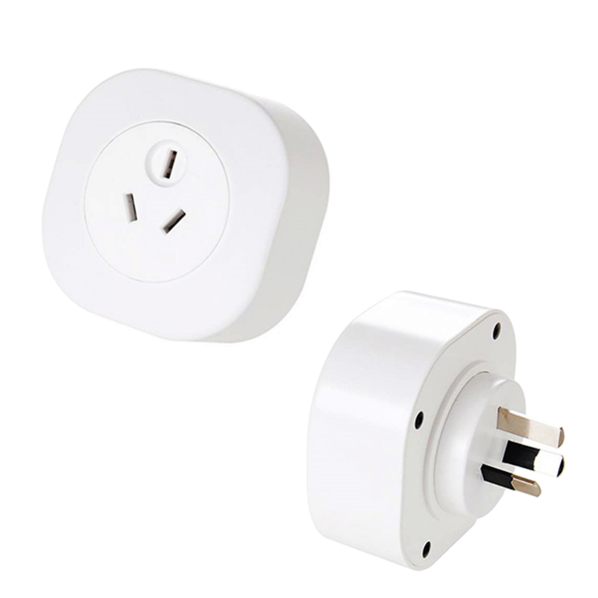

Maker: https://www.athom.tech/

Also on Aliexpress, with preflashed Tasmota or Homekit.

## GPIO Pinout

| Pin    | Function            |
| ------ | ------------------- |
| GPIO3  | Button              |
| GPIO4  | BL0937 CF           |
| GPIO5  | HLWBL CF1           |
| GPIO12 | HLWBL SELi          |
| GPIO13 | LedLink             |
| GPIO14 | Relay               |

## Basic Configuration

```yaml
substitutions:
  devicename: athom-au-plug
  upper_devicename: Athom Plug AU

esphome:
  name: $devicename

esp8266:
  board: esp8285

# Enable logging
logger:

# Enable Home Assistant API
api:

ota:

captive_portal:

wifi:
  ssid: !secret wifi_ssid
  password: !secret wifi_password
  ap:


binary_sensor:
  - platform: gpio
    pin:
      number: 3
      mode: INPUT_PULLUP
      inverted: true
    name: $upper_devicename Power Button
    on_press:
      - switch.toggle: relay
    on_click:
      min_length: 4s
      max_length: 8s
      then:
        - lambda: |-
              ESP.reset();

sensor:
  - platform: uptime
    name: $upper_devicename Uptime Sensor
  - platform: hlw8012
    sel_pin:
      number: GPIO12
      inverted: True
    cf_pin: GPIO4
    cf1_pin: GPIO5
    voltage_divider: 780
    current:
      name: $upper_devicename Current
      unit_of_measurement: A
      id: socket_my_amps
      accuracy_decimals: 2
      filters:
          - calibrate_linear:
            - 0.0000 -> 0.0110 # Relay off no load
            - 0.0097 -> 0.0260 # Relay on no load
            - 0.9270 -> 0.7570
            - 2.0133 -> 1.6330
            - 2.9307 -> 2.3750
            - 5.4848 -> 4.4210
            - 8.4308 -> 6.8330
            - 9.9171 -> 7.9830
          # Normalize for plug load
          - lambda: if (x < 0.0260) return 0; else return (x - 0.0260);
    voltage:
      name: $upper_devicename Voltage
      unit_of_measurement: V
      id: socket_my_voltage

    power:
      name: $upper_devicename Power
      id: socket_my_power
      unit_of_measurement: W
      filters:
          - calibrate_linear:
            - 0.0000 -> 0.5900 # Relay off no load
            - 0.0000 -> 1.5600 # Relay on no load
            - 198.5129 -> 87.8300
            - 434.2469 -> 189.5000
            - 628.6241 -> 273.9000
            - 1067.0067 -> 460.1000
            - 1619.8098 -> 699.2000
            - 2043.0282 -> 885.0000
          # Normalize for plug load
          - lambda: if (x < 1.5600) return 0; else return (x - 1.5600);
    change_mode_every: 1
    update_interval: 5s
  - platform: total_daily_energy
    name: $upper_devicename Total Daily Energy
    power_id: socket_my_power
    unit_of_measurement: kWh
    filters:
      - multiply: 0.001

switch:
  - platform: gpio
    id: blue_led
    pin:
      number: GPIO13
      inverted: true

  - platform: gpio
    name: $devicename
    pin: GPIO14
    id: relay

    on_turn_on:
      - switch.turn_on: blue_led

    on_turn_off:
      - switch.turn_off: blue_led

time:
  - platform: sntp
    id: my_time
```
