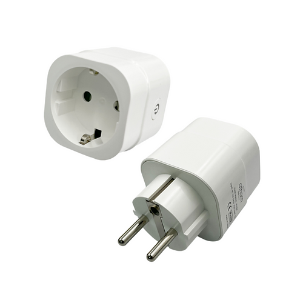

Maker: https://www.athom.tech/
Product page: https://www.athom.tech/blank-1/esp32-c3-eu-plug-for-esphome

Also on Aliexpress, available pre-flashed with ESPHome or Tasmota.

## GPIO Pinout

| Pin    | Function            |
| ------ | ------------------- |
| GPIO20 | CSE7766 Rx          |
| GPIO3  | Button              |
| GPIO5  | Relay               |
| GPIO6  | Led                 |

## Basic Configuration

```yaml
substitutions:
  name: "athom-smart-plug-v3"
  friendly_name: "Athom Plug V3"
  # Allows ESP device to be automatically lined to an 'Area' in Home Assistant. Typically used for areas such as 'Lounge Room', 'Kitchen' etc  
  room: ""
  device_description: "athom esp32-c3 smart plug"
  project_name: "Athom Technology.Smart Plug V3"
  # Projection version denotes the release version of the yaml file, allowing checking of deployed vs latest version
  project_version: "v1.0.1"
  relay_restore_mode: RESTORE_DEFAULT_OFF
  sensor_update_interval: 10s
  # Current Limit in Amps. AU Plug = 10. IL, BR, EU, UK, US Plug = 16.
  current_limit : "16"
  # Define a domain for this device to use. i.e. iot.home.lan (so device will appear as athom-smart-plug-v2.iot.home.lan in DNS/DHCP logs)
  dns_domain: ""
  # Set timezone of the smart plug. Useful if the plug is in a location different to the HA server. Can be entered in unix Country/Area format (i.e. "Australia/Sydney")
  timezone: ""
  # Enables faster network connections, with last connected SSID being connected to and no full scan for SSID being undertaken
  wifi_fast_connect: "false"

esphome:
  name: "${name}"
  friendly_name: "${friendly_name}"
  area: "${room}"  
  name_add_mac_suffix: true
  project:
    name: "${project_name}"
    version: "${project_version}"
  platformio_options:
    board_build.mcu: esp32c3
    board_build.variant: esp32c3
    board_build.flash_mode: dio

esp32:
  board: esp32-c3-devkitm-1
  flash_size: 4MB
  variant: ESP32C3
  framework:
    type: arduino
    version: recommended

preferences:
  flash_write_interval: 5min

# OTA flashing
ota:
  - platform: esphome

wifi: # Your Wifi network details
  
# Enable fallback hotspot in case wifi connection fails  
  ap:

# Enabling the logging component
logger:

# Enable Home Assistant API
api:

# Enable the captive portal
captive_portal:

# Enable the Web Server component 
webserver:

dashboard_import:
  package_import_url: github://athom-tech/esp32-configs/athom-smart-plug.yaml

uart:
  rx_pin: GPIO20
  baud_rate: 4800
  data_bits: 8
  stop_bits: 1
  parity: EVEN

globals:
  - id: total_energy
    type: float
    restore_value: yes
    initial_value: '0.0'

binary_sensor:
  - platform: status
    name: "Status"
    entity_category: diagnostic

  - platform: gpio
    pin:
      number: GPIO3
      mode: INPUT_PULLUP
      inverted: true
    name: "Power Button"
    disabled_by_default: true
    on_multi_click:
      - timing:
          - ON for at most 1s
          - OFF for at least 0.2s
        then:
          - switch.toggle: relay
      - timing:
          - ON for at least 4s
        then:
          - button.press: Reset
sensor:

  - platform: cse7766
    current:
      name: "Current"
      filters:
          - throttle_average: ${sensor_update_interval}
          - lambda: if (x < 0.060) return 0.0; else return x;   #For the chip will report less than 3w power when no load is connected
      on_value_range:
        - above: ${current_limit}
          then:
            - switch.turn_off: relay

    voltage:
      name: "Voltage"
      filters:
          - throttle_average: ${sensor_update_interval}

    power:
      name: "Power"
      id: power_sensor
      filters:
          - throttle_average: ${sensor_update_interval}
          - lambda: if (x < 3.0) return 0.0; else return x;    #For the chip will report less than 3w power when no load is connected

    energy:
      name: "Energy"
      id: energy
      unit_of_measurement: kWh
      filters:
        - throttle_average: ${sensor_update_interval}
        # Multiplication factor from W to kW is 0.001
        - multiply: 0.001
        - filter_out: nan
      on_value:
        then:
          - lambda: |-
              static float previous_energy_value = 0.0;
              float current_energy_value = id(energy).state;
              id(total_energy) += current_energy_value - previous_energy_value;
              previous_energy_value = current_energy_value;
              id(total_energy_sensor).update();

  - platform: template
    name: "Total Energy"
    id: total_energy_sensor
    unit_of_measurement: kWh
    device_class: "energy"
    state_class: "total_increasing"
    icon: "mdi:lightning-bolt"
    accuracy_decimals: 3
    lambda: |-
      return id(total_energy);
    update_interval: ${sensor_update_interval}

  - platform: total_daily_energy
    name: "Total Daily Energy"
    restore: true
    power_id: power_sensor
    unit_of_measurement: kWh
    accuracy_decimals: 3
    filters:
      - multiply: 0.001

button:
  - platform: restart
    name: "Restart"
    entity_category: config

  - platform: factory_reset
    name: "Factory Reset"
    id: Reset
    entity_category: config

  - platform: safe_mode
    name: "Safe Mode"
    internal: false
    entity_category: config

switch:
  - platform: gpio
    name: "Power"
    pin: GPIO5
    id: relay
    restore_mode: ${relay_restore_mode}

light:
  - platform: status_led
    name: "Status LED"
    id: blue_led
    disabled_by_default: true
    pin:
      inverted: true
      number: GPIO6

time:
  - platform: sntp
    id: sntp_time
  # Define the timezone of the device
    timezone: "${timezone}"
  # Change sync interval from default 5min to 6 hours
    update_interval: 360min
  # Publish the time the device was last restarted
    on_time_sync:
      then:
        # Update last restart time, but only once.
        - if:
            condition:
              lambda: 'return id(device_last_restart).state == "";'
            then:
              - text_sensor.template.publish:
                  id: device_last_restart
                  state: !lambda 'return id(sntp_time).now().strftime("%a %d %b %Y - %I:%M:%S %p");'
```
