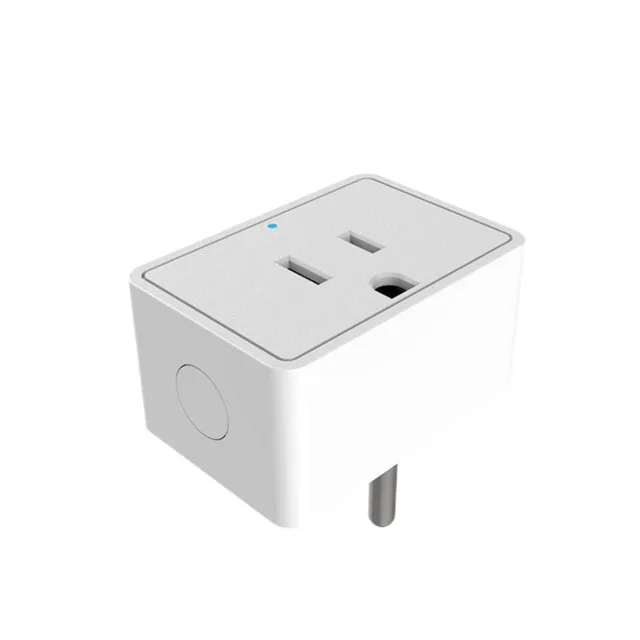

Manufacturer: <https://www.athom.tech/> (*discontinued*. New version:
[PG03V2-US16A](https://templates.blakadder.com/athom_PG03V2-US16A-TAS))
Available with Tasmota pre-flashed.

Pinout information thanks to

- <https://templates.blakadder.com/athom_PG03-US16A.html>

Sensor constants and reference ESPHome configuration from

- <https://github.com/athom-tech/athom-configs/blob/main/athom-smart-plug.yaml>

## GPIO Pinout

| Pin    | Function            |
| ------ | ------------------- |
| GPIO3  | Button              |
| GPIO4  | BL0937 CF           |
| GPIO5  | HLWBL CF1           |
| GPIO12 | HLWBL SELi          |
| GPIO13 | Blue LED            |
| GPIO14 | Relay               |

## Basic Configuration

```yaml
substitutions:
  name: "athom-smart-plug"
  friendly_name: "Athom Smart Plug"
  relay_restore_mode: RESTORE_DEFAULT_OFF

esphome:
  name: "${name}"
  name_add_mac_suffix: true

esp8266:
  board: esp8285
  restore_from_flash: true

preferences:
  flash_write_interval: 1min

# Enable Home Assistant API
api:

ota:

# Enable logging
logger:

web_server:
  port: 80

wifi:
  ssid: "ssid"
  password: "password"

  # Enable fallback hotspot (captive portal) in case wifi connection fails
  ap:
    ssid: "${friendly_name} Hotspot"
    password: ""

captive_portal:

# Time used for daily KWh usage
time:
  - platform: homeassistant
    id: homeassistant_time

binary_sensor:
  - platform: status
    name: "${friendly_name} Status"

  - platform: gpio
    pin:
      number: GPIO3
      mode: INPUT_PULLUP
      inverted: true
    name: "${friendly_name} Power Button"
    disabled_by_default: true
    on_multi_click:
      - timing:
          - ON for at most 1s
          - OFF for at least 0.2s
        then:
          - switch.toggle: relay
      - timing:
          - ON for at least 4s
        then:
          - button.press: Reset

sensor:
  - platform: uptime
    name: "${friendly_name} Uptime"
    icon: mdi:clock-outline
    disabled_by_default: true

  - platform: hlw8012
    sel_pin:
      number: GPIO12
      inverted: True
    cf_pin: GPIO4
    cf1_pin: GPIO5
    voltage_divider: 780
    current:
      name: "${friendly_name} Current"
      icon: mdi:lightning-bolt-circle
      filters:
          - calibrate_linear:
            - 0.0000 -> 0.0110 # Relay off no load
            - 0.0097 -> 0.0260 # Relay on no load
            - 0.9270 -> 0.7570
            - 2.0133 -> 1.6330
            - 2.9307 -> 2.3750
            - 5.4848 -> 4.4210
            - 8.4308 -> 6.8330
            - 9.9171 -> 7.9830
          # Normalize for plug load
          - lambda: if (x < 0.0260) return 0; else return (x - 0.0260);
    voltage:
      name: "${friendly_name} Voltage"
      icon: mdi:lightning-bolt-circle

    power:
      name: "${friendly_name} Power"
      icon: mdi:lightning-bolt-circle
      id: socket_my_power
      unit_of_measurement: W
      filters:
          - calibrate_linear:
            - 0.0000 -> 0.5900 # Relay off no load
            - 0.0000 -> 1.5600 # Relay on no load
            - 198.5129 -> 87.8300
            - 434.2469 -> 189.5000
            - 628.6241 -> 273.9000
            - 1067.0067 -> 460.1000
            - 1619.8098 -> 699.2000
            - 2043.0282 -> 885.0000
          # Normalize for plug load
          - lambda: if (x < 1.5600) return 0; else return (x - 1.5600);
    change_mode_every: 1
    update_interval: 10s

  - platform: total_daily_energy
    name: "${friendly_name} Total Energy"
    icon: mdi:clock-alert
    power_id: socket_my_power
    unit_of_measurement: kWh
    accuracy_decimals: 3
    restore: true
    filters:
      - multiply: 0.001

  - platform: wifi_signal
    name: "${friendly_name} Wifi Signal"
    update_interval: 60s


button:
  - platform: factory_reset
    name: Restart with Factory Default Settings
    id: Reset

switch:
  - platform: gpio
    name: "${friendly_name}"
    icon: mdi:power-socket-us
    pin: GPIO14
    id: relay
    restore_mode: ${relay_restore_mode}
    on_turn_on:
      - light.turn_on: blue_led

    on_turn_off:
      - light.turn_off: blue_led

light:
  - platform: status_led
    name: "${friendly_name} Status LED"
    icon: mdi:led-outline
    id: blue_led
    disabled_by_default: true
    pin:
      inverted: true
      number: GPIO13

text_sensor:
  - platform: wifi_info
    ip_address:
      name: "${friendly_name} IP Address"
      disabled_by_default: true
```
