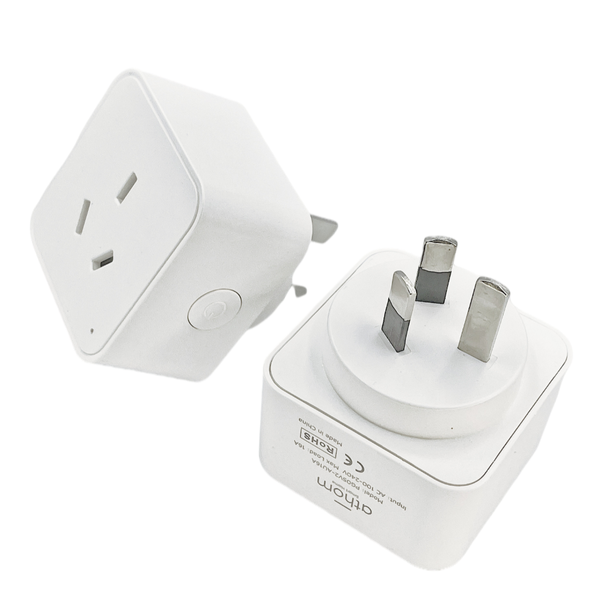

Maker: https://www.athom.tech/

Also on Aliexpress, available pre-flashed with ESPHome or Tasmota.

## GPIO Pinout

| Pin    | Function            |
| ------ | ------------------- |
| GPIO3  | CSE7766 Rx          |
| GPIO5  | Button              |
| GPIO12 | Relay               |
| GPIO13 | LedLink             |

## Basic Configuration

```yaml
substitutions:
  device_name: "athom-smart-plug-v2"
  friendly_name: "Athom Smart Plug V2"
  project_name: "athom.smart-plug-v2"
  project_version: "1.1"
  relay_restore_mode: RESTORE_DEFAULT_OFF

esphome:
  name: "${device_name}"
  name_add_mac_suffix: true
  project:
    name: "${project_name}"
    version: "${project_version}"

esp8266:
  board: esp8285
  restore_from_flash: true

preferences:
  flash_write_interval: 1min

# OTA flashing
ota:
  - platform: esphome

wifi: # Your Wifi network details
  
# Enable fallback hotspot in case wifi connection fails  
  ap:

# Enabling the logging component
logger:

# Enable Home Assistant API
api:

# Enable the captive portal
captive_portal:

# Enable the Web Server component 
webserver:

dashboard_import:
  package_import_url: github://athom-tech/athom-configs/athom-smart-plug-v2.yaml

uart:
  rx_pin: RX
  baud_rate: 4800

globals:
  - id: total_energy
    type: float
    restore_value: yes
    initial_value: '0.0'

binary_sensor:
  - platform: status
    name: "${friendly_name} Status"

  - platform: gpio
    pin:
      number: 5
      mode: INPUT_PULLUP
      inverted: true
    name: "${friendly_name} Power Button"
    disabled_by_default: true
    on_multi_click:
      - timing:
          - ON for at most 1s
          - OFF for at least 0.2s
        then:
          - switch.toggle: relay
      - timing:
          - ON for at least 4s
        then:
          - button.press: Reset

sensor:
  - platform: uptime
    name: "${friendly_name} Uptime Sensor"

  - platform: cse7766
    update_interval: 10s
    current:
      name: "${friendly_name} Current"
      filters:
          - lambda: if (x < 0.060) return 0.0; else return x;   #For the chip will report less than 3w power when no load is connected

    voltage:
      name: "${friendly_name} Voltage"
    power:
      name: "${friendly_name} Power"
      id: power_sensor
      filters:
          - lambda: if (x < 3.0) return 0.0; else return x;    #For the chip will report less than 3w power when no load is connected

    energy:
      name: "${friendly_name} Energy"
      id: energy
      unit_of_measurement: kWh
      filters:
        # Multiplication factor from W to kW is 0.001
        - multiply: 0.001
      on_value:
        then:
          - lambda: |-
              static float previous_energy_value = 0.0;
              float current_energy_value = id(energy).state;
              id(total_energy) += current_energy_value - previous_energy_value;
              previous_energy_value = current_energy_value;
  - platform: template
    name: "${friendly_name} Total Energy"
    unit_of_measurement: kWh
    device_class: "energy"
    state_class: "total_increasing"
    icon: "mdi:lightning-bolt"
    accuracy_decimals: 3
    lambda: |-
      return id(total_energy);
    update_interval: 10s

  - platform: total_daily_energy
    name: "${friendly_name} Total Daily Energy"
    restore: true
    power_id: power_sensor
    unit_of_measurement: kWh
    accuracy_decimals: 3
    filters:
      - multiply: 0.001


button:
  - platform: factory_reset
    name: "Restart with Factory Default Settings"
    id: Reset

  - platform: safe_mode
    name: "Safe Mode"
    internal: false

switch:
  - platform: gpio
    name: "${friendly_name}"
    pin: GPIO12
    id: relay
    restore_mode: ${relay_restore_mode}

light:
  - platform: status_led
    name: "${friendly_name} Status LED"
    id: blue_led
    disabled_by_default: true
    pin:
      inverted: true
      number: GPIO13

time:
  - platform: sntp
    id: sntp_time
```
