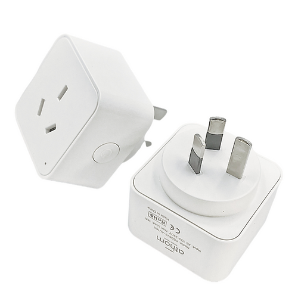

Maker: https://www.athom.tech/
Product page: https://www.athom.tech/blank-1/esp32-c3-au-plug-for-esphome

Also on Aliexpress, available pre-flashed with ESPHome or Tasmota.

## GPIO Pinout

| Pin    | Function   |
| ------ | ---------- |
| GPIO20 | CSE7766 Rx |
| GPIO3  | Button     |
| GPIO5  | Relay      |
| GPIO6  | Led        |

## Basic Configuration

The [Latest configuration](https://github.com/athom-tech/esp32-configs/blob/main/athom-smart-plug.yaml)
can be found on Athom's GitHub repo.
