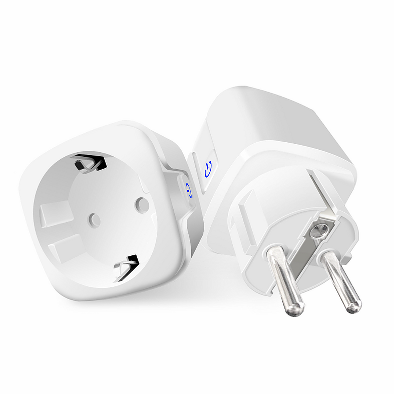

Maker: https://www.athom.tech/

Also on Aliexpress, with preflashed Tasmota or Homekit.

## GPIO Pinout

| Pin    | Function            |
| ------ | ------------------- |
| GPIO3  | Button              |
| GPIO4  | BL0937 CF           |
| GPIO5  | HLWBL CF1           |
| GPIO12 | HLWBL SELi          |
| GPIO13 | LedLink             |
| GPIO14 | Relay               |

## Basic Configuration

```yaml
substitutions:
  devicename: athomsmartplug
  upper_devicename: Athom Smart Plug
    # Higher value gives lower watt readout
  current_res: "0.00225"
  # Lower value gives lower voltage readout
  voltage_div: "757"

esphome:
  name: $devicename

esp8266:
  board: esp01_1m

wifi:
  ssid: !secret wifi_ssid
  password: !secret wifi_password
  ap:

captive_portal:

# Enable logging
logger:

# Enable Home Assistant API
api:

ota:

web_server:
  port: 80

# Time used for daily KWh usage  
time:
  - platform: homeassistant
    id: homeassistant_time

status_led:
  pin:
    number: GPIO0
    inverted: yes

binary_sensor:
    # Button 1 configuration
  - platform: gpio
    pin:
      number: GPIO3
      mode: INPUT_PULLUP
      inverted: True
    id: button_1
    on_press:
      then:
        - switch.toggle: relay_1
    on_click:
      min_length: 5000ms
      max_length: 10000ms
      then:
        - switch.turn_on: reset
  - platform: status
    name: "${upper_devicename} Status"

switch: # Set relays as switches
  - platform: gpio
    id: relay_1
    icon: mdi:power-socket-uk
    pin: GPIO14
    name: "${upper_devicename} Switch"
    on_turn_on:
    - switch.turn_on: sw_led1
    on_turn_off:
    - switch.turn_off: sw_led1
  # Register LED on GPIO
  - platform: gpio
    id: sw_led1
    pin: GPIO13
    inverted: True
  - platform: restart
    name: "${upper_devicename} Restart"
    id: reset

sensor:
  - platform: hlw8012
    sel_pin:
      number: GPIO12
      inverted: True
    cf_pin: GPIO04
    cf1_pin: GPIO5
    current_resistor: ${current_res}
    voltage_divider: ${voltage_div}
    current:
      name: "${upper_devicename} Amperage"
      unit_of_measurement: A
      accuracy_decimals: 3
      icon: mdi:flash-circle
    voltage:
      name: "${upper_devicename} Voltage"
      unit_of_measurement: V
      icon: mdi:flash-circle
    power:
      name: "${upper_devicename} Wattage"
      unit_of_measurement: W
      id: "${devicename}_Wattage"
      icon: mdi:flash-circle
    change_mode_every: 4
    update_interval: 10s
  - platform: total_daily_energy
    name: "${upper_devicename} Total Daily Energy"
    power_id: "${devicename}_Wattage"
    filters:
        # Multiplication factor from W to kW is 0.001
        - multiply: 0.001
    unit_of_measurement: kWh
    icon: mdi:clock-alert
  - platform: uptime
    name: "${upper_devicename} Uptime"
    icon: mdi:clock-outline
  - platform: wifi_signal
    name: "${upper_devicename} Wifi Signal"
    update_interval: 60s
```
