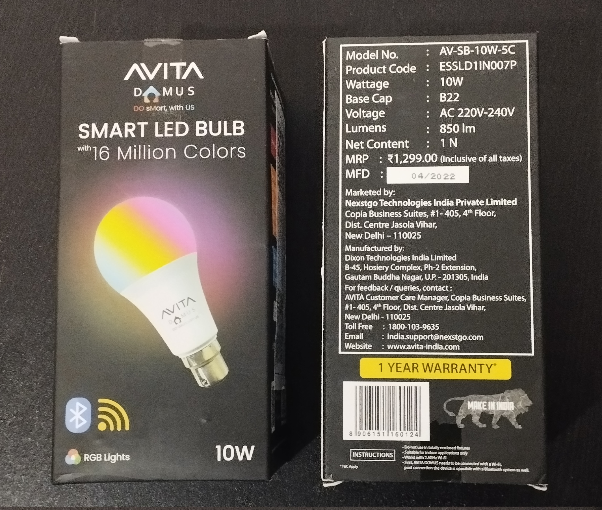
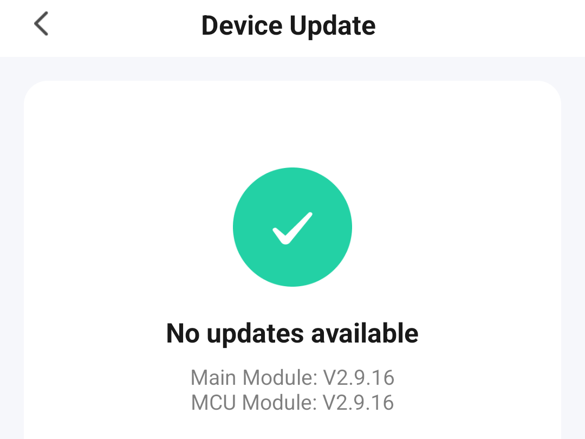
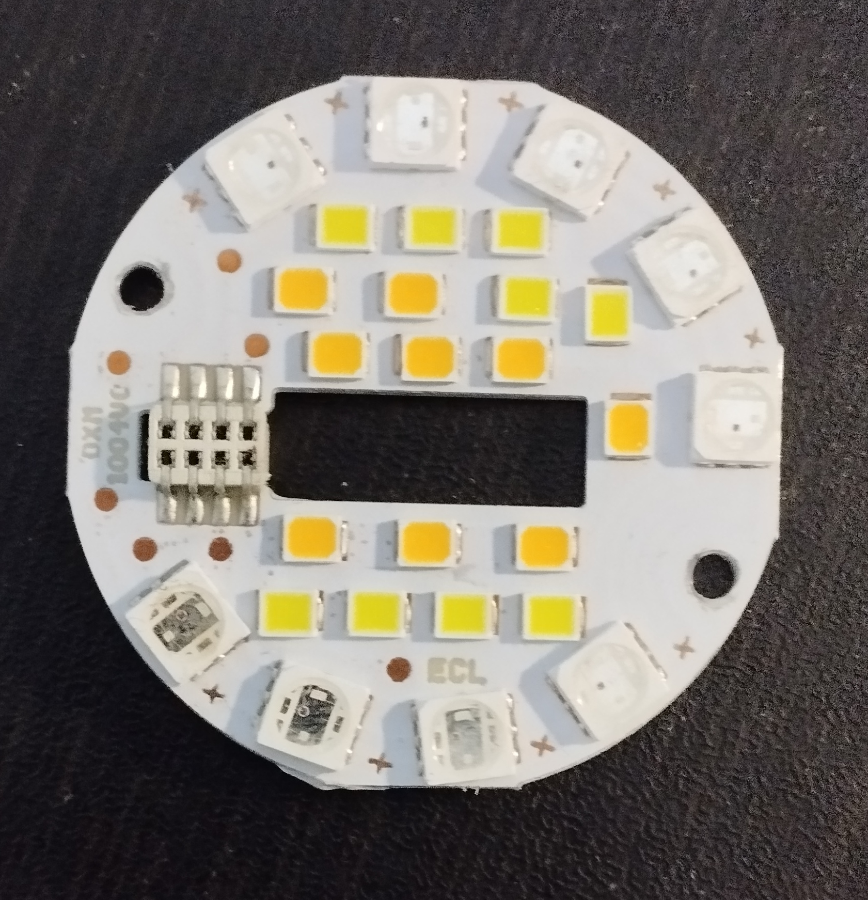
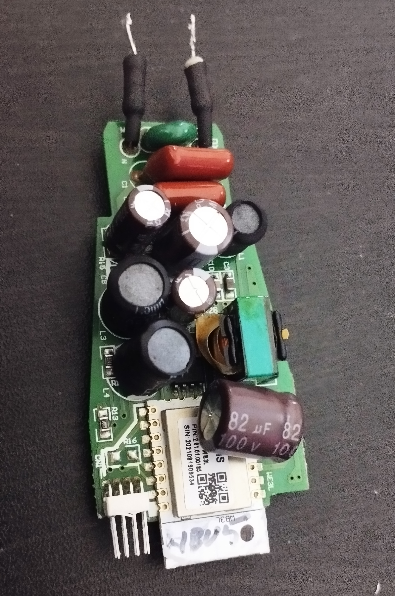
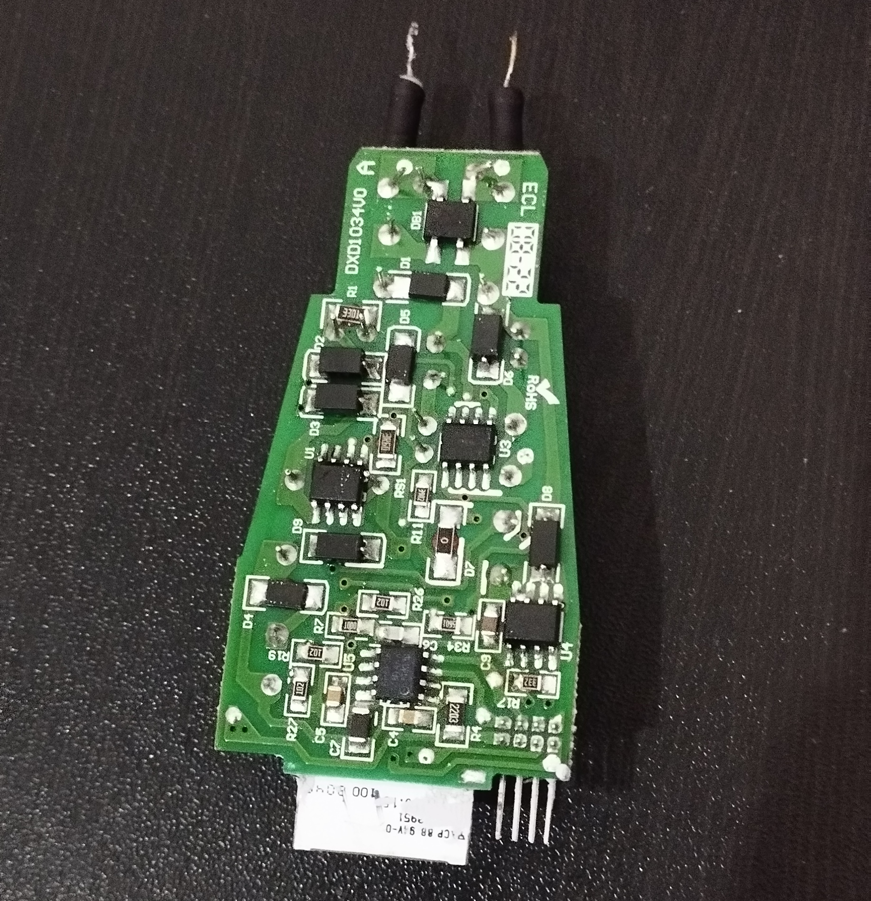
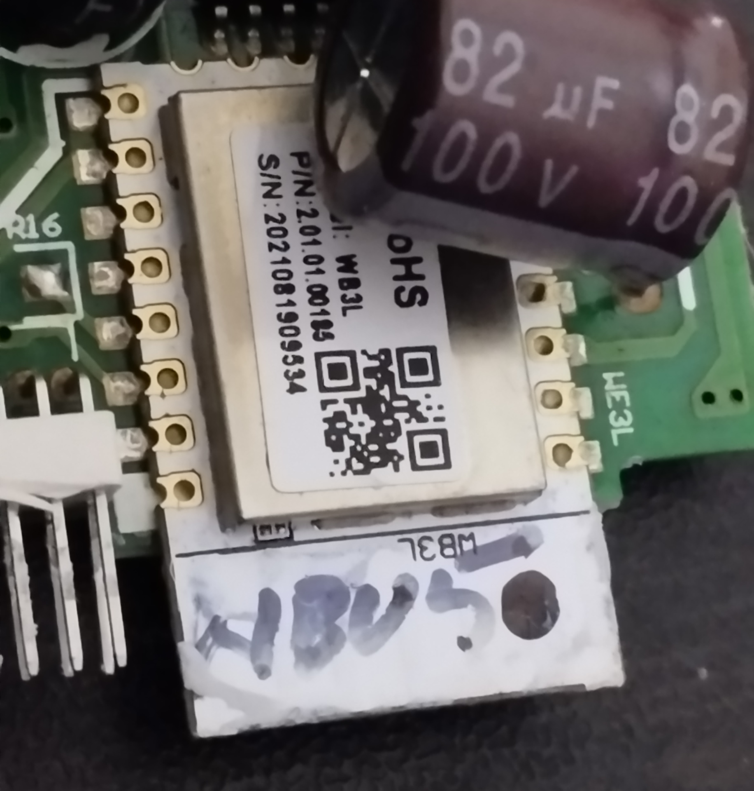
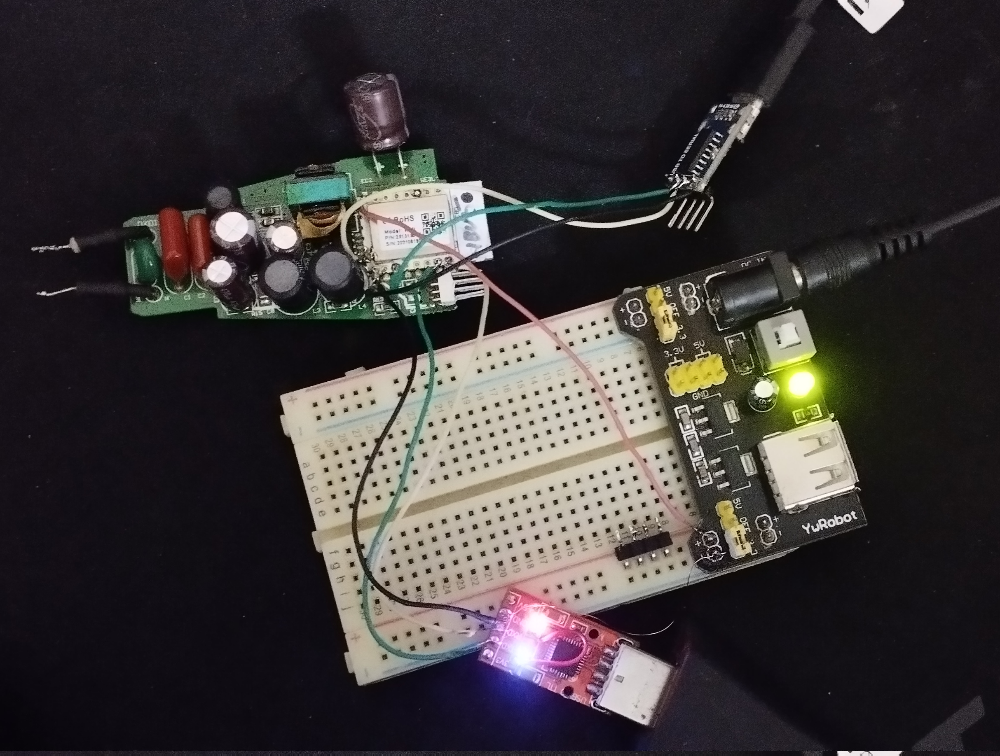
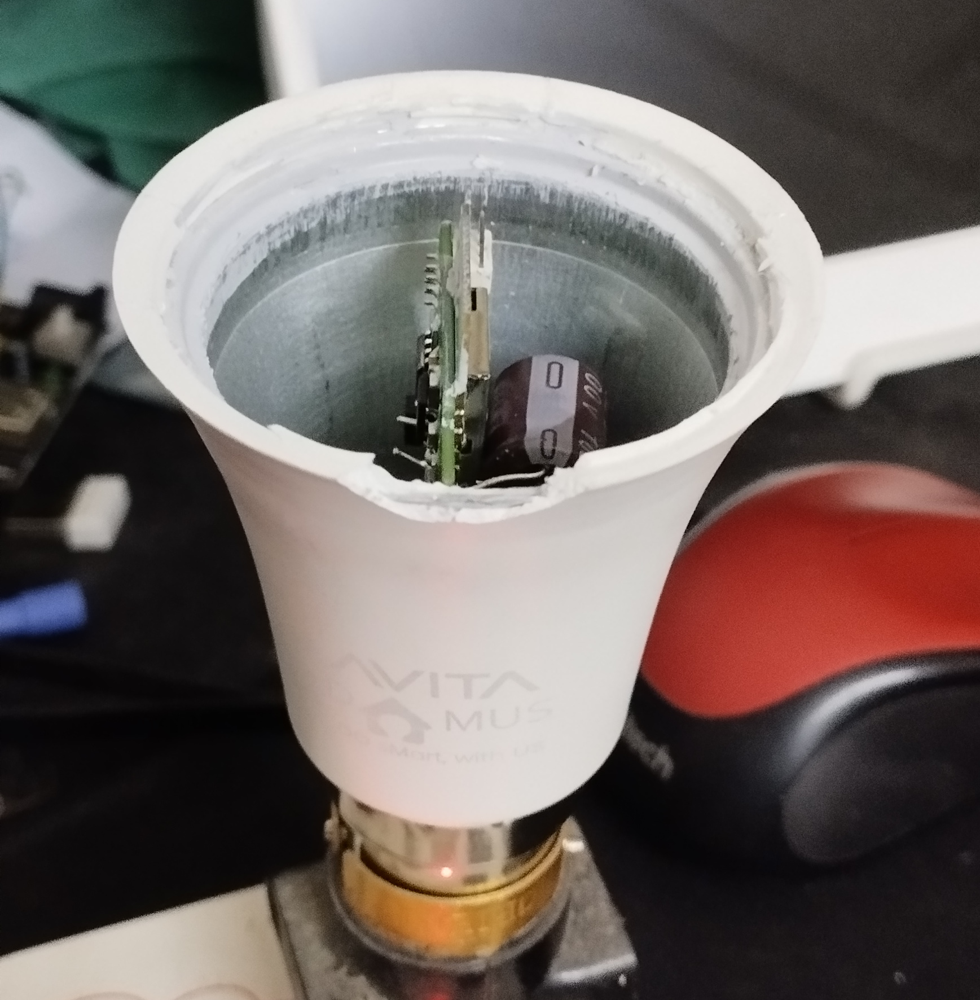
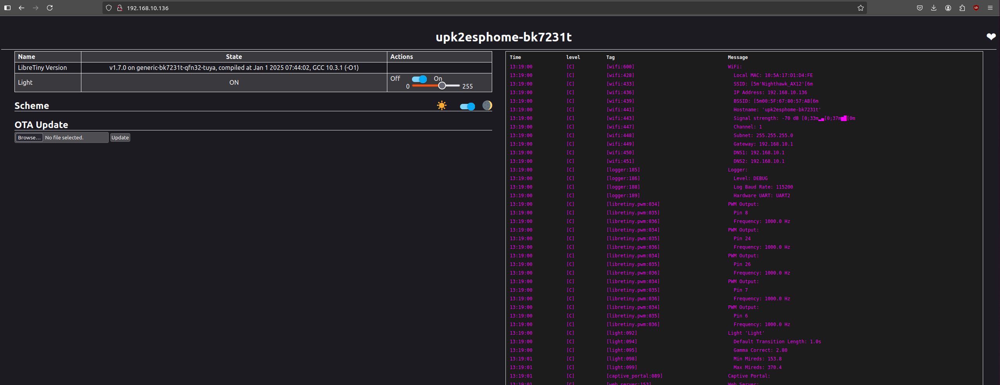
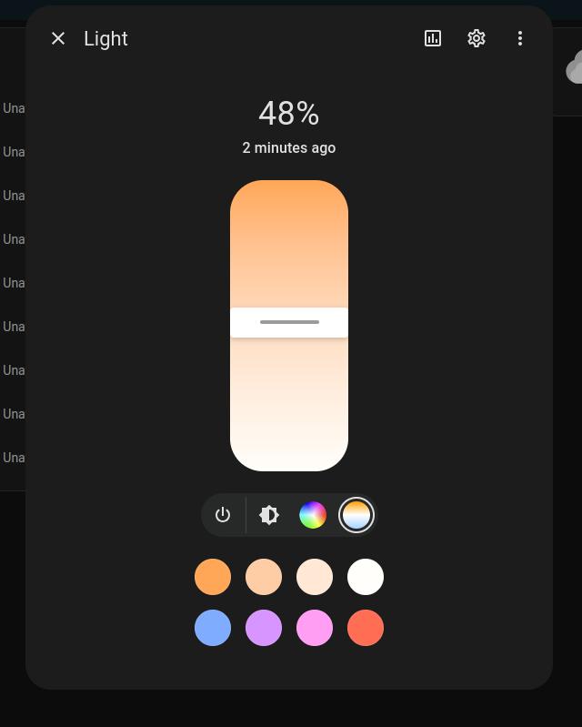

## Device Info

This Avita Domus Bulb has a B22 Bayonet fitting.

SKU: ESSLD1IN007P

**Available from:**

- [Flipkart.com](http://dl.flipkart.com/dl/avita-domus-10w-led-5ch-rgb-smart-bulb/p/itme7f7f0be94b45)

**Manufacturer:**

- [Avita India](https://avita-india.com/)

## Flashing With Cloudcutter

1. [Setup tuya-cloudcutter](https://github.com/tuya-cloudcutter/tuya-cloudcutter)
2. Start the cloudcutter process
3. Select the option `2) Flash 3rd Party Firmware`
4. How do you want to choose the device? Select `► By firmware version and name`.
5. Select the firmware version and name: Choose `► 2.9.16 - BK7231T / oem_bk7231s_light_ty`
6. When prompted, Select your custom firmware file for the BK7231T chip: Choose `► ESPHome-Kickstart-v23.08.29_bk7231t_app.ota.ug.bin`
7. Place your device in AP (slow blink) mode. This step is explained in the terminal prompt when you select your custom firmware file. In this case we are using the ESPHome-Kickstart firmware.

(double check your version in the Tuya Smart Life - Smart Living app!)



## GPIO Pinout

| Pin    | Function             |
| ------ | -------------------- |
| GPIO6  | CT Output            |
| GPIO7  | CT Brightness Output |
| GPIO8  | Red Output           |
| GPIO24 | Green Output         |
| GPIO26 | Blue Output          |

## Basic Configuration

```yaml
esphome:
  name: upk2esphome-bk7231t

bk72xx:
  board: generic-bk7231t-qfn32-tuya

logger:

web_server:

captive_portal:

mdns:

api:
  password: !secret api_password

ota:
  platform: esphome
  password: !secret ota_password

wifi:
  ssid: !secret wifi_ssid
  password: !secret wifi_password
  ap:
    ssid: "Avita Fallback Hotspot"
    password: !secret hotspot_password

text_sensor:
  - platform: libretiny
    version:
      name: LibreTiny Version

output:
  - platform: libretiny_pwm
    id: output_red
    pin: P8
  - platform: libretiny_pwm
    id: output_green
    pin: P24
  - platform: libretiny_pwm
    id: output_blue
    pin: P26
  - platform: libretiny_pwm
    id: output_brightness
    pin: P7
  - platform: libretiny_pwm
    id: output_temperature
    pin: P6
    inverted: true

light:
  - platform: rgbct
    id: light_rgbct
    name: Light
    color_interlock: true
    cold_white_color_temperature: 6500 K
    warm_white_color_temperature: 2700 K
    red: output_red
    green: output_green
    blue: output_blue
    white_brightness: output_brightness
    color_temperature: output_temperature
```

## Doing it the hard way

It's all fun and games when TuyaCloudCutter supports your stock firmware version. My device was manufactured in 04/2022, almost three years old and had firmware version 2.9.16. The Tuya exploit got patched after version 2.9.29. It's a good probablity that the newer batches may come with the patched firmware.

## Disassembly









## Components detail

- U1 - BP2306: Dimmable Non-isolated APFC Buck LED Driver

- U2 - BP1638: 3-channel PWM dimmable Linear constant current LED driver

- U3 - BP2513D for generating DC rail which will be the input to the 3-channel LED driver IC

- U4 - BP8516: for generating DC rail for WiFi module

- U5 - BP5926: PWM LED Driver

- WB3L Wi-Fi Module - An embedded Wi-Fi and Bluetooth LE module developed by Tuya based on the WiFi SoC BK7231T.

## Wiring for the UART firmware read/write



You don't need to hook up the debug UART for firmware flashing but in my case, I was getting my esphome firmware boot looping. After several hours of head scratching, it was found to be the power supply issue.

The ltchiptool guys recommand a good 3.3V power source for firmware read/write to work reliably. Their choice is the AMS1117 based power supply, which I have used here. This will do the job well, but for some reason, this particular LED bulb needs more current when running the firmware. Maybe some other IC is also consuming this 3.3V supply.

The esphome firmware runs just fine with the mains power supply.



After some esphome config tweaks and assembling the bulb, I can now see a few controls on my bulb's esphome web server.



The Home Assistant able to have full control of the bulb with color and brightness.


