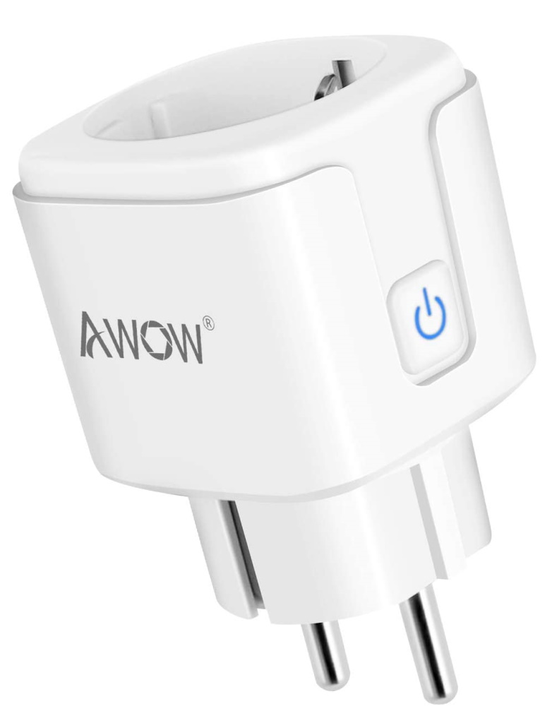
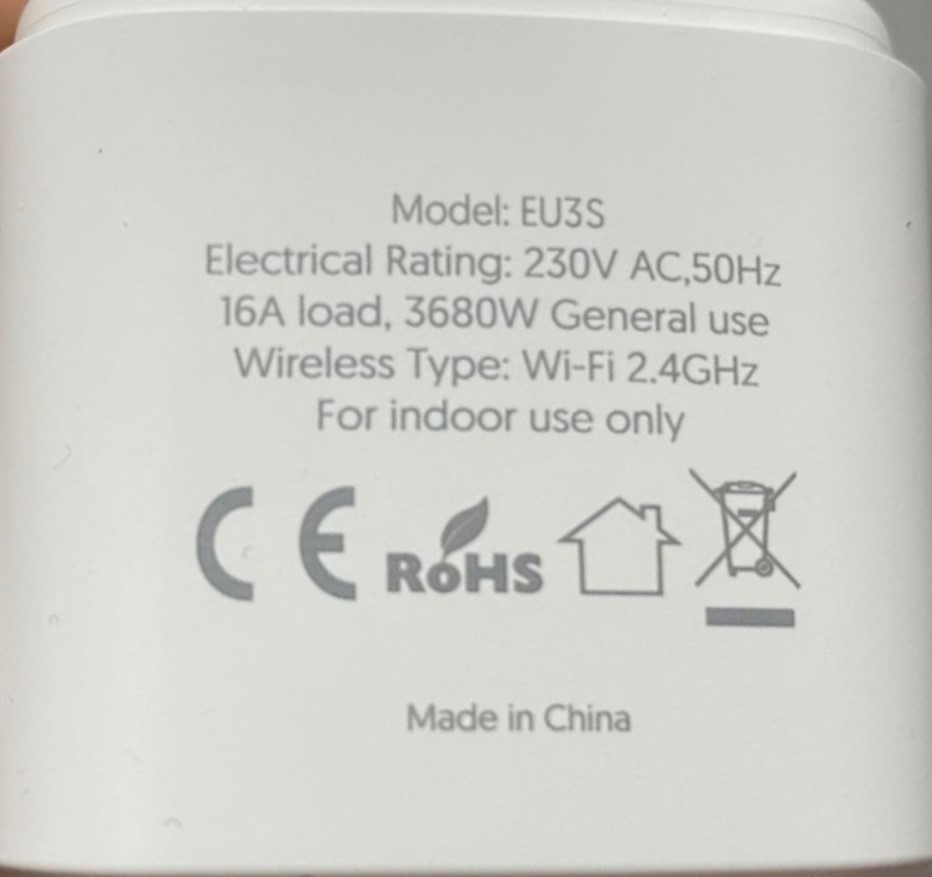

  
  

Model reference: EU3S  

- [Loetad EU3S 16A Power Monitoring Plug](https://devices.esphome.io/devices/loetad-eu3s-power-monitoring-plug/)
- [CloudFree EU Plug (P1EU)](https://devices.esphome.io/devices/cloudfree-eu-plug-p1eu/)
- Maxus Brio Head 16A Power Monitoring Plug (BRIO-W-HEAD16)
- iQtech SmartLife Power Monitoring Plug (WS020)

Manufacturer: [Awow](https://www.awow-tech.com/)

## GPIO Pinout

| Pin    | Function                   |
|--------|----------------------------|
| GPIO02 | Blue LED (Inverted: true)  |
| GPIO05 | HLW8012 CF Pin             |
| GPIO12 | HLWBL SELi Pin             |
| GPIO13 | Push Button                |
| GPIO14 | HLWBL CF1 Pin              |
| GPIO15 | Relay                      |

## Basic Config

```yaml files-config.yaml
```
