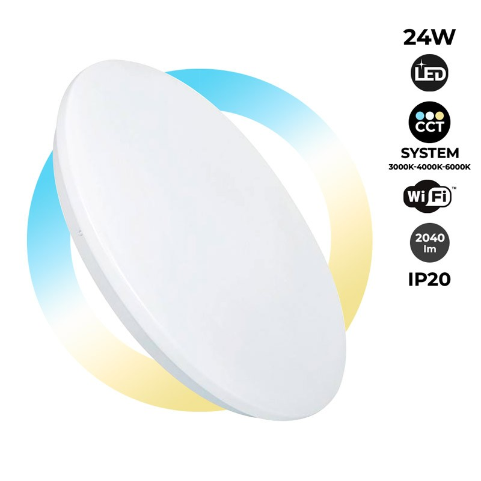
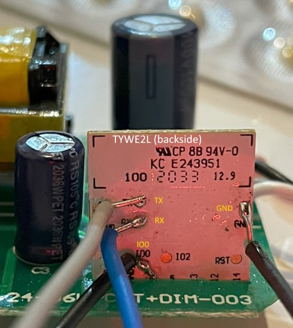

## Surface-Mounted Smart LED Ceiling Light 24W 2040lm with CCT (`B1295-SMART`)


<br />
*Product Image*

Sold by Barcelona LED in Spain. Model number B1295-SMART.

Flashing requires opening the inline driver (hence, exposure to line voltage), and soldering wires to the TYWE2L board inside.<br />
*Flashing via tuya-convert is NOT tested.*

Colour temperature range advertised on the box as 3000K to 6000K.

## GPIO Pinout

| Pin    | Function                        |
| ------ | ------------------------------- |
| GPIO12 | White temperature setting (PWM) |
| GPIO14 | Brightness setting (PWM)        |

## Flashing


<br />
*TYWE2L with soldered wires*

- Open the driver by removing the four screws on the terminal covers, and then unclipping the back plate
- Solder wires to the IO0, Tx, Rx, and GND test pads on the back of the TYWE2L board.
- Easily flashed using [esphome-flasher](https://github.com/esphome/esphome-flasher). Connect both GPIO0 and GND to GND on your USB-UART bridge (Puts device in flash mode), then Tx and Rx as required. Power the device up (CARE to avoid the live voltage lugs, traces, etc), and hit flash.
  - The device can also presumably be powered from a suitable USB-UART bridge by also soldering to the 3.3v pin (labelled as such) on the board, and powering from the bridge. This avoids having to plug the device in at the wall for flashing, and hence removes the risk of exposure to the line voltage. Not tested.
- Once flashed, desolder the wires from earlier and re-assemble the device.

## Basic Configuration

```yaml
substitutions:
  device_name: "living-room-light-1"
  friendly_name: "Living Room Light 1"

esphome:
  name: ${device_name}
  friendly_name: ${friendly_name}

esp8266:
  board: esp01_1m

wifi:
  ssid: !secret wifi_ssid
  password: !secret wifi_password

sensor:
  - platform: uptime
    name: ${friendly_name} Uptime

  - platform: wifi_signal
    name: ${friendly_name} Signal Strength

output:
  - platform: esp8266_pwm
    pin: GPIO12
    inverted: true
    id: output_temperature
  - platform: esp8266_pwm
    pin: GPIO14
    id: output_brightness

light:
  - platform: color_temperature
    name: ${friendly_name}
    color_temperature: output_temperature
    brightness: output_brightness
    cold_white_color_temperature: 6000 K
    warm_white_color_temperature: 3000 K
```
