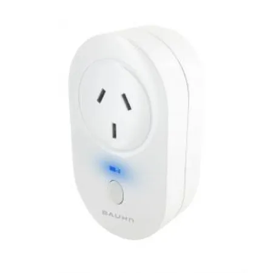

The Bauhn ASPU-1019 Smart Wall Plug is sold through ALDI in Australia.

They can be flashed without disassembly or soldering [using tuya-convert](#tuya-convert).

## GPIO Pinout

| Pin    | Function                  |
| ------ | ------------------------- |
| GPIO04 | Relay                     |
| GPIO13 | Blue LED (Inverted: true) |
| GPIO14 | Button                    |

## Getting it up and running

### Tuya Convert

These wall plugs are Tuya devices, and you can compile the below code in ESPHome, "manually install" to get the .bin file, then [use tuya-convert to initially get ESPHome onto the device](/guides/tuya-convert/). After that, you can use ESPHome's OTA functionality to make any further changes.

- Put the switch into "smartconfig" / "autoconfig" / pairing mode by holding the button for about 5 seconds until it clicks
- The status LED blinks rapidly to confirm that it has entered pairing mode.

- Be patient with tuya-convert, and you may need to try a few times to get tuya-convert to connect to the device

## Basic Configuration

```yaml
# Change the below substitutions to something you prefer, and update the number for each new device you create
substitutions:
  devicename: esphome-bauhn-plug-1
  upper_devicename: Bauhn SmartPlug 1

# BELOW IS COMMON CODE FOR ALL BAUHN ASPU-1019 PLUGS
esphome:
  name: $devicename

esp8266:
  board: esp01_1m
    
# OTA flashing
ota:
  - platform: esphome

wifi: # Your Wifi network details
  
# Enable fallback hotspot in case wifi connection fails  
  ap:

# Enabling the logging component
logger:

# Enable Home Assistant API
api:

# Enable the captive portal
captive_portal:

binary_sensor:
  - platform: gpio
    pin:
      number: GPIO14
      inverted: True
      mode: INPUT_PULLUP
    name: ${upper_devicename} Button
    filters:
      delayed_on_off: 100ms # Debouncing
    on_press:
      then:
        - switch.toggle: relay

switch:
  - platform: gpio
    pin: GPIO04
    name: ${upper_devicename} Socket
    id: relay
    restore_mode: always on
    icon: mdi:power-socket-au
    on_turn_on:
      then:
        - output.turn_on: relay2
        - output.turn_on: button_led
    on_turn_off:
      then:
        - output.turn_off: relay2
        - output.turn_off: button_led

output:
  - platform: gpio
    id: button_led
    pin:
      number: GPIO13
      inverted: True
  - platform: gpio
    id: relay2
    pin:
      number: GPIO05
```
