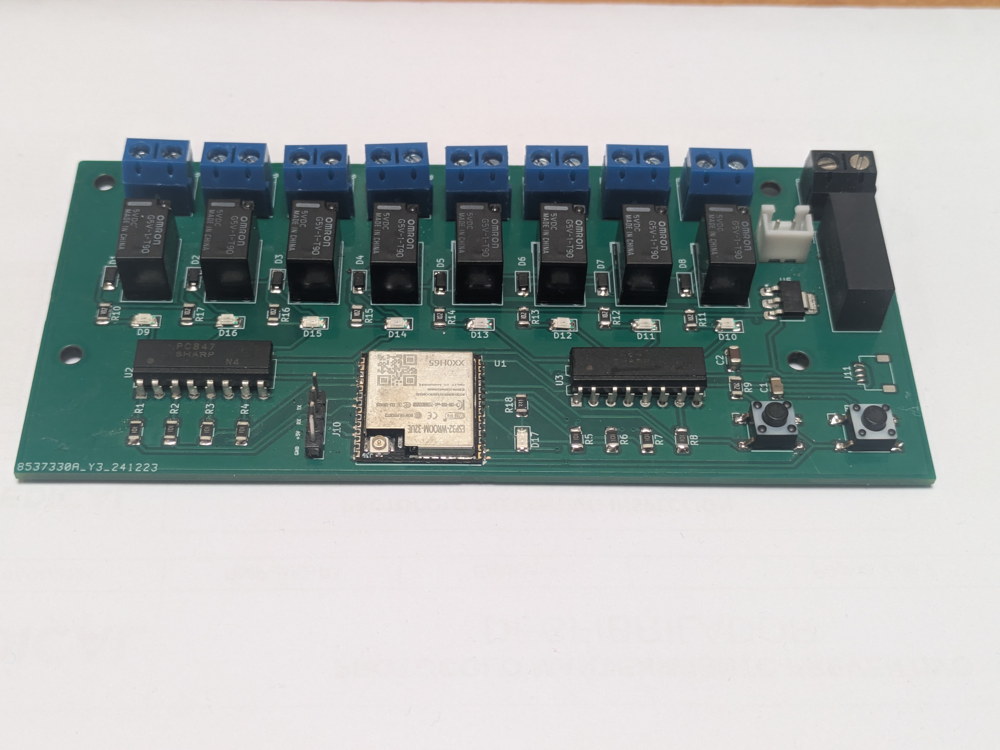

## ESP32 MultiBoard

The BeaverDam Sprinkler System is designed to bring advanced,
automated control to your irrigation system,
leveraging the power of the ESP32 microcontroller and
seamless integration with Home Assistant.

This board offers a robust and flexible platform
for managing up to 8 independent irrigation zones.
It’s engineered for reliability and ease of use,
making it ideal for both DIY enthusiasts and professional
installers looking to upgrade traditional irrigation systems to a smart,
app-controlled environment.

Is designed to be compatible with both 12V DC and 24V AC
irrigation solenoid valves, depending on the specific model
of the board. This flexibility ensures it can integrate
with a wide range of existing irrigation systems,
reducing the need for costly valve replacements.



---

### 🧩 Specifications

- **Power Supply:** 12V or 24V DC input
- **Qwiic Connector:** For I²C peripherals (3.3V)
- **8 zone valve control**
- **ESPHome Compatible:** Designed to easily integrate with ESPHome.

---

### Pinout


---

```yaml
substitutions:
  id_prefix: sprl

esphome:
  name: sprinkler
  friendly_name: Sprinkler System
  name_add_mac_suffix: true
  project:
    name: "thebeaverdam.sprinkler"
    version: "1.0"

esp32:
  board: esp32dev

  framework:
    type: esp-idf  

logger:

mdns:

# Enable Home Assistant API with auto-generated encryption key
api:

# Enable Over-The-Air updates
ota:
  - platform: esphome

# WiFi configuration with fallback hotspot
wifi:
  # Enable fallback hotspot (captive portal) if WiFi connection fails
  ap:
    ssid: "Sprinkler Setup"


# Enable captive portal for easy WiFi setup
captive_portal:

# Enable improv via serial for WiFi provisioning
improv_serial:

# Enable ESPHome dashboard adoption
dashboard_import:
  package_import_url: github://thebeaverdam/ESP32_SprinklerSystem/firmware/sprinkler.yaml
  


web_server:

sprinkler:
  - id: ${id_prefix}_sprinklers
    main_switch: "Sprinklers"
    auto_advance_switch: "Sprinklers Auto Advance"
    valves:
      - valve_switch: "Zone 1"
        enable_switch: "Enable Zone 1"
        run_duration_number:
          id: zone_1_run_duration
          name: "Zone 1 Run Duration"
          icon: "mdi:timer-outline"
          initial_value: 1
          unit_of_measurement: min
        valve_switch_id: lawn_sprinkler_valve_sw1

      - valve_switch: "Zone 2"
        enable_switch: "Enable Zone 2"
        run_duration_number:
          id: zone_2_run_duration
          name: "Zone 2 Run Duration"
          icon: "mdi:timer-outline"
          initial_value: 1
          unit_of_measurement: min
        valve_switch_id: lawn_sprinkler_valve_sw2

      - valve_switch: "Zone 3"
        enable_switch: "Enable Zone 3"
        run_duration_number:
          id: zone_3_run_duration
          name: "Zone 3 Run Duration"
          icon: "mdi:timer-outline"
          initial_value: 1
          unit_of_measurement: min
        valve_switch_id: lawn_sprinkler_valve_sw3

      - valve_switch: "Zone 4"
        enable_switch: "Enable Zone 4"
        run_duration_number:
          id: zone_4_run_duration
          name: "Zone 4 Run Duration"
          icon: "mdi:timer-outline"
          initial_value: 1
          unit_of_measurement: min
        valve_switch_id: lawn_sprinkler_valve_sw4

      - valve_switch: "Zone 5"
        enable_switch: "Enable Zone 5"
        run_duration_number:
          id: zone_5_run_duration
          name: "Zone 5 Run Duration"
          icon: "mdi:timer-outline"
          initial_value: 1
          unit_of_measurement: min
        valve_switch_id: lawn_sprinkler_valve_sw5

      - valve_switch: "Zone 6"
        enable_switch: "Enable Zone 6"
        run_duration_number:
          id: zone_6_run_duration
          name: "Zone 6 Run Duration"
          icon: "mdi:timer-outline"
          initial_value: 1
          unit_of_measurement: min
        valve_switch_id: lawn_sprinkler_valve_sw6

      - valve_switch: "Zone 7"
        enable_switch: "Enable Zone 7"
        run_duration_number:
          id: zone_7_run_duration
          name: "Zone 7 Run Duration"
          icon: "mdi:timer-outline"
          initial_value: 1
          unit_of_measurement: min
        valve_switch_id: lawn_sprinkler_valve_sw7

      - valve_switch: "Zone 8"
        enable_switch: "Enable Zone 8"
        run_duration_number:
          id: zone_8_run_duration
          name: "Zone 8 Run Duration"
          icon: "mdi:timer-outline"
          initial_value: 1
          unit_of_measurement: min
        valve_switch_id: lawn_sprinkler_valve_sw8


switch:
  - platform: gpio
    id: lawn_sprinkler_valve_sw1
    pin: GPIO19
  - platform: gpio
    id: lawn_sprinkler_valve_sw2
    pin: GPIO18
  - platform: gpio
    id: lawn_sprinkler_valve_sw3
    pin: GPIO17
  - platform: gpio
    id: lawn_sprinkler_valve_sw4
    pin: GPIO16  
  - platform: gpio
    id: lawn_sprinkler_valve_sw5
    pin: GPIO32
  - platform: gpio
    id: lawn_sprinkler_valve_sw6
    pin: GPIO33
  - platform: gpio
    id: lawn_sprinkler_valve_sw7
    pin: GPIO25
  - platform: gpio
    id: lawn_sprinkler_valve_sw8
    pin: GPIO26

  # Day toggles
  - platform: template
    id: ${id_prefix}_sunday
    name: Sunday
    entity_category: config
    optimistic: true
    restore_mode: RESTORE_DEFAULT_ON
  - platform: template
    id: ${id_prefix}_monday
    name: Monday
    entity_category: config
    optimistic: true
    restore_mode: RESTORE_DEFAULT_ON
  - platform: template
    id: ${id_prefix}_tuesday
    name: Tuesday
    entity_category: config
    optimistic: true
    restore_mode: RESTORE_DEFAULT_ON
  - platform: template
    id: ${id_prefix}_wednesday
    name: Wednesday
    entity_category: config
    optimistic: true
    restore_mode: RESTORE_DEFAULT_ON
  - platform: template
    id: ${id_prefix}_thursday
    name: Thursday
    entity_category: config
    optimistic: true
    restore_mode: RESTORE_DEFAULT_ON
  - platform: template
    id: ${id_prefix}_friday
    name: Friday
    entity_category: config
    optimistic: true
    restore_mode: RESTORE_DEFAULT_ON
  - platform: template
    id: ${id_prefix}_saturday
    name: Saturday
    entity_category: config
    optimistic: true
    restore_mode: RESTORE_DEFAULT_ON

  - platform: template
    id: ${id_prefix}_schedule1_enabled
    name: "Schedule 1 Enabled"
    entity_category: config
    optimistic: true

  # Rain delays
  - platform: template
    id: ${id_prefix}_raindelay_24h_enabled
    name: Enable 24h Rain Delay
    optimistic: true
    restore_mode: RESTORE_DEFAULT_OFF
    turn_on_action:
      - delay: 24h
      - switch.turn_off: ${id_prefix}_raindelay_24h_enabled

  - platform: template
    id: ${id_prefix}_raindelay_48h_enabled
    name: Enable 48h Rain Delay
    optimistic: true
    restore_mode: RESTORE_DEFAULT_OFF
    turn_on_action:
      - delay: 48h
      - switch.turn_off: ${id_prefix}_raindelay_48h_enabled

datetime:
  - platform: template
    name: Schedule 1 Start Time
    entity_category: config
    id: ${id_prefix}_s1t
    type: time
    optimistic: true
    restore_value: true

time:
  - platform: homeassistant
    id: ha_time
    on_time:
      - seconds: 0
        minutes: /1
        then:
          - script.execute: ${id_prefix}_check_day
    on_time_sync:
      then:
        - logger.log: "Clock synced"

script:
  - id: ${id_prefix}_check_day
    then:
      - if:
          condition:
            lambda: return id(${id_prefix}_sunday).state && id(ha_time).now().day_of_week == 1;
          then:
            - script.execute: ${id_prefix}_check_time
      - if:
          condition:
            lambda: return id(${id_prefix}_monday).state && id(ha_time).now().day_of_week == 2;
          then:
            - script.execute: ${id_prefix}_check_time
      - if:
          condition:
            lambda: return id(${id_prefix}_tuesday).state && id(ha_time).now().day_of_week == 3;
          then:
            - script.execute: ${id_prefix}_check_time
      - if:
          condition:
            lambda: return id(${id_prefix}_wednesday).state && id(ha_time).now().day_of_week == 4;
          then:
            - script.execute: ${id_prefix}_check_time
      - if:
          condition:
            lambda: return id(${id_prefix}_thursday).state && id(ha_time).now().day_of_week == 5;
          then:
            - script.execute: ${id_prefix}_check_time
      - if:
          condition:
            lambda: return id(${id_prefix}_friday).state && id(ha_time).now().day_of_week == 6;
          then:
            - script.execute: ${id_prefix}_check_time
      - if:
          condition:
            lambda: return id(${id_prefix}_saturday).state && id(ha_time).now().day_of_week == 7;
          then:
            - script.execute: ${id_prefix}_check_time

  - id: ${id_prefix}_check_time
    then:
      lambda: |-
        int hour = id(ha_time).now().hour;
        int minute = id(ha_time).now().minute;
        if (!id(${id_prefix}_raindelay_24h_enabled).state &&
            !id(${id_prefix}_raindelay_48h_enabled).state &&
            id(${id_prefix}_schedule1_enabled).state) {
          if (hour == id(${id_prefix}_s1t).hour &&
              minute == id(${id_prefix}_s1t).minute) {
            id(${id_prefix}_start_sprinklers).execute();
          }
        }

  - id: ${id_prefix}_start_sprinklers
    then:
      - sprinkler.start_full_cycle: ${id_prefix}_sprinklers
      - lambda: ESP_LOGI("main", "Sprinkler cycle started");

sensor:
  - platform: wifi_signal
    name: "WiFi Signal dB"
    id: wifi_signal_db
    update_interval: 60s
    entity_category: diagnostic

  - platform: copy
    source_id: wifi_signal_db
    name: "WiFi Signal Percent"
    filters:
      - lambda: return min(max(2 * (x + 100.0), 0.0), 100.0);
    unit_of_measurement: "%"
    entity_category: diagnostic

  - platform: uptime
    name: Uptime
    entity_category: diagnostic

  - platform: template
    name: "Tiempo restante de riego"
    id: remainig_time
    icon: "mdi:timer-sand"
    unit_of_measurement: min
    update_interval: 5s
    lambda: |-
      auto call = id(${id_prefix}_sprinklers).time_remaining_active_valve();
      if (call.has_value()) return call.value() / 60.0;
      return 0.0;

binary_sensor:
  - platform: status
    name: "Connection Status"

```
