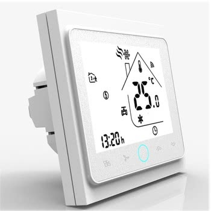

The Beca thermostats, also sold under other brand names such as MOES and Qiumi,
comprise a series of thermostats that support various configurations, including
water heating, water/gas boilers, and electric heating. Some models are
WiFi-enabled and can be configured using ESPHome. This allows you to set the
target temperature through the Climate component, as well as access internal
and external temperature sensors through the Sensor component.

## Hardware versions

The hardware comes in multiple versions, including offline-only models (those
without a built-in WiFi module), Zigbee-compatible models, and WiFi-enabled
versions.

For ESPHome, the WiFi version is required. Please note that WiFi cannot
typically be added to the offline variants after purchase due to hardware
limitations, so be extra careful when purchasing your thermostat.

Several vendors, such as Beca and MOES, include specific characteristics in the
product name. For instance, the WiFi version will include a "W" in its name,
like BHT-002-GCL**W**.

### Variants

The product name typically follows the format YYY-NNN-ZZZ (e.g. BHT-002-GCLW),
consisting of three parts: the first indicates the mode of operation (**BHT**
for heating only, **BAC** for Cooling, Heating, and Ventilation), the second
specifies the model type (e.g., 002, 006, etc.), and the third part contains
additional characteristics, including:

* **GA** - Water heating
  * Two Relays for opening and closing a valve
  * Only one Relay will be closed at the same time
  * Closing Relay PIN 1 - PIN 3 (N or L)
  * Opening Relay PIN 2 - PIN 3 (N or L)
  * Max Power: 3A
* **GB** - Electric floor Heating
  * Connect Heating between PIN 1 and PIN 2
  * Max Power: 16A
* **GC** - Water/Gas Boiler
  * One Relay - potential free (dry contact)
  * Relay on PIN 1 - PIN 2 (dry contacts)
  * Max Power: 3A
* **L**: Backlight
* **P**: Weekly programmable
* **W**: WiFi controllable
* **Z**: Zigbee controllable
* **S2**: Both internal sensor and floor external sensor
* **DB**: Dual-band (2.4 GHz/5 GHz)

### WiFi modules

The thermostats implement their WiFi functionality through a Tuya MCU WiFi
module, that communicates with the main MCU through a UART port.

Earlier models shipped with the Tuya TYWE3S module, which is an Espressif
ESP8266-based module. Later models, found in the wild since mid-2021, have
replaced the module with the Tuya WB3S module, which is based on the BK7231T
chip.

Before the advent of Beken BK72xx support in ESPHome, several users had success
by desoldering the WB3S and soldering pinout-compatible Espressif modules such
as the ESP12-E. **This is not required anymore**, as the thermostat has been
confirmed to work with the BK7231T support introduced with ESPHome 2023.9.0.

Be aware that the dual-band variants, such as the BHT-002-GCLW**DB**, ship with
the Tuya WBR3D module, utilizing the Realtek RTL8720DN chip. It's important to
note that as of late 2023, LibreTiny, and therefore ESPHome, do not offer
support for this particular chipset.

## Flashing

It is often possible to use [tuya-convert](/guides/tuya-convert/) for the
Espressif-based modules, and
[tuya-cloudcutter](https://github.com/tuya-cloudcutter/tuya-cloudcutter/)
for the Beken-based modules, to flash ESPHome over-the-air, without opening up
the thermostat.

Both of these tools rely on exploiting vulnerabilities in the stock Tuya
firmware, which may be patched in newer versions, so this may or may not work
in your firmware. It is generally advisable to not install firmware updates
through the stock smartphone application (Tuya Smart/Smart Life) as this may
patch any vulnerabilities that exist in the shipped software.

It is, however, always possible to flash the module through the serial port
pins, using [esptool](https://github.com/espressif/esptool/) for the
Espressif-based modules, or
[ltchiptool](https://github.com/libretiny-eu/ltchiptool) for the Beken-based
modules, by attaching to the UART pins on the WiFi module, and providing +3.3V
and GND directly on the module or in the separate debugging holes the main PCB
has. No desoldering is required.

## Board Configuration

```yaml
esphome:
  name: example-device
  friendly_name: Example Device
    
# OTA flashing
ota:
  - platform: esphome

wifi: # Your Wifi network details
  
# Enable fallback hotspot in case wifi connection fails  
  ap:

# Enabling the logging component
logger:

# Enable Home Assistant API
api:

# Enable the captive portal
captive_portal:

bk72xx:
  board: generic-bk7231t-qfn32-tuya

uart:
  rx_pin: RX1
  tx_pin: TX1
  baud_rate: 9600

time:
  - platform: homeassistant
    id: ha_time

tuya:
  # The MCU uses this for displaying the time in the display as well as for
  # scheduled programmes one may have configured in their thermostat.
  time_id: ha_time

  # (Optional)
  # Schedules are not modeled in neither ESPHome nor Home Assistant.
  #
  # This parses the data point and emitting it as a string in the logs, and
  # serves as an example for users desiring more advanced configurations.
  on_datapoint_update:
    - sensor_datapoint: 101
      datapoint_type: raw
      then:
        - lambda: |-
            // Apparently these vary per model; these are valid for the BHT-002
            const int POS_HOUR = 1;
            const int POS_MINUTE = 0;
            const float TEMPERATURE_MULTIPLIER = 0.5f;
            const std::map<int, std::string> DAY_OFFSET = {
                {0, "days 1-5"},
                {6, "day 6"},
                {12, "day 7"},
            };

            for (auto& day : DAY_OFFSET) {
                for (int period = 0; period < 6; period++) {
                    int offset = (day.first + period) * 3;
                    int hour = x[offset + POS_HOUR];
                    int minute = x[offset + POS_MINUTE];
                    float temp = x[offset + 2] * TEMPERATURE_MULTIPLIER;
                    ESP_LOGD("custom", "Scheduled program for %s %02d:%02d set at %.1f C", day.second.c_str(), hour, minute, temp);
              }
            }

climate:
  - platform: tuya
    name: "Thermostat"
    switch_datapoint: 1
    target_temperature_datapoint: 2
    current_temperature_datapoint: 3
    eco_datapoint: 5
    eco_temperature: 20 °C
    temperature_multiplier: 0.5
    visual:
      min_temperature: 20 °C
      max_temperature: 35 °C
      temperature_step: 0.5 °C

sensor:
  - platform: "tuya"
    name: "Temperature"
    sensor_datapoint: 3
    unit_of_measurement: "°C"
    device_class: "temperature"
    accuracy_decimals: 1
    filters:
      - multiply: 0.5
    # The climate component already includes temperature, but having the
    # temperature as a separate sensor can be useful
    disabled_by_default: true

  # The external temperature sensor, if wired
  - platform: "tuya"
    name: "Temperature (external)"
    sensor_datapoint: 102
    unit_of_measurement: "°C"
    device_class: "temperature"
    accuracy_decimals: 1
    filters:
      - multiply: 0.5
    disabled_by_default: true

switch:
  - platform: "tuya"
    name: "Lock"
    icon: "mdi:lock"
    switch_datapoint: 6

select:
  - platform: "tuya"
    name: "Scheduled programming"
    icon: "mdi:calendar"
    enum_datapoint: 4
    options:
      0: Use scheduled programs
      1: Manual control
```

## See Also

* [WThermostatBeca alternative open source firmware](https://github.com/klausahrenberg/WThermostatBeca)
* [Fork of WThermostatBeca with additional information](https://github.com/fashberg/WThermostatBeca/)
* [Detailed review by SmartHomeScene including wiring diagrams](https://smarthomescene.com/reviews/moes-zigbee-smart-thermostat-bht-002/)
