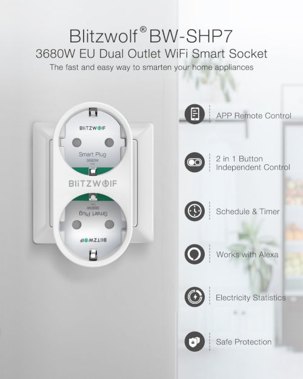
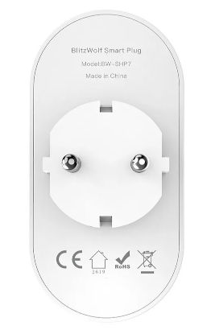

  
  
  

Model reference: BW-SHP7

Manufacturer: [BlitzWolf](https://www.blitzwolf.com/3680W-EU-Dual-WiFi-Smart-Socket-p-380.html)

## GPIO Pinout

| Pin    | Function                   |
|--------|----------------------------|
| GPIO00 | Button1 (pullup, inverted) |
| GPIO12 | Button2 (pullup, inverted) |
| GPIO13 | Red LED1(inverted)         |
| GPIO02 | Red LED2(inverted)         |
| GPIO14 | Relay1                     |
| GPIO16 | Relay2                     |
| GPIO01 | Blue LED (inverted)        |
| GPIO03 | HLW8012 - SEL              |
| GPIO04 | HLW8012 - CF               |
| GPIO05 | HLW8012 - CF1              |

## Basic Config

The configuration has some default sensors for wifi reporting etc.
Some SHP7 devices experiences unexpected reboots after few minutes from start. By adding some config for GPIO15 it is solved.

```yaml
substitutions:
  device_name: shp7
  # Higher value gives lower watt readout
  current_res: '0.002291'
  # Lower value gives lower voltage readout
  voltage_div: '940'
  # BW-SHP7, dual outlet with powermonitoring.
  # One button for each relay, and one red led for each relay, as well as a blue status led
  # Static IP is configured, and fast_connect is enabled, as the SSID is hidden
  # Webserver is active and pw protected, and the OTA is password protected

esphome:
  name: '${device_name}'

esp8266:
  board: esp8285

# OTA flashing
ota:
  - platform: esphome

wifi: # Your Wifi network details
  
# Enable fallback hotspot in case wifi connection fails  
  ap:

# Enabling the logging component
logger:
  baud_rate: 0

# Enable Home Assistant API
api:

# Enable the captive portal
captive_portal:

# Button configuration
binary_sensor:
  - platform: gpio
    id: button1
    name: button1
    internal: true
    pin:
      number: GPIO0
      mode: INPUT_PULLUP
      inverted: true
    on_press:
      - switch.toggle: relay1
  - platform: gpio
    id: button2
    name: button2
    internal: true
    pin:
      number: GPIO12
      mode: INPUT_PULLUP
      inverted: true
    on_press:
      - switch.toggle: relay2
  - platform: gpio
    pin: GPIO15
    id: gpio15_irq
    internal: true

# Setup of LED's used in displaying LED status
output:
   - platform: esp8266_pwm
     id: led1
     pin:
       number: GPIO13
       inverted: true
   - platform: esp8266_pwm
     id: led2
     pin:
       number: GPIO2
       inverted: true

# Config for switches
switch:
  - platform: gpio
    pin: GPIO14
    id: relay1
    name: 'relay1'
    on_turn_on:
      - output.turn_on: led1
    on_turn_off:
      - output.turn_off: led1
  - platform: gpio
    pin: GPIO16
    id: relay2
    name: 'relay2'
    on_turn_on:
      - output.turn_on: led2
    on_turn_off:
      - output.turn_off: led2

# Status LED for connection
status_led:
  pin:
    number: GPIO01
    inverted: true

# Sensors for WIFI signal strength, Uptime, Voltage, Current, Power, Daily energy usage
sensor:
  - platform: hlw8012
    sel_pin:
      number: GPIO03
      inverted: true
    cf_pin: GPIO04
    cf1_pin: GPIO05
    current_resistor: ${current_res}
    voltage_divider: ${voltage_div}
    current:
      name: '${device_name} current'
      unit_of_measurement: 'A'
      accuracy_decimals: 3
      icon: mdi:flash-outline
    voltage:
      name: '${device_name} voltage'
      unit_of_measurement: 'V'
      icon: mdi:flash-outline
    power:
      name: '${device_name} power'
      unit_of_measurement: 'kW'
      id: power
      accuracy_decimals: 3
      filters:
        - multiply: 0.001
      icon: mdi:flash-outline
    change_mode_every: 4
    update_interval: 10s
  - platform: total_daily_energy
    name: '${device_name} daily energy'
    power_id: power
    unit_of_measurement: kWh
    accuracy_decimals: 5
```

## Advanced config additions

Starting with ESPHome v1.16.1 the `hlw8012` platform sensor now supports energy, so we can add the following to the `hlw8012` platform sensor and get rid of the `total_daily_energy` platform sensor and the `homeassistant` time sensor:

```yaml
sensor:
  - platform: hlw8012
    energy:
      name: "${device_name} Energy"
      unit_of_measurement: "Wh"
      icon: mdi:flash-outline
```

In the esphome section, you can perform actions when the device boots:

```yaml
  on_boot:
    then:
      - switch.turn_on: relay1
#  - switch.turn_on: relay2


