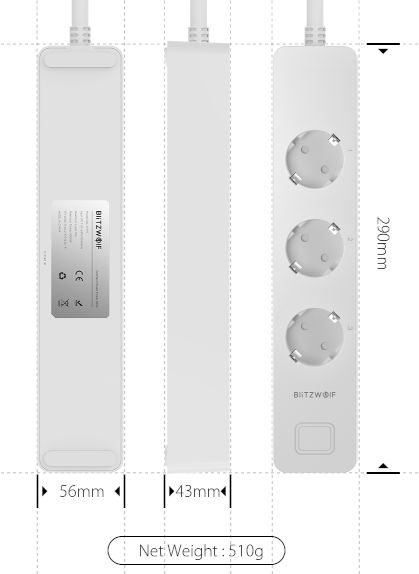
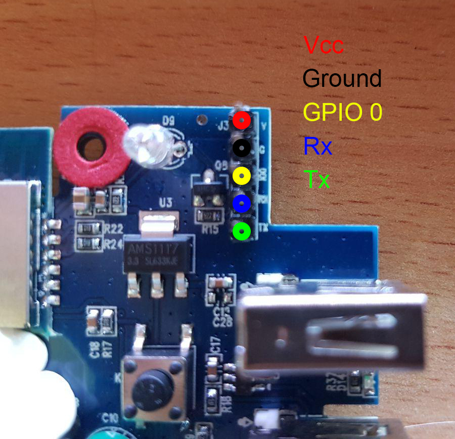

  
  

Model reference: BW-SHP9

The powerstrip has four controllable relays, one for each socket, and one for the dual 2.4A usb power.

Manufacturer: [BlitzWolf](https://www.blitzwolf.com/BlitzWolf-BW-SHP9-15A-3300W-Smart-Power-Strip---3-Outlets-EU-with-Dual-USB-2.4A-Output,-Remote-Control,-Timing-Function,-Voice-Control,-Safety-Protection-and-Indicator-Light-p-417.html)

## How to flash

1. Open

   There are 6 triangle screws to open the box.
  
  
2. Unmount circuit from the box

   6 more screws (classic ones)
  

3. Pins

   Pins are at the corner, near usb ports. **Vcc is not 3V**, it needs to be >4V.
   To configure chip for flashing GPIO0 needs to be pulled down to ground at boot.

  

## GPIO Pinout

| Pin    | Function                   |
|--------|----------------------------|
| GPIO12 | Relay1                     |
| GPIO13 | Button  (pullup, inverted) |
| GPIO14 | Relay2                     |
| GPIO05 | Relay3                     |
| GPIO15 | Relay4  (usb power)        |
| GPIO00 | Blue LED                   |

## Basic Config

The configuration has some default sensors for wifi reporting etc.
There are LED's showing the state of each socked, but they are not settable through GPIO's, they just reflect the state of the socket directly.

```yaml
substitutions:
  device_name: shp9
  # NO Powermeasurement
  # BW-SHP9
  # relay1 is set up as a lamp, and the button is controlling the relay1
  # All relays can be controlled through Esphome/HA, but the button only controls relay1
  # Wifi is set with static IP, and fast_connect is used as the SSID is hidden
  # The Web server is active, and both web_server and OTA is protected by PW.

esphome:
  name: '${device_name}'

esp8266:
  board: esp8285

wifi:
  ssid: !secret wifi_ssid
  password: !secret wifi_password
  ap:

logger:
  baud_rate: 0

api:

ota:
  password: !secret otapw

# Button configuration
binary_sensor:
  - platform: gpio
    id: button
    internal: true
    pin:
      number: GPIO13
      mode: INPUT_PULLUP
      inverted: true
    on_press:
      - light.toggle: relay1

# Config for switches
switch:
  - platform: gpio
    pin: GPIO14
    id: relay2
    name: 'livingroomextension-socket2'
  - platform: gpio
    pin: GPIO5
    id: relay3
    name: 'livingroomextension-socket3'
  - platform: gpio
    pin: GPIO15
    id: relay4
    name: 'livingroomextension-usb-socket'

# Relay1 is set up as a light
output:
  - platform: gpio
    id: light_relay
    pin: GPIO12

# Relay1 is set up as a light
light:
  - platform: binary
    id: relay1
    name: Floorlamp
    output: light_relay

# Status LED for connection
status_led:
  pin:
    number: GPIO0
```

## Advanced config additions

In the esphome section, you can perform actions when the device boots:

```yaml
  on_boot:
    then:
#  - switch.turn_on: relay1
      - switch.turn_on: relay2
      - switch.turn_on: relay3
      - switch.turn_on: relay4
```

Under wifi this can be added, this will set up static IP, allow the device to connect to a hidden SSID (fast_connect) and create a backup AP

```yaml
wifi:
  reboot_timeout: 60min
  manual_ip:
    static_ip: 192.168.1.100
    gateway: 192.168.1.1
    subnet: 255.255.255.0
  fast_connect: true

# Enable fallback hotspot (captive portal) in case wifi connection fails
  ap:
    ssid: "${device_name} Hotspot"
    password: !secret appw
```

This wll activate the internal webserver with password protection

```yaml
web_server:
  port: 80
  auth:
    username: !secret webuser
    password: !secret webpw
```

To set time locally to the same as on the HomeAssistant (better logging)

```yaml
# Sets time from Homeassistant
time:
  - platform: homeassistant
    id: homeassistant_time
```

To have different data shown for the device (ESPHome version) and the wifi. Will appear as sensors in HA.

```yaml
# Sensors for ESP version and WIFI information
text_sensor:
  - platform: version
    name: "${device_name} ESPHome Version"
  - platform: wifi_info
    ip_address:
      name: "${device_name} ip"
    ssid:
      name: "${device_name} ssid"
```

This will create sensors so that you can track wifi coverage for the devices, and also note the uptime for the devices.

```yaml
sensors:
  - platform: wifi_signal
    name: '${device_name} WiFi Signal'
    update_interval: 60s
    accuracy_decimals: 0
  - platform: uptime
    name: '${device_name} Uptime'
    unit_of_measurement: days
    update_interval: 300s
    accuracy_decimals: 1
    filters:
      - multiply: 0.000011574
```
