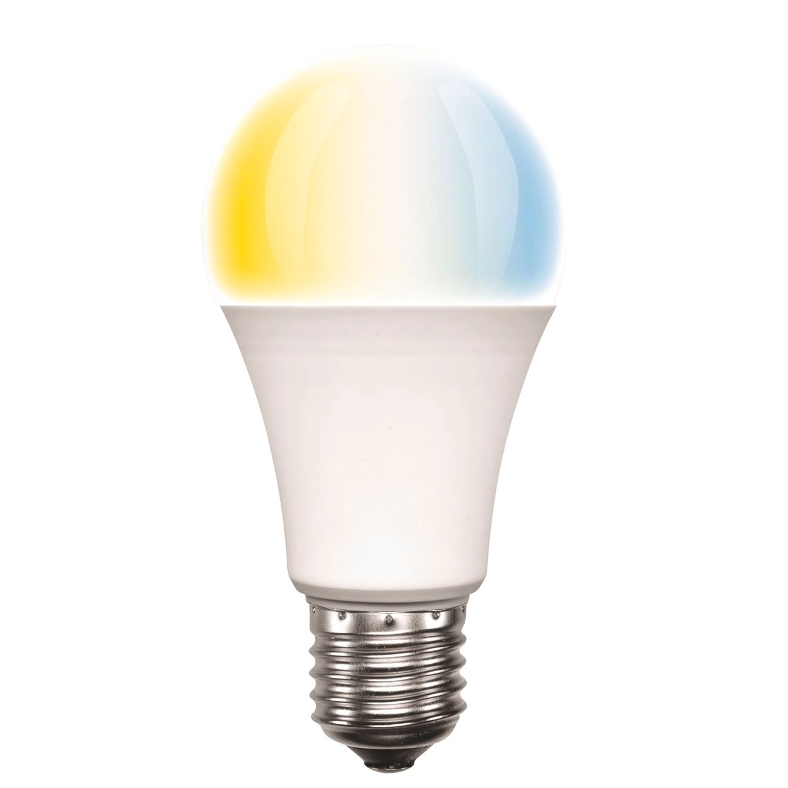

## Device Info

This light globe is sold is Australia. SKU: 20696/20874

- [Bunnings](https://www.bunnings.com.au/brilliant-8-5w-a60-e27-warm-white-daylight-led-smart-globe_p0137909)
- [OfficeWorks](https://www.officeworks.com.au/shop/officeworks/p/brilliant-lighting-smart-cct-globe-8-5w-e27-bl20874)

## GPIO Pinout

| Pin    | Function                     |
| ------ | ---------------------------- |
| GPIO12 | Warm white color temperature |
| GPIO14 | Cold white color temperature |

## Basic Configuration

```yaml
substitutions:
  device_name: brilliantsmart-cct-light
  friendly_name: BrilliantSmart CCT Light
  device_description: Brilliant Lighting BL20696 8.5W 800lm globe with CCT support.

esphome:
  name: $device_name
  comment: $device_description
  platform: ESP8266
  board: esp01_1m
  esp8266_restore_from_flash: true

logger:
api:
  password: "password"
ota:
  password: "password"
wifi:
  ssid: "wifi_ssid"
  password: "wifi_password"
  ap:
    ssid: $friendly_name
    password: "password"
captive_portal:

output:
  - platform: esp8266_pwm
    id: ww_color_temp
    pin: GPIO12
  - platform: esp8266_pwm
    id: cw_color_temp
    pin: GPIO14

light:
  - platform: cwww
    name: $friendly_name
    cold_white: cw_color_temp
    warm_white: ww_color_temp
    cold_white_color_temperature: 6500 K
    warm_white_color_temperature: 2700 K
```
