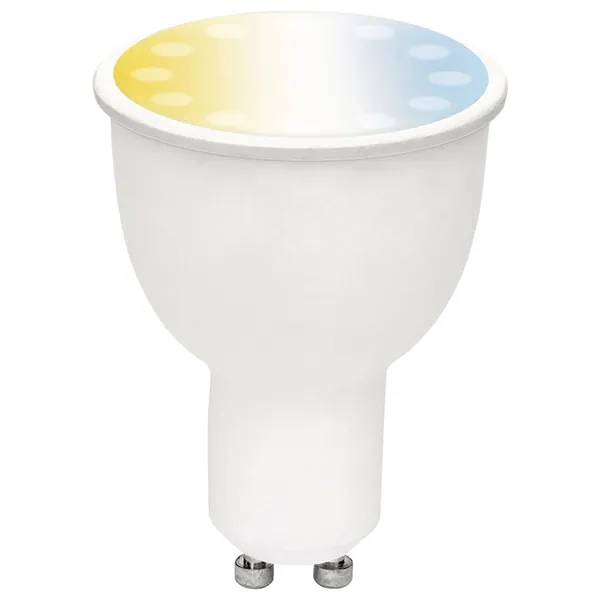

## General Notes

Brilliant Smart CCT Globe GU10 sold at OfficeWorks, part number BL20887. Provides adjustable brightness and white colour temperature (cool to warm). Based on the ESP8266 platform by way of independent PWM control of a warm LED and a cool LED. 

[https://www.officeworks.com.au/shop/officeworks/p/brilliant-smart-cct-globe-gu10-bl20887](https://www.officeworks.com.au/shop/officeworks/p/brilliant-smart-cct-globe-gu10-bl20887)



## GPIO Pinout

| Pin     | Function                           |
|---------|------------------------------------|
| GPIO5   | PWM Light - cool white             |
| GPI12   | PWM Light - warm white             |

## Basic Configuration

Notes on the configuration code:

- Best to use static IP address to ensure that the globe reconnects to the Home Assistant API quickly at power up
- Customise the `substitutions` to suit your specific needs (names, IP addresses)
- Use ESPHome secrets for passwords
- If the brightness is set too low, the globe will go out. Looking into a solution for this
- Colour temperatures in code are a guess

```yaml
substitutions:
  device_name: brilliant-gu10
  device_id: brilliant_gu10_1
  friendly_name: "Brilliant GU10"
  device_description: Brilliant Smart CCT Globe GU10 (BL20887)
  device_ip: x.x.x.x
  gateway_ip: x.x.x.x
  subnet_mask: 255.255.255.0
  dns_ip: x.x.x.x

esphome:
  name: ${device_name}
  comment: ${device_description}
  platform: ESP8266
  board: esp01_1m
  esp8266_restore_from_flash: true

logger:
api:
  password: !secret api_password
ota:
  password: !secret ota_password
wifi:
  ssid: !secret wifi_ssid
  password: !secret wifi_password
  manual_ip:
    static_ip: ${device_ip}
    gateway: ${gateway_ip}
    subnet: ${subnet_mask}
    dns1: ${dns_ip}
    
  fast_connect: on

  ap:
    ssid: ${device_name}
    password: !secret wifi_password
captive_portal:

output:
  - platform: esp8266_pwm
    id: ww_color_temp
    pin: GPIO12
  - platform: esp8266_pwm
    id: cw_color_temp
    pin: GPIO05

light:
  - platform: cwww
    name: ${friendly_name}
    id: ${device_id}
    cold_white: cw_color_temp
    warm_white: ww_color_temp
    cold_white_color_temperature: 6500 K
    warm_white_color_temperature: 2700 K
    constant_brightness: true
```
