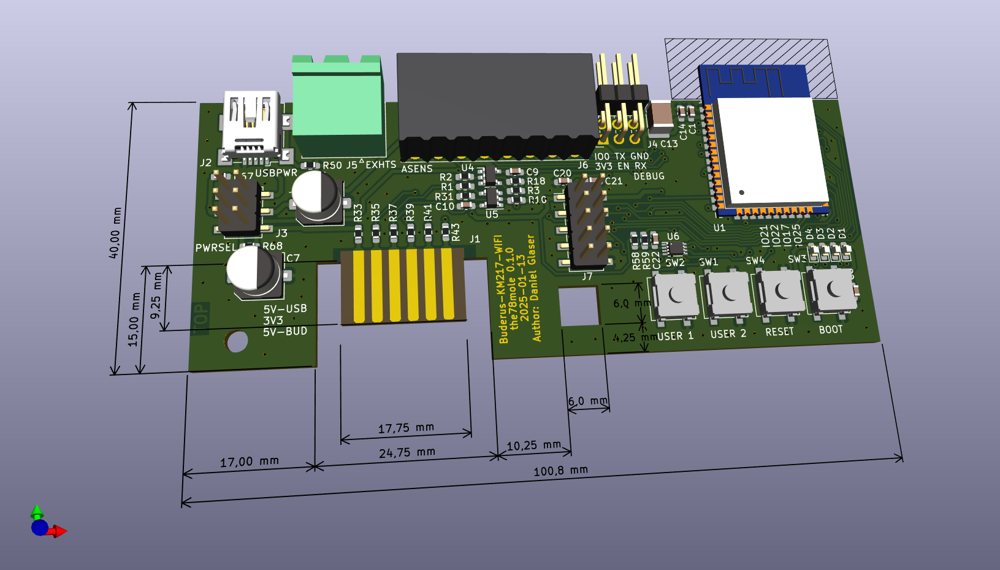

The sources for the hardware can be found in my [KM271-WiFi repo](https://github.com/the78mole/km271-wifi). There is also a [WebTools](https://the78mole.github.io/ESPhome-KM271-WiFi/) enabled project for the KM271-WiFi ESPhome variant, including the esphome firmware binaries (Releases).

    NOTE: Use the WebTools, if you just want to flash the board.

The sources for the ESPhome component can be found in my [esphome_components repo](https://github.com/the78mole/esphome_components). Maybe added to ESPhome repo somewhen.

The hardware can usually bought on [tindie](https://www.tindie.com/products/24664/) for a raesonable price (~$40).

An alternative, standalone and very sophisticated firmware can be found here on [dewenni's repo](https://github.com/dewenni/ESP_Buderus_KM271). This firmware is supports now MQTT discovery and also integrates seamlessly with Home Assistant.

