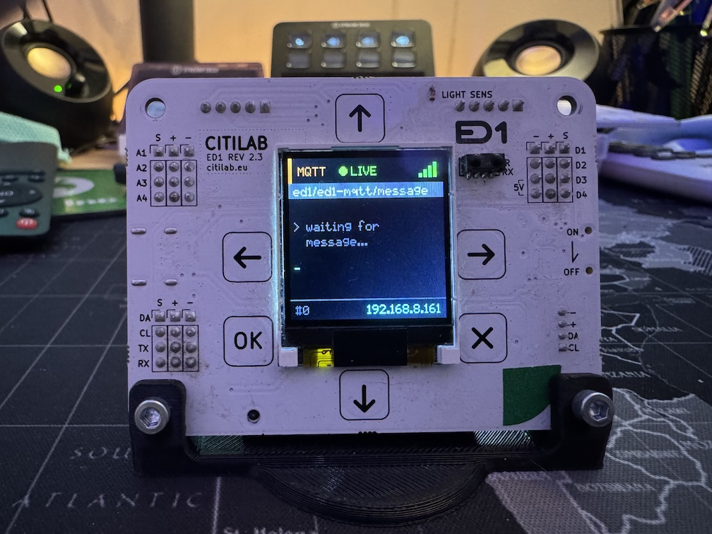

# Citilab ED1

The **ED1** is an educational development board based on the **ESP32**, created by [Citilab Edutec](https://citilab.eu). It is designed to teach embedded systems, programming, and IoT.

It features a built-in 1.44" TFT display, capacitive touch buttons, sensors (light, temperature), and expansion ports for controlling stepper motors (28BYJ-48) and WS2812 LED matrices.

<div align="center">
  
</div>

## Features

*   **MCU:** ESP32-SIP (Dual-core 240MHz, WiFi, BLE)
*   **Display:** 1.44" TFT LCD (ST7735, 128x128 pixels)
*   **Input:** 6 Capacitive Touch Buttons (Up, Down, Left, Right, OK, X)
*   **Audio:** Passive Buzzer with amplifier (PAM8301)
*   **Sensors:**
    *   Light Sensor (ALS-PT19-315C)
    *   IR Receiver (38kHz)
    *   Internal Temperature & WiFi Signal
*   **Power:** USB-C (5V) and Li-Ion Battery (16340) charger
*   **Expansion:**
    *   **Stepper Motors:** I2C Expander (MCP23009) + ULN2004A drivers for 2x 28BYJ-48 motors.
    *   **LED Matrix:** Dedicated port for WS2812 32x8 matrix.
    *   **I2C/UART:** Grove connector and pin headers.

## Configuration

The following configuration enables the display, buttons, buzzer, and basic sensors.

> **Note:** For advanced features like stepper motors (which use direct I2C register manipulation via MCP23009) or complex display layouts, consider using external packages or custom components as seen in the [project repository](https://github.com/glifocat/ed1-hoas).

```yaml
# ==============================================================================
# Citilab ED1 - Minimal ESPHome Configuration
# ==============================================================================
substitutions:
  name: ed1-board
  friendly_name: ED1 Board

esphome:
  name: ${name}
  friendly_name: ${friendly_name}
  name_add_mac_suffix: true
  project:
    name: citilab.ed1
    version: "1.0"

esp32:
  board: esp32dev
  framework:
    type: arduino

logger:
  level: INFO

api:

ota:
  - platform: esphome

wifi:
  id: wifi_component
  # Enable fallback hotspot (captive portal) in case wifi connection fails
  ap:
    ssid: "ED1-Fallback"

captive_portal:

# ==============================================================================
# Hardware Buses
# ==============================================================================

spi:
  clk_pin: GPIO18
  mosi_pin: GPIO23
  miso_pin: GPIO19

i2c:
  sda: GPIO21
  scl: GPIO22
  scan: true
  id: bus_i2c

# ==============================================================================
# Fonts (using Google Fonts - no external files needed)
# ==============================================================================

font:
  - file: "gfonts://Roboto"
    id: font_large
    size: 20
  - file: "gfonts://Roboto"
    id: font_medium
    size: 14
  - file: "gfonts://Roboto"
    id: font_small
    size: 10

# ==============================================================================
# TFT Display (ST7735 128x128)
# ==============================================================================

display:
  - platform: st7735
    id: internal_display
    cs_pin: GPIO5
    dc_pin: GPIO9
    reset_pin: GPIO10
    rotation: 0
    model: "INITR_GREENTAB"
    device_width: 128
    device_height: 128
    col_start: 2
    row_start: 3
    update_interval: 1s
    lambda: |-
      // Colors
      auto BLACK = Color(0, 0, 0);
      auto WHITE = Color(255, 255, 255);
      auto GREEN = Color(0, 255, 0);
      auto GRAY = Color(100, 100, 100);

      it.fill(BLACK);

      // Title
      it.print(64, 20, id(font_large), GREEN, TextAlign::CENTER, "ED1");

      // IP Address (if connected)
      if (id(wifi_component).is_connected()) {
         it.print(64, 50, id(font_small), WHITE, TextAlign::CENTER, id(wifi_ip).state.c_str());
      } else {
         it.print(64, 50, id(font_small), GRAY, TextAlign::CENTER, "Connecting...");
      }

      // Separator
      it.horizontal_line(10, 65, 108, GRAY);

      // Sensor readings
      if (!std::isnan(id(cpu_temp).state)) {
        it.printf(64, 75, id(font_small), WHITE, TextAlign::CENTER, "CPU: %.1fC", id(cpu_temp).state);
      }

      if (!std::isnan(id(light_sensor).state)) {
        it.printf(64, 90, id(font_small), WHITE, TextAlign::CENTER, "Light: %.0f%%", id(light_sensor).state);
      }

      // WiFi signal
      if (!std::isnan(id(wifi_signal_sensor).state)) {
        it.printf(64, 105, id(font_small), GRAY, TextAlign::CENTER, "WiFi: %.0fdBm", id(wifi_signal_sensor).state);
      }

# ==============================================================================
# Buzzer
# ==============================================================================

output:
  - platform: ledc
    pin: GPIO26
    id: buzzer_output

rtttl:
  output: buzzer_output
  id: buzzer

switch:
  - platform: template
    name: "Buzzer Test"
    id: buzzer_switch
    turn_on_action:
      - rtttl.play: "beep:d=4,o=5,b=100:c"
    turn_off_action:
      - rtttl.stop

# ==============================================================================
# Touch Buttons
# ==============================================================================

esp32_touch:
  setup_mode: false

binary_sensor:
  - platform: esp32_touch
    name: "Button Up"
    id: btn_up
    pin: GPIO4
    threshold: 500
    on_press:
      - rtttl.play: "beep:d=16,o=5,b=140:c"

  - platform: esp32_touch
    name: "Button Down"
    id: btn_down
    pin: GPIO13
    threshold: 500
    on_press:
      - rtttl.play: "beep:d=16,o=5,b=140:d"

  - platform: esp32_touch
    name: "Button Left"
    id: btn_left
    pin: GPIO2
    threshold: 500
    on_press:
      - rtttl.play: "beep:d=16,o=5,b=140:e"

  - platform: esp32_touch
    name: "Button Right"
    id: btn_right
    pin: GPIO27
    threshold: 500
    on_press:
      - rtttl.play: "beep:d=16,o=5,b=140:f"

  - platform: esp32_touch
    name: "Button OK"
    id: btn_ok
    pin: GPIO15
    threshold: 500
    on_press:
      - rtttl.play: "ok:d=8,o=5,b=160:c,e,g"

  - platform: esp32_touch
    name: "Button X"
    id: btn_x
    pin: GPIO14
    threshold: 900
    on_press:
      - rtttl.play: "alert:d=8,o=5,b=180:c,c,c"

# ==============================================================================
# Sensors
# ==============================================================================

sensor:
  - platform: wifi_signal
    name: "WiFi Signal"
    id: wifi_signal_sensor
    update_interval: 60s

  - platform: uptime
    name: "Uptime"
    id: uptime_sensor

  - platform: internal_temperature
    name: "CPU Temperature"
    id: cpu_temp

  - platform: adc
    pin: GPIO34
    name: "Light Level"
    id: light_sensor
    attenuation: 12db
    update_interval: 5s
    unit_of_measurement: "%"
    filters:
      - multiply: 30.3

text_sensor:
  - platform: wifi_info
    ip_address:
      name: "IP Address"
      id: wifi_ip
    ssid:
      name: "WiFi SSID"
```

## References

*   [Official Citilab ED1 Documentation](https://citilab.eu)
*   [ED1 Home Assistant Project (GitHub)](https://github.com/glifocat/ed1-hoas)