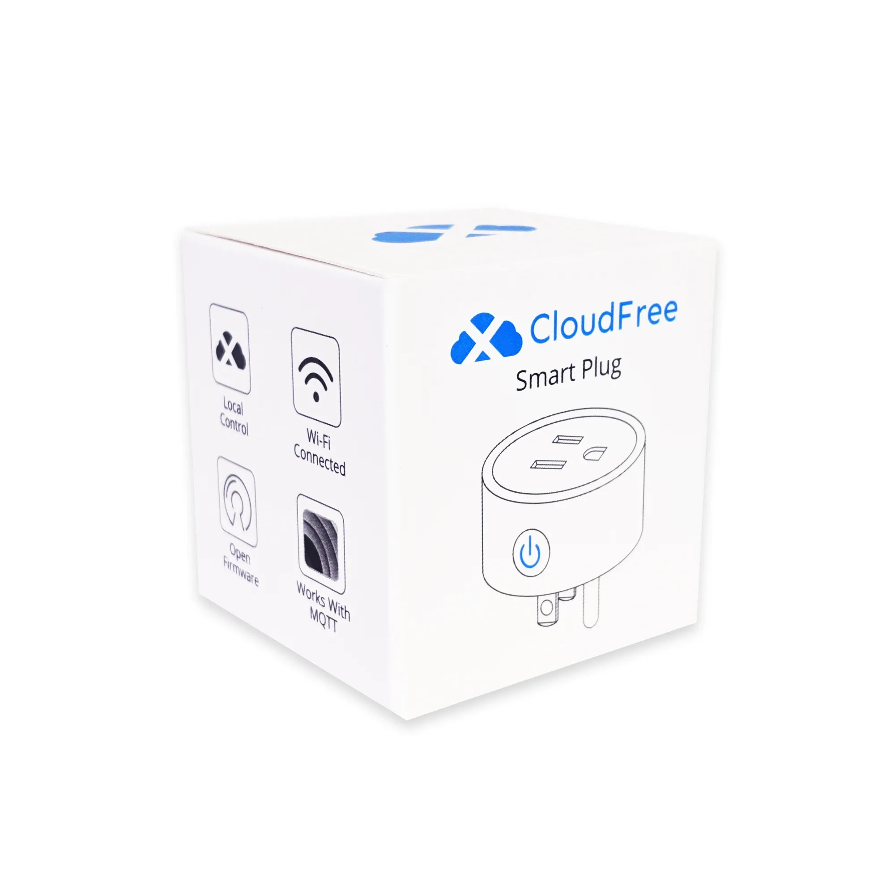

  
  

Model reference: CF-P1

Equivalent devices:

- [FrankEver FK-PW801US](../FrankEver-FK-PW801US)

Manufacturer: [CloudFree](https://cloudfree.shop/)

## GPIO Pinout

| Pin    | Function                   |
|--------|----------------------------|
| GPIO02 | Blue LED (Inverted: true)  |
| GPIO13 | Push Button                |
| GPIO15 | Relay                      |

## Basic Config

```yaml
substitutions:
  device_name: cloudfree-cf-p1
  friendly_name: CloudFree CF-P1
  device_description: CloudFree smart plug with button and blue led.

esphome:
  name: ${device_name}
  comment: ${device_description}

esp8266:
  board: esp01_1m

wifi:
  # Enable fallback hotspot (captive portal) for WiFi configuration
  ap:
    ssid: ${friendly_name}

captive_portal:

# Enable logging
logger:

# Enable Home Assistant API
api:

# Enable OTA
ota:

binary_sensor:
  - platform: gpio
    device_class: power
    id: button
    pin:
      number: GPIO13
      inverted: true
      mode: INPUT_PULLUP
    on_press:
      - switch.toggle: relay

switch:
  - platform: gpio
    name: Relay
    pin: GPIO15
    id: relay
    on_turn_on:
      - output.turn_on: led
    on_turn_off:
      - output.turn_off: led

output:
  - platform: gpio
    id: led
    pin:
      number: GPIO02
      inverted: true
```
