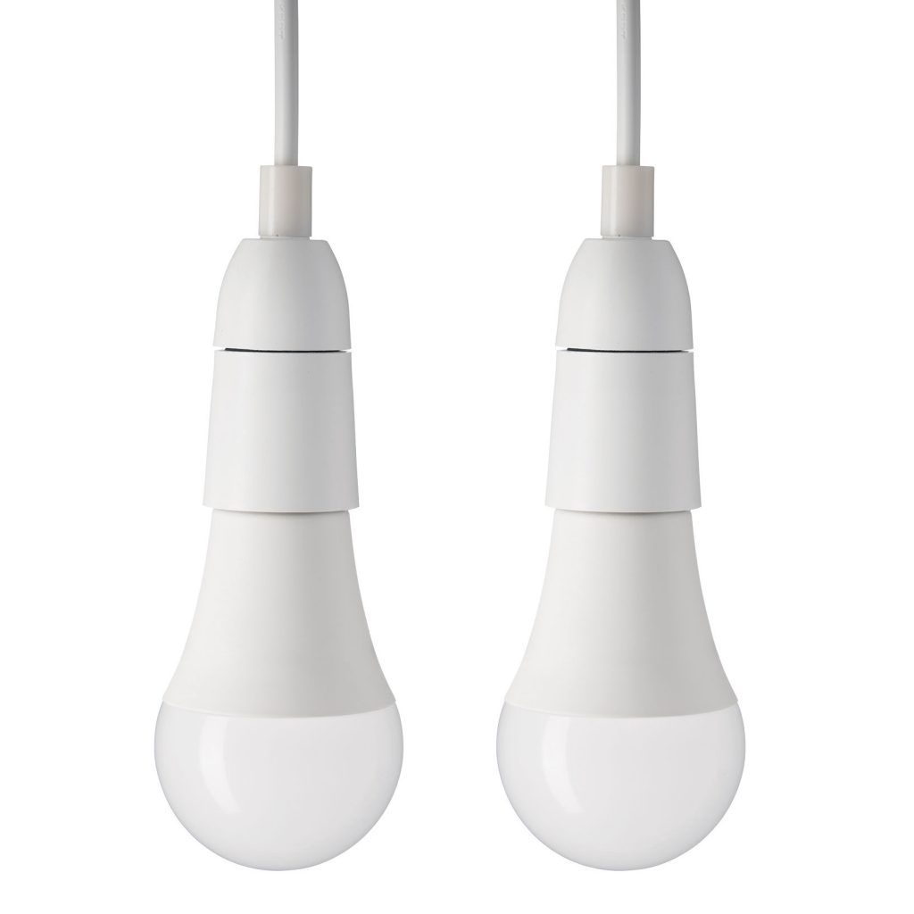

## General Notes

The Cocoon DY180363 was a RGB Smart Bulb sold at Aldi in Australia & the UK between 2020 and 2023.

The bulb had a few variants (`-E` for AU/Taiwan, and `-B` for the rest of the world), but this configuration should work for both.

[https://support.cocoonproducts.com.au/hc/en-au/sections/360000250915-Smart-LED-Light-Bulb-E27](https://support.cocoonproducts.com.au/hc/en-au/sections/360000250915-Smart-LED-Light-Bulb-E27)



## GPIO Pinout

| Pin     | Function                           |
|---------|------------------------------------|
| GPIO4   | PWM Light - red                    |
| GPIO5   | PWM Light - white                  |
| GPIO12  | PWM Light - green                  |
| GPIO14  | PWM Light - blue                   |

## Basic Configuration

Notes on the configuration code:

- Use the `mini`fied version to complete the initial flash, otherwise the compiled image will be too big for OTA.
- Then, once flashed, you can use the full example after updating the `use_address` value under `wifi:` to point to the new bulb  

### Minified Configuration

Take the output of this ESPHome build (which should be less than 500kb) and use it with [tuya-convert](https://github.com/ct-Open-Source/tuya-convert) to get a good base-flash.

```yaml
esphome:
  name: test-light
  friendly_name: 'Test Light (minified)'
  comment: 'Cocoon DY180363-E (ex-Tuya)'

esp8266:
  board: esp01_1m

# Enable logging
logger:

# Connectivity configuration
ota:
  - platform: esphome
    password: !secret ota_pass
wifi:
  ssid: !secret wifi_ssid
  password: !secret wifi_password
  fast_connect: True
web_server:
  include_internal: True
  version: 3

# GPIO Output configuration
output:
  - platform: esp8266_pwm
    id: output_red
    pin: GPIO4
  - platform: esp8266_pwm
    id: output_green
    pin: GPIO12
  - platform: esp8266_pwm
    id: output_blue
    pin: GPIO14
  - platform: esp8266_pwm
    id: output_white
    pin: GPIO5

# Core light functionality
light:
  - platform: rgbw
    name: None
    icon: mdi:light
    id: this_light
    red: output_red
    green: output_green
    blue: output_blue
    white: output_white
    color_interlock: True
    # Attempt to restore state and default to OFF if not possible to restore.
    restore_mode: RESTORE_DEFAULT_OFF
```

### Full configuration

Once your device is configured, you can use the full-configuration below to add required sensors/connectivity, etc.

```yaml
substitutions:
  friendly_name: 'Test Light' # human-readable
  device_name: 'test-light' # machine-readable; only use dashes
  description: 'Cocoon DY180363-E (ex-Tuya)'

esphome:
  name: ${device_name}
  friendly_name: ${friendly_name}
  comment: ${description}

esp8266:
  board: esp01_1m

# Enable logging
logger:

# Enable Home Assistant API
api:

# Connectivity configuration
# mqtt: # Uncomment if you're using MQTT
#   broker: !secret mqtt_broker
#   username: !secret mqtt_user
#   password: !secret mqtt_pass
#   birth_message:
#   shutdown_message:
#   will_message:
network:
  # enable_ipv6: True # Uncomment if you're using IPv6
ota:
  - platform: esphome
    password: !secret ota_pass
update:
wifi:
  ssid: !secret wifi_ssid
  password: !secret wifi_password
  fast_connect: True
  ###################################
  # Uncomment & update the below to move an existing bulb to a new OTA config:
  # Once the config is updated, you should be able to remove this and use mDNS again
  # use_address: "PREVIOUS.IP.FOR.OTA"
  ###################################
web_server:
  include_internal: True
  version: 3

# Default sensors
binary_sensor:
  - platform: status
    name: "${friendly_name} Status"
    icon: mdi:check-network-outline
sensor:
  - platform: uptime
    name: "${friendly_name} Uptime"
  - platform: wifi_signal
    id: wifi_signal_db
    name: "${friendly_name} WiFi Signal"
    icon: mdi:wifi
    update_interval: 60s
  # Reports the WiFi signal strength in % instead
  - platform: copy
    source_id: wifi_signal_db
    name: "${friendly_name} WiFi Signal Percent"
    icon: mdi:wifi
    filters:
      - lambda: return min(max(2 * (x + 100.0), 0.0), 100.0);
    unit_of_measurement: "Signal %"
    entity_category: "diagnostic"
    device_class: ""
text_sensor:
  - platform: wifi_info
    ip_address:
      name: "${friendly_name} IP Address"
      icon: mdi:ip
      # address_0:
      #   name: "${friendly_name} IP Address: 0"
      #   icon: mdi:ip-network
      # address_1:
      #   name: "${friendly_name} IP Address: 1"
      #   icon: mdi:ip-network
      # address_2:
      #   name: "${friendly_name} IP Address: 2"
      #   icon: mdi:ip-network
      # address_3:
      #   name: "${friendly_name} IP Address: 3"
      #   icon: mdi:ip-network
      # address_4:
      #   name: "${friendly_name} IP Address: 4"
      #   icon: mdi:ip-network
    dns_address:
      name: "${friendly_name} DNS Address"
      icon: mdi:ip-outline
    ssid:
      name: "${friendly_name} Connected SSID"
      icon: mdi:network
    mac_address:
      name: "${friendly_name} Mac Wifi Address"
      icon: mdi:desktop-classic
time:
  - platform: homeassistant
    id: homeassistant_time

# GPIO Output configuration
output:
  - platform: esp8266_pwm
    id: output_red
    pin: GPIO4
  - platform: esp8266_pwm
    id: output_green
    pin: GPIO12
  - platform: esp8266_pwm
    id: output_blue
    pin: GPIO14
  - platform: esp8266_pwm
    id: output_white
    pin: GPIO5

# Core light functionality
light:
  - platform: rgbw
    name: None
    icon: mdi:lightbulb
    id: this_light
    red: output_red
    green: output_green
    blue: output_blue
    white: output_white
    color_interlock: True
    effects:
      # Use default parameters:
      - strobe:
      - flicker:
      - pulse:
      - random:
      # Add some custom ones:
      - lambda:
          name: "RGB Fade"
          update_interval: 4s
          lambda: |-
            static int state = 0;
            auto call = id(this_light).turn_on();
            call.set_transition_length(3000);
            if (state == 0) {
              call.set_rgb(1.0, 0.0, 0.0);
            } else if (state == 1) {
              call.set_rgb(0.0, 1.0, 0.0);
            } else if (state == 2) {
              call.set_rgb(0.0, 0.0, 1.0);
            } else {
              call.set_rgb(1.0, 0.0, 0.0);
            }
            call.set_white(0.0);
            call.perform();
            state += 1;
            if (state == 3)
              state = 0;
      - lambda:
          name: "Pulsing Red"
          update_interval: 2s
          lambda: |-
            static int state = 0;
            auto call = id(this_light).turn_on();
            call.set_transition_length(1500);
            if (state == 0) {
              call.set_rgb(1.0, 0.0, 0.0);
              call.set_brightness(1.0);
            } else if (state == 1) {
              call.set_rgb(1.0, 0.0, 0.0);
              call.set_brightness(0.0);
            }
            call.set_white(0.0);
            call.perform();
            state += 1;
            if (state == 1)
              state = 0;
      - lambda:
          name: "Random Fade"
          update_interval: 3s
          lambda: |-
            auto call = id(this_light).turn_on();
            call.set_red_if_supported(random_float());
            call.set_green_if_supported(random_float());
            call.set_blue_if_supported(random_float());
            call.set_white_if_supported(0.0);
            call.set_transition_length_if_supported(2000);
            call.set_publish(true);
            call.set_save(false);
            call.perform();
    # Attempt to restore state and default to OFF if not possible to restore.
    restore_mode: RESTORE_DEFAULT_OFF
```
