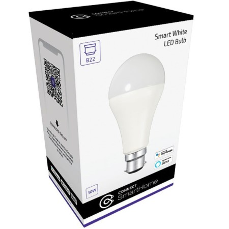

## Device Info

This Connect Smart Bulb has a B22 Bayonet fitting.

SKU: CSH-B22WW10W

**Available from:**

- [Harvey Norman](https://www.harveynorman.com.au/)
- [Laser](https://www.laserco.com.au/)

**Manufacturer:**

- [Connect SmartHome](https://connectsmarthome.com.au/product/connect-10w-smart-white-bulb-b22/)

## GPIO Pinout

| Pin    | Function                     |
| ------ | ---------------------------- |
| GPIO5  | Cold white color temperature |
| GPIO13 | Warm white color temperature |

## Basic Configuration

```yaml
substitutions:
  device_name: "csh-B22WW10W"
  friendly_name: "Connect SmartHome CSH-B22WW10W"

esphome:
  name: ${device_name}
  comment: ${friendly_name}

esp8266:
  board: esp01_1m
  restore_from_flash: true
    
# OTA flashing
ota:
  - platform: esphome

wifi: # Your Wifi network details
  
# Enable fallback hotspot in case wifi connection fails  
  ap:

# Enabling the logging component
logger:

# Enable Home Assistant API
api:

# Enable the captive portal
captive_portal:

output:
  - platform: esp8266_pwm
    id: cw_color_temp
    pin: GPIO5
  - platform: esp8266_pwm
    id: ww_color_temp
    pin: GPIO13

light:
  - platform: cwww
    name: ${friendly_name}
    cold_white: cw_color_temp
    warm_white: ww_color_temp
    cold_white_color_temperature: 6500 K
    warm_white_color_temperature: 2700 K
    effects:
      - random:
      - pulse:
      - strobe:
      - flicker:
```
