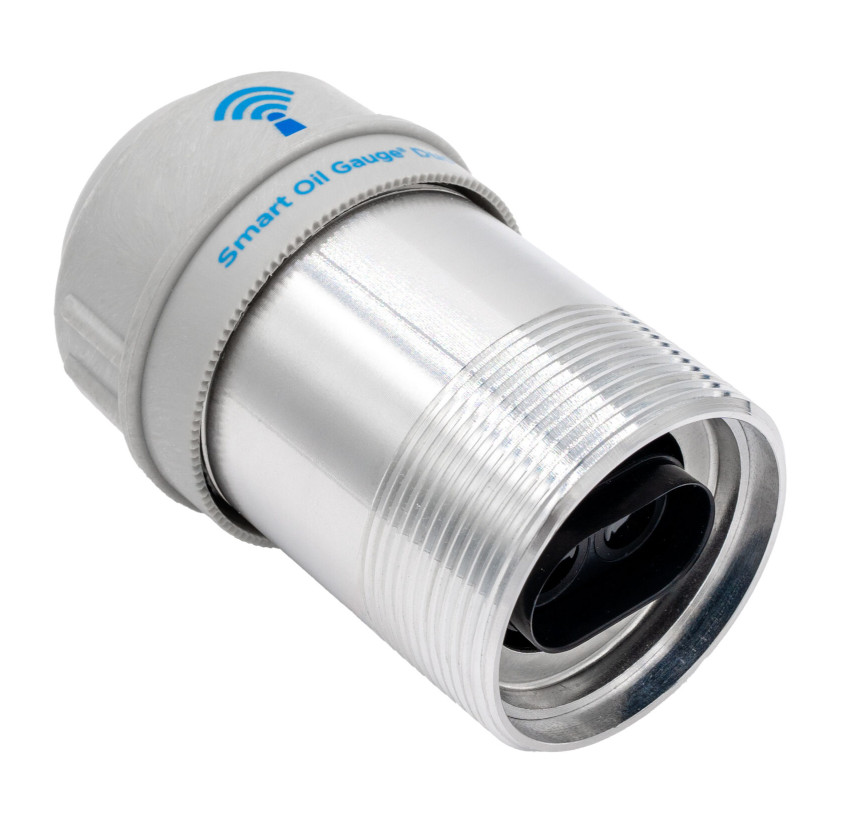
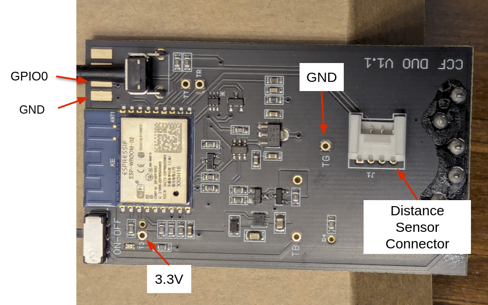
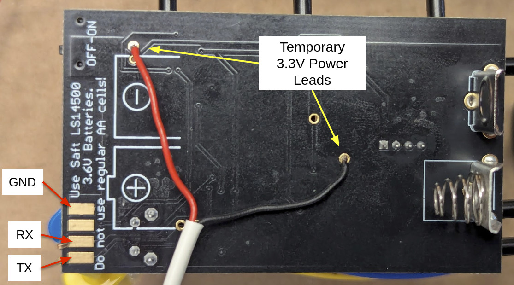
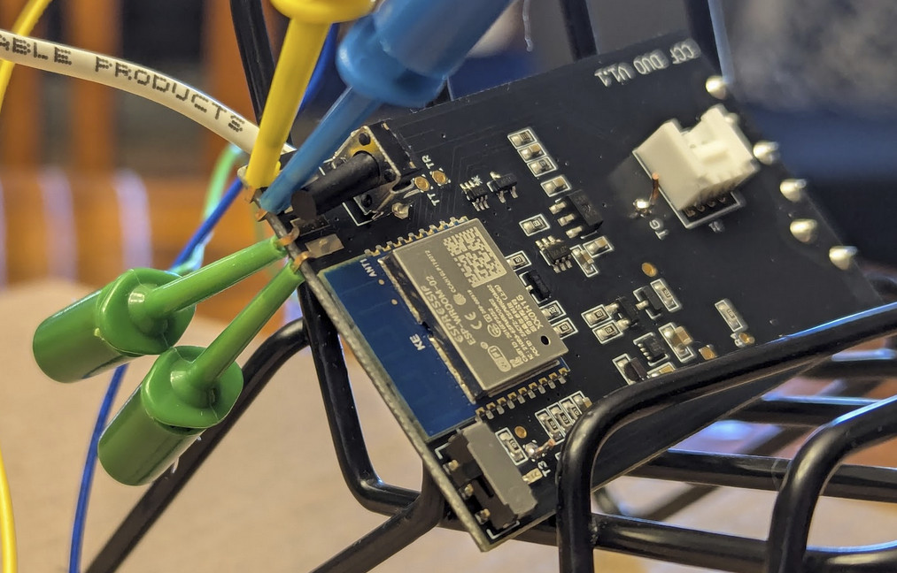
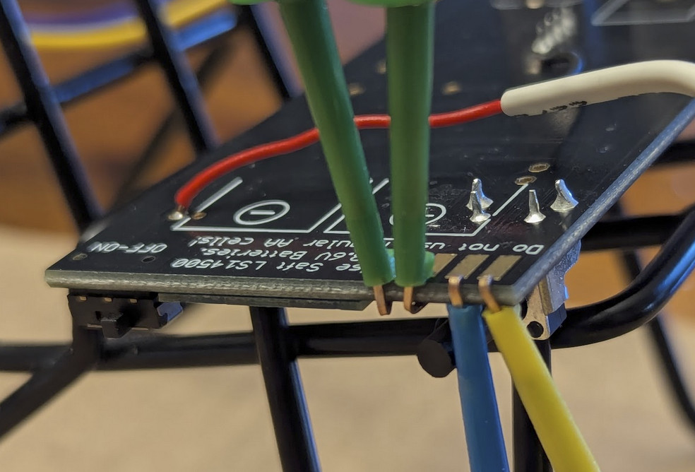

Product Page: [https://www.smartoilgauge.com/shop/product/smart-oil-gauge-duo/](https://www.smartoilgauge.com/shop/product/smart-oil-gauge-duo/)

SKU: CCF-903

## Pinout

| Pin    | Function                                 |
| ------ | ---------------------------------------- |
| GPIO14 | Ultrasonic Power                         |
| GPIO12 | Control Button (HIGH = off, LOW = on)    |
| GPIO13 | System Timer DONE (TP5111)               |
| GPIO15 | Analog Switch SELECT (SN74LVC1G3157)     |
| GPIO2  | Control Board LED (HIGH = off, LOW = on) |
| GPIO0  | UART download                            |
| GPIO16 | Connected to RST                         |
| A0     | Temperature or Battery Voltage           |
| RST    | Reset, Connected to GPIO16               |
| GPIO5  | Ultrasonic Echo (DYP-A22)                |
| TXD    | UART0_TXD                                |
| RXD    | UART0_RXD                                |
| GPIO4  | Ultrasonic Trigger (DYP-A22)             |

## Flashing

1. REMOVE THE BATTERIES!!
2. Open the internal electronics (2 screws)
3. Unplug the distance sensor
4. Remove the control board
5. Locate the contact points required for physically connecting to your device. Use the following photos for reference:
   
   
6. Solderless connections to the edge contact points can be made using hook test leads such as these:
   [https://www.sparkfun.com/hook-test-lead-set.html](https://www.sparkfun.com/hook-test-lead-set.html)
   
   
7. Follow the directions as outlined by ESPHome for physically connecting to your device:
  
[https://esphome.io/guides/physical_device_connection#physically-connecting-to-your-device](https://esphome.io/guides/physical_device_connection/)
