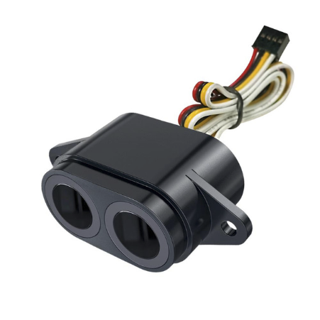
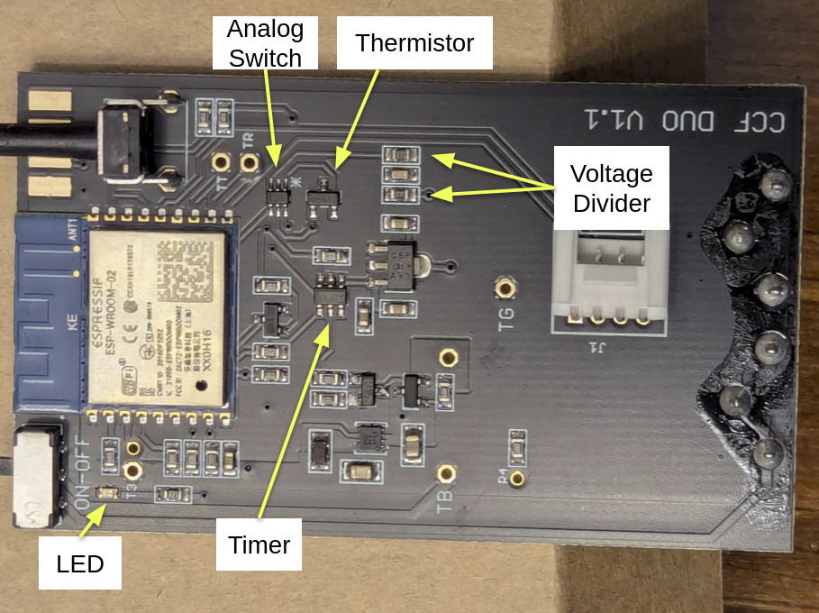

Product Page: [https://www.smartoilgauge.com/shop/product/smart-oil-gauge-duo/](https://www.smartoilgauge.com/shop/product/smart-oil-gauge-duo/)

SKU: CCF-903

## Pinout

| Pin    | Function                                 |
| ------ | ---------------------------------------- |
| GPIO14 | Ultrasonic Power                         |
| GPIO12 | Control Button (HIGH = off, LOW = on)    |
| GPIO13 | System Timer DONE (TP5111)               |
| GPIO15 | Analog Switch SELECT (SN74LVC1G3157)     |
| GPIO2  | Control Board LED (HIGH = off, LOW = on) |
| GPIO0  | UART download                            |
| GPIO16 | Connected to RST                         |
| A0     | Temperature or Battery Voltage           |
| RST    | Reset, Connected to GPIO16               |
| GPIO5  | Ultrasonic Echo (DYP-A22)                |
| TXD    | UART0_TXD                                |
| RXD    | UART0_RXD                                |
| GPIO4  | Ultrasonic Trigger (DYP-A22)             |

## Flashing

1. REMOVE THE BATTERIES!!
2. Open the internal electronics (2 screws)
3. Unplug the distance sensor
4. Remove the control board
5. Locate the contact points required for physically connecting to your device. Use the following photos for reference:
   
   
6. Solderless connections to the edge contact points can be made using hook test leads such as these:
   [https://www.sparkfun.com/hook-test-lead-set.html](https://www.sparkfun.com/hook-test-lead-set.html)
   
   
7. Follow the directions as outlined by ESPHome for physically connecting to your device:
  
[https://esphome.io/guides/physical_device_connection/](https://esphome.io/guides/physical_device_connection/)

## Setup and Configuration Notes

Be sure to modify the substitution section of the code for your specific setup: `tank_size`, `tank_orientation`, `oil_depth_offset`, `volume_calc_method`.

#### Oil Depth Offset
Used to correct the distance offset between the ultrasonic sensor's zero distance and the top of the oil tank.

The removable electronics module design of the Smart Oil Gauge Duo allows for easy access to directly measure the distance from the bottom of the tank to the surface of the oil using an appropriate measuring stick. \
`oil_depth_offset = (Oil Depth by Stick Measurement) - (Oil Depth reported by the sensor)`

#### Volume Calculation Method
The oil volume can be calculated from the oil depth either geometrically, or using a look-up table.

The Geometric Method uses geometry to calculate the volume of oil needed to fill an oil tank of somewhat standard dimensions up to the level of the measured oil depth.

The Table Method uses ESPHome's Calibrate Linear Filter to go directly from oil depth to oil volume. If the manufacturer of your tank provides an oil volume chart, it may be possible to get a more accurate oil volume measurement by inputting their chart data and using the table method.
The Basic Configuration below has chart data as published by [Fuel Snap](https://www.fuelsnap.com/heating_oil_tank_charts.php) for all configurable tank sizes. There are also links to other published oil volume charts.

#### Power Supply
It is highly recommended to use an external 6.5 to 7.4 VDC power supply. Running this code will likely deplete the
batteries faster than the stock firmware. Power leads can be soldered onto the battery contacts and pass through a hole drilled into the top cap.

#### Assembly
The oil gauge must be fully reassembled with all gaskets in place in order for the vapor seal to be maintained.

## Operation

The controller wakes every hour, sends one level reading to Home Assistant, and then powers down for another hour
waiting for the TPL5111 to power it back up.

Pressing the control button once will either wake up the controller, or power it back down.

Double pressing the control button while powered on will toggle between allowing and not allowing the automatic power
down. When the controller is on, and the automatic power down is allowed, the LED on the control board will be OFF and
briefly blink ON every second. When the controller is on, and the automatic power down is not allowed, the LED on the
control board will be ON and briefly blink OFF every second. Wait about 15 to 20 seconds after waking the controller
before attempting to disable the automatic power down. Disabling the Automatic power down gives time to flash ESPHome
code updates.

| LED Behavior                 | Controller State (Double Press Control Button to switch states)                                           |
| ---------------------------- | --------------------------------------------------------------------------------------------------------- |
| Short Blink ON every Second  | Controller is awake, after sending 3 oil volume measurements, will power down for 1 hour. (Default State) |
| Short Blink OFF every Second | Controller is awake, will continue to stay awake until restarted. Useful for reprogramming.               |

## Ultrasonic DYP-A22 with PWM Control

Datasheet:
[https://www.dypcn.com/2cm-blind-zone-ip67-high-precision-ultrasonic-sensor-product/](https://www.dypcn.com/2cm-blind-zone-ip67-high-precision-ultrasonic-sensor-product/)



The Ultrasonic sensor seems to be a DYP-A22 with PWM Control. In this configuration, the DYP-A22 operates using trigger and echo pulses
like an HC-SR04 ultrasonic distance sensor. 

## IC References

 \

### TPL5111 - Nano-Power System Timer for Power Gating

SMD Marking: ZFVX \
[https://www.ti.com/lit/ds/symlink/tpl5111.pdf](https://www.ti.com/lit/ds/symlink/tpl5111.pdf)

Power Gating of 3.3VDC to the ESP8266.\
Hardwired to restart the controller every hour.\
Timer will cut 3.3V when DONE pin goes HIGH, will wake after 1hr.

### SN74LVC1G3157 - Single-Pole Double-Throw Analog Switch

SMD Marking: C5J \
Datasheet:
[https://www.ti.com/lit/ds/symlink/sn74lvc1g3157.pdf](https://www.ti.com/lit/ds/symlink/sn74lvc1g3157.pdf)

Switches the connection to A0 (GPIO17)

| SELECT (GPIO15) | A0 (GPIO17)                  |
| --------------- | ---------------------------- |
| LOW             | Battery Voltage\*            |
| HIGH            | Temperature (MCP9700AT-E/TT) |

\*Battery Voltage is measured with a voltage divider circuit using R1= 10MOhm, R2= 1MOhm.

### MCP9700AT-E/TT - Low-Power Linear Active Thermistor IC

SMD Marking: AFST \
Datasheet:
[https://ww1.microchip.com/downloads/aemDocuments/documents/MSLD/ProductDocuments/DataSheets/MCP970X-Family-Data-Sheet-DS20001942.pdf](https://ww1.microchip.com/downloads/aemDocuments/documents/MSLD/ProductDocuments/DataSheets/MCP970X-Family-Data-Sheet-DS20001942.pdf)

## Basic Configuration

```yaml
substitutions:
  device_name: "smart-oil-gauge-duo"
  friendly_name: "Smart Oil Gauge Duo"
  Samples_Before_Sleep: '6'
  Auto_Sleep_On_dc: '2.5%'
  Auto_Sleep_Off_dc: '87%'
  ultrasonic_interval: '70ms'
  throttle_average_duration: '15s'
  skip_initial_count: '1'
  tank_size: "330" # 275, 330, 500, 550, or 1000
  tank_orientation: '1'  # 1 = Vertical,  2 = Horizontal
  volume_calc_method: '2' # 1 = Geometric, 2 = Table
  oil_depth_offset: '-0.0' # inches


### Tank Chart Sources ###
# https://www.fuelsnap.com/heating_oil_tank_charts.php
# https://www.highlandtank.com/wp-content/uploads/2018/10/highland_gauge_chart_book.pdf
# https://www.granbyindustries.com/wp-content/uploads/2017/04/GranbyInd_Capacity-Chart_VerticalTanks_USA_v1.pdf
# https://allamericanenviro.com/determine-residential-heating-oil-tank-size-home-oil-tank-size-chart/


esphome:
  name: ${device_name}
  friendly_name: ${friendly_name}
  on_boot:
    - priority: 800
      then:
        - switch.turn_off: ultrasonic_en
        - switch.turn_off: deep_sleep_trig
        - switch.turn_off: ultrasonic_pwr
        - switch.turn_off: Auto_Sleep_Disable
    - priority: -100
      then:
        - script.execute: set_tank_dimensions
        - output.turn_on: LED_pwm
        - output.set_level:
            id: LED_pwm
            level: ${Auto_Sleep_On_dc}
        - switch.turn_on: TempSens_EN  
  
  on_shutdown:
    - priority: 800
      then:
        - if:
            condition:
              - switch.is_on: deep_sleep_trig
            then:
              - lambda: 'delay(50);'
              - switch.turn_on: Done
      
esp8266:
  board: esp_wroom_02

# Enable logging
logger:
  level: DEBUG

# Enable Home Assistant API
api:
  encryption:
    key: !secret api_encryption_key_oil_gauge_duo

ota:
  - platform: esphome
    password: !secret ota_password_oil_gauge_duo

wifi:
  ssid: !secret wifi_ssid
  password: !secret wifi_password
  min_auth_mode: WPA2

  # Enable fallback hotspot (captive portal) in case wifi connection fails
  ap:
    ssid: ${device_name}
    password: !secret fallback_password_oil_gauge_duo

captive_portal:

deep_sleep:
  id: my_deep_sleep
  sleep_duration: 30s
    

globals:
  - id: Tank_Width
    type: float
    initial_value: '0'

  - id: Tank_Radius
    type: float
    initial_value: '0'

  - id: Tank_Height
    type: float
    initial_value: '0'

  - id: Tank_Length
    type: float
    initial_value: '0'

  - id: Max_Fill
    type: double
    initial_value: '0'

  - id: Tank_Orientation
    type: float
    initial_value: ${tank_orientation}

  - id: Tank_Size
    type: float
    initial_value: ${tank_size}

  - id: Measure_Count
    type: int
    initial_value: '0'

  - id: Samples_Before_Sleep
    type: int
    initial_value: ${Samples_Before_Sleep}

  - id: Volume_Calc_Method
    type: int
    initial_value: ${volume_calc_method}


switch:
  - platform: restart
    name: Reboot

  - platform: template
    name: "Ultrasonic EN"
    id: ultrasonic_en
    entity_category: "config"
    disabled_by_default: true
    optimistic: true
    on_turn_on: 
      then:
        - script.execute: ultrasonic_loop
    on_turn_off:
      then:
        - switch.turn_off: ultrasonic_pwr
  
  - platform: template
    name: "Deep Sleep Trigger"
    id: deep_sleep_trig
    optimistic: True
    on_turn_on:
      then:
        - script.stop: ultrasonic_loop
        - switch.turn_off: ultrasonic_en
        - output.turn_off: LED_pwm
        - deep_sleep.enter:
            id: my_deep_sleep
        
  - platform: template
    name: "Auto Sleep Disable"
    id: Auto_Sleep_Disable
    optimistic: True
    on_turn_on:
      - output.set_level:
          id: LED_pwm
          level: ${Auto_Sleep_Off_dc}
    on_turn_off:
      - output.set_level:
          id: LED_pwm
          level: ${Auto_Sleep_On_dc}

  - platform: gpio
    pin: GPIO15
    id: TempSens_EN
    name: "TempSens EN"
    entity_category: "config"
    disabled_by_default: true

  - platform: gpio
    pin: GPIO14
    id: ultrasonic_pwr
    name: "Ultrasonic Pwr"
    entity_category: "config"
    disabled_by_default: false
    on_turn_on:
      then:
        - delay: 3s
        - switch.turn_on: ultrasonic_en

  - platform: gpio
    pin: GPIO13 # Done Signal to TPL5111
    id: Done # Use Deep_Sleep_EN
    entity_category: "config"
    disabled_by_default: true
    name: "Done"


output:
  - platform: slow_pwm
    id: LED_pwm
    period: 1s
    pin: GPIO2
    inverted: True

binary_sensor:
  - platform: gpio
    pin:
      number: GPIO12
      inverted: true
    id: ctrl_btn
    name: "Control Button"
    on_multi_click:
      - timing:
          - ON for at most 1s
          - OFF for at most 1s
          - ON for at most 1s
          - OFF for at least 0.2s
        then:
          - switch.toggle: Auto_Sleep_Disable
      - timing:
          - ON for at most 1s
          - OFF for at least 0.5s
        then:
          - switch.turn_on: deep_sleep_trig

sensor:

  - platform: adc
    pin: A0
    name: "ADC Input"
    id: ADC_Input
    accuracy_decimals: 3
    update_interval: 5s
    entity_category: "diagnostic"
    icon: mdi:current-dc
    filters:
      - lambda: |-
          
          // Battery Voltage Divider R Values
          int R1 = 10.0;  // MOhm
          int R2 = 1.0;   // MOhm

          float offset = -1.1; // Temperature correction offset (degC)

          if (id(TempSens_EN).state){
            return (((x*1000.0)-500.0)/10.0) + offset; // Temperature Sensor (degC)
          } else {
            return (x * (R1+R2))/R2; // Battery Voltage
          }

    on_value:
      then:
        - if:
            condition:
              - switch.is_on: TempSens_EN
            then:
              - sensor.template.publish:
                  id: TempC
                  state: !lambda 'return id(ADC_Input).state;'
              - switch.turn_off: TempSens_EN
              - delay: 1s
              - switch.turn_on: ultrasonic_pwr
            else:
              - sensor.template.publish:
                  id: Batt_V
                  state: !lambda 'return id(ADC_Input).state;'

  - platform: template
    name: 'Temperature'
    id: TempC
    device_class: temperature
    update_interval: never
    state_class: measurement
    accuracy_decimals: 3
    unit_of_measurement: '°C'
    on_value:
      then:
        - component.update: VP_Oil


  - platform: template
    name: 'Battery Voltage'
    id: Batt_V
    device_class: voltage
    state_class: measurement
    update_interval: never
    accuracy_decimals: 3
    unit_of_measurement: 'V'
    icon: mdi:current-dc

  - platform: template
    name: 'Vapor Pressure Oil'
    id: VP_Oil
    update_interval: never
    device_class: pressure
    unit_of_measurement: kPa
    entity_category: "diagnostic"
    accuracy_decimals: 8
    lambda: |-
      return id(TempC).state;
    filters:
      - calibrate_linear:
          method: exact
          datapoints:
            # https://www.eng-tips.com/threads/typical-diesel-info.109718/post-424028
            # Map 0.0 (from sensor) to 1.0 (true value)
            # degC to Oil Vapor Pressure kPa
            - 4.444444444 -> 0.021373756
            - 10.0 -> 0.03102642
            - 15.55555556 -> 0.051021224
            - 21.11111111 -> 0.06205284
            - 26.66666667 -> 0.08273712
            - 32.22222222 -> 0.11031616
            - 37.77777778 -> 0.15168472

    on_value:
      then:
        - component.update: MW_Total_Vapor

  - platform: template
    id: MW_Total_Vapor
    name: 'Total Vapor MW'
    update_interval: never
    unit_of_measurement: 'kg/mol'
    entity_category: "diagnostic"
    icon: mdi:scale-unbalanced
    lambda: |-

          // Calc Molecular Weight of Vapor above Oil

          double MW_Oil = 167.31102; // g_Oil/mol_Oil  (C12H23)
          double MW_Air = 28.9639475; // g_Air/mol_Air
          
          double P_Total = 101.325; // kPa (Could use a measured pressure here)
          double P_Oil = id(VP_Oil).state; // Partial Pressure of Oil kPa
          double P_Air = P_Total - P_Oil; // Partial Pressure Of Air kPa

          double nOil_per_nTotal = P_Oil / P_Total; // mol_Oil/mol_Total
          double nAir_per_nTotal = P_Air / P_Total; // mol_Air/mol_Total

          double g_Oil_per_nTotal = nOil_per_nTotal * MW_Oil; // g_Oil/mol_Total
          double g_Air_per_nTotal = nAir_per_nTotal * MW_Air; // g_Air/mol_Total

          double MW_Total = g_Oil_per_nTotal + g_Air_per_nTotal; // g_Total/mol_Total
          MW_Total = MW_Total / 1000.0; // kg_Total/mol_Total

          return MW_Total;

    on_value:
      then:
        - component.update: Speed_of_Sound

  - platform: template
    id: Speed_of_Sound
    name: "Speed of Sound"
    unit_of_measurement: 'm/s'
    device_class: speed
    update_interval: never
    entity_category: "diagnostic"
    lambda: |-
          
          // Calc Speed of Sound in Vapor above Oil
          // https://en.wikipedia.org/wiki/Speed_of_sound
          double gamma = 1.4; // Oil is small enough fraction that large change in gamma is not expected
          double R = 8.31446261815324;
          double Sc = sqrt(gamma * R * 273.15 / id(MW_Total_Vapor).state);
          double speed_sound_m_per_s = Sc * sqrt(1+(id(TempC).state/273.15)); // ideal diatomic gas
          
          return speed_sound_m_per_s;


  - platform: ultrasonic
    trigger_pin: 
      number: GPIO4
      inverted: True
    echo_pin: GPIO5
    name: "Ultrasonic Distance"
    id: Ultrasonic_Distance
    update_interval: never
    accuracy_decimals: 4
    unit_of_measurement: 'cm'
    device_class: distance
    entity_category: "diagnostic"
    filters:
      - multiply: 100 # convert m to cm
      - median:
          window_size: 5
          send_every: 1
          send_first_at: 1
      - throttle_average: ${throttle_average_duration}
      - skip_initial: ${skip_initial_count}
    on_value:
      then:
        - sensor.template.publish:
            id: Time_of_Flight
            state: !lambda 'return x;'

  - platform: template
    id: Time_of_Flight
    name: 'Time of Flight'
    unit_of_measurement: 'ms'
    update_interval: never
    entity_category: "diagnostic"
    icon: mdi:timer-outline
    filters:
      - lambda: |-
          
          // x = cm as measured by ultrasonic sensor

          // Back Calc Time of Flight
          double ESP_speed_sound_m_per_s = 343.0;
          double distance_m = x / 100.0;
          double total_dist = distance_m * 2.0;
          double time_s = total_dist / ESP_speed_sound_m_per_s;
          double time_ms = time_s * 1000.0;
          return time_ms;
    on_value:
      then:
        - component.update: Distance_to_Oil
        - sensor.template.publish:
            id: Time_of_Flight_Avg
            state: !lambda 'return x;'
  
  - platform: template
    id: Time_of_Flight_Avg
    name: 'Time of Flight Avg'
    unit_of_measurement: 'ms'
    update_interval: never
    entity_category: "diagnostic"
    icon: mdi:timer-outline
    filters:
      - sliding_window_moving_average: 
          window_size: ${Samples_Before_Sleep}
          send_every: ${Samples_Before_Sleep}
          send_first_at: ${Samples_Before_Sleep}

  - platform: template
    id: Distance_to_Oil
    name: 'Distance to Oil'
    unit_of_measurement: 'cm'
    device_class: distance
    state_class: measurement
    update_interval: never
    icon: mdi:arrow-expand-vertical
    entity_category: "diagnostic"
    lambda: |-
      // Calc Distance to Oil Surface
      double time_s = id(Time_of_Flight).state / 1000.0;
      double speed_sound_m_per_s = id(Speed_of_Sound).state;

      double total_dist_m = time_s * speed_sound_m_per_s;

      return (total_dist_m / 2.0) * 100.0; // cm
    on_value:
      then:
        - sensor.template.publish:
            id: Oil_Depth
            state: !lambda 'return x;'

  - platform: template
    id: Oil_Depth
    name: "Oil Depth"
    unit_of_measurement: 'in'
    device_class: distance
    state_class: measurement
    update_interval: never
    icon: mdi:arrow-expand-vertical
    accuracy_decimals: 4
    filters:
      - sliding_window_moving_average: 
          window_size: ${Samples_Before_Sleep}
          send_every: ${Samples_Before_Sleep}
          send_first_at: ${Samples_Before_Sleep}
      - lambda: |-
          
          // x = speed corrected cm to oil

          double Oil_Distance = x * 10 /25.4; // cm to inches
          double Oil_Depth;

          if (id(Tank_Orientation) == 1){ // Vertical
            Oil_Depth = id(Tank_Height) - Oil_Distance;
          } else { // Horizontal
            Oil_Depth = id(Tank_Width) - Oil_Distance;
          }

          return Oil_Depth; // inches
      - offset: ${oil_depth_offset}
    on_raw_value: 
      then:
        - script.execute: Sleep_Check
    on_value:
      then:
        - if:
            condition:
              - lambda: 'return (id(Volume_Calc_Method) == 1);'  # Geometric
            then:
              - sensor.template.publish:
                  id: Oil_Area_Geo
                  state: !lambda 'return x;'
        - if:
            condition:
              - lambda: 'return (id(Volume_Calc_Method) == 2);' # Table
            then:
              - if:
                  condition:
                    - lambda: 'return (id(Tank_Size) == 500);'
                  then:
                    - sensor.template.publish:
                        id: Oil_Volume_Table_500
                        state: !lambda 'return x;'
              - if:
                  condition:
                    - lambda: 'return (id(Tank_Size) == 550);'
                  then:
                    - sensor.template.publish:
                        id: Oil_Volume_Table_550
                        state: !lambda 'return x;'
              - if:
                  condition:
                    - lambda: 'return (id(Tank_Size) == 1000);'
                  then:
                    - sensor.template.publish:
                        id: Oil_Volume_Table_1000
                        state: !lambda 'return x;'
              - if:
                  condition:
                    - lambda: 'return id(Tank_Orientation) == 1;' # Vertical
                  then:
                    - if:
                        condition:
                          - lambda: 'return (id(Tank_Size) == 330);'
                        then:
                          - sensor.template.publish:
                              id: Oil_Volume_Table_330V
                              state: !lambda 'return x;'
                    - if:
                        condition:
                          - lambda: 'return (id(Tank_Size) == 275);'
                        then:
                          - sensor.template.publish:
                              id: Oil_Volume_Table_275V
                              state: !lambda 'return x;'
                  else: # Horizontal
                      - if:
                          condition:
                            - lambda: 'return (id(Tank_Size) == 330);'
                          then:
                            - sensor.template.publish:
                                id: Oil_Volume_Table_330H
                                state: !lambda 'return x;'
                      - if:
                          condition:
                            - lambda: 'return (id(Tank_Size) == 275);'
                          then:
                            - sensor.template.publish:
                                id: Oil_Volume_Table_275H
                                state: !lambda 'return x;'


  - platform: template
    id: Oil_Area_Geo
    name: 'Oil Area Geo'
    unit_of_measurement: 'in²'
    update_interval: never
    device_class: area
    entity_category: "diagnostic"
    internal: True
    filters:
      - lambda: |-
          // Calculate the Oil Area


          // Calculate Rectangle and Arc Heights

          double Oil_Height = x; // Inches
          double Rectangle_Height = 0.0;
          double Arc_Height = 0.0;

          if (id(Tank_Orientation) == 0){ // Horizontal

            Rectangle_Height = Oil_Height;
            Arc_Height = Oil_Height;

          } else { // Vertical

            if (Oil_Height >= (id(Tank_Height) - id(Tank_Radius))) {
              Rectangle_Height = id(Tank_Height) - id(Tank_Width);
              Arc_Height = Oil_Height - Rectangle_Height;
            }

            if ((Oil_Height >= id(Tank_Radius))&&(Oil_Height < (id(Tank_Height) - id(Tank_Radius)))) {
              Rectangle_Height = Oil_Height - id(Tank_Radius);
              Arc_Height = id(Tank_Radius);
            }

            if ((Oil_Height >= 0)&&(Oil_Height < id(Tank_Radius))){
              Rectangle_Height = 0;
              Arc_Height = Oil_Height;
            }

            if (Oil_Height < 0){
              Rectangle_Height = 0;
              Arc_Height = 0;
            }
          }

          // Calculate Arc Area

          double Arc_Area;

          double d;
          double r;
          double arc;

          d = Arc_Height;
          r = id(Tank_Radius);
          arc = 2 * (acos((r-d)/r));
          Arc_Area = ((r*r) * (arc - sin(arc))) / 2;

          // Calculate Rectangle Area
          double Rectangle_Area;

          if (id(Tank_Orientation) == 1){ // Vertical
            Rectangle_Area = Rectangle_Height * id(Tank_Width);
          } else { // Horizontal
            Rectangle_Area = Rectangle_Height * (id(Tank_Height) - id(Tank_Width));
          }

          //ESP_LOGD("VarCheck", "Tank_Orientation %.15g", id(Tank_Orientation));
          //ESP_LOGD("VarCheck", "Tank_Size %.15g", id(Tank_Size));
          //ESP_LOGD("VarCheck", "Tank_Width %.15g", id(Tank_Width));
          //ESP_LOGD("VarCheck", "Tank_Height %.15g", id(Tank_Height));
          //ESP_LOGD("VarCheck", "Tank_Length %.15g", id(Tank_Length));
          //ESP_LOGD("VarCheck", "Tank_Radius %.15g", id(Tank_Radius));
          //ESP_LOGD("VarCheck", "Oil_Height %.15g", Oil_Height);
          //ESP_LOGD("VarCheck", "Arc_Height %.15g", Arc_Height);
          //ESP_LOGD("VarCheck", "Rectangle_Height %.15g", Rectangle_Height);
          //ESP_LOGD("VarCheck", "Arc_Area %.15g", Arc_Area);
          //ESP_LOGD("VarCheck", "Rectangle_Area %.15g", Rectangle_Area);

          return Rectangle_Area + Arc_Area; // Total Area in²

    on_value:
      then:
        - sensor.template.publish:
            id: Oil_Volume_Geo
            state: !lambda 'return x;'

  - platform: template
    id: Oil_Volume_Geo
    name: 'Oil Volume Geo'
    unit_of_measurement: 'gal'
    update_interval: never
    device_class: volume_storage
    internal: True
    filters: 
      - lambda: |-
          // Calculate Oil Volume in Tank
          // x = Total Area in²
          return x * id(Tank_Length) / 231; // gallons
    on_value: 
      then:
        - sensor.template.publish:
            id: Oil_Volume
            state: !lambda 'return x;'

  - platform: template
    id: Oil_Volume_Table_330V
    name: "Oil Volume FuelSnap Table"
    unit_of_measurement: 'gal'
    update_interval: never
    device_class: volume_storage
    internal: True
    accuracy_decimals: 4
    filters: 
      - calibrate_linear: # inches to Gallons
          method: exact
          datapoints:
            # https://www.fuelsnap.com/heating_oil_tank_charts.php
            # Map 0.0 (from sensor) to 1.0 (true value)
            # inches to gallons
            - 0 -> 0
            - 1 -> 2
            - 2 -> 6
            - 3 -> 11
            - 4 -> 17
            - 5 -> 23
            - 6 -> 30
            - 7 -> 38
            - 8 -> 45
            - 9 -> 53
            - 10 -> 61
            - 11 -> 70
            - 12 -> 78
            - 13 -> 87
            - 14 -> 96
            - 15 -> 104
            - 16 -> 113
            - 17 -> 121
            - 18 -> 130
            - 19 -> 139
            - 20 -> 147
            - 21 -> 156
            - 22 -> 164
            - 23 -> 173
            - 24 -> 182
            - 25 -> 190
            - 26 -> 199
            - 27 -> 207
            - 28 -> 216
            - 29 -> 225
            - 30 -> 233
            - 31 -> 242
            - 32 -> 250
            - 33 -> 259
            - 34 -> 267
            - 35 -> 275
            - 36 -> 283
            - 37 -> 291
            - 38 -> 298
            - 39 -> 305
            - 40 -> 312
            - 41 -> 318
            - 42 -> 323
            - 43 -> 326
            - 44 -> 330
    on_value:
      then:
        - sensor.template.publish:
            id: Oil_Volume
            state: !lambda 'return x;'

  - platform: template
    id: Oil_Volume_Table_330V_Highland
    name: "Oil Volume Highland Table"
    unit_of_measurement: 'gal'
    update_interval: never
    device_class: volume_storage
    internal: True
    accuracy_decimals: 4
    filters: 
      - calibrate_linear: # inches to Gallons
          method: exact
          datapoints:
            # https://www.highlandtank.com/wp-content/uploads/2018/10/highland_gauge_chart_book.pdf
            # Map 0.0 (from sensor) to 1.0 (true value)
            # inches to gallons
            - 0    -> 0
            - 1    -> 3
            - 2    -> 6
            - 3    -> 11
            - 4    -> 17
            - 5    -> 23
            - 6    -> 30
            - 7    -> 37
            - 8    -> 44
            - 9    -> 52
            - 10    -> 60
            - 11    -> 68
            - 12    -> 77
            - 13    -> 85
            - 14    -> 93
            - 15    -> 102
            - 16    -> 110
            - 17    -> 119
            - 18    -> 127
            - 19    -> 136
            - 20    -> 144
            - 21    -> 152
            - 22    -> 161
            - 23    -> 169
            - 24    -> 178
            - 25    -> 186
            - 26    -> 194
            - 27    -> 203
            - 28    -> 211
            - 29    -> 220
            - 30    -> 228
            - 31    -> 237
            - 32    -> 245
            - 33    -> 253
            - 34    -> 262
            - 35    -> 270
            - 36    -> 278
            - 37    -> 285
            - 38    -> 292
            - 39    -> 299
            - 40    -> 306
            - 41    -> 311
            - 42    -> 317
            - 43    -> 320
            - 44    -> 325
    on_value:
      then:
        - sensor.template.publish:
            id: Oil_Volume
            state: !lambda 'return x;'

  - platform: template
    id: Oil_Volume_Table_330V_AllAmerican
    name: "Oil Volume All American Table"
    unit_of_measurement: 'gal'
    update_interval: never
    device_class: volume_storage
    internal: True
    accuracy_decimals: 4
    filters: 
      - calibrate_linear: # inches to Gallons
          method: exact
          datapoints:
            # https://allamericanenviro.com/determine-residential-heating-oil-tank-size-home-oil-tank-size-chart/
            # Map 0.0 (from sensor) to 1.0 (true value)
            # inches to gallons
            - 0    -> 0
            - 1    -> 3
            - 2    -> 6
            - 3    -> 11
            - 4    -> 17
            - 5    -> 23
            - 6    -> 30
            - 7    -> 37
            - 8    -> 44
            - 9    -> 52
            - 10    -> 60
            - 11    -> 68
            - 12    -> 77
            - 13    -> 85
            - 14    -> 93
            - 15    -> 102
            - 16    -> 110
            - 17    -> 119
            - 18    -> 127
            - 19    -> 136
            - 20    -> 144
            - 21    -> 152
            - 22    -> 161
            - 23    -> 169
            - 24    -> 178
            - 25    -> 186
            - 26    -> 194
            - 27    -> 203
            - 28    -> 211
            - 29    -> 220
            - 30    -> 228
            - 31    -> 237
            - 32    -> 245
            - 33    -> 253
            - 34    -> 262
            - 35    -> 270
            - 36    -> 278
            - 37    -> 285
            - 38    -> 292
            - 39    -> 299
            - 40    -> 306
            - 41    -> 311
            - 42    -> 317
            - 43    -> 320
            - 44    -> 325
    on_value:
      then:
        - sensor.template.publish:
            id: Oil_Volume
            state: !lambda 'return x;'

  - platform: template
    id: Oil_Volume_Table_275V
    unit_of_measurement: 'gal'
    update_interval: never
    device_class: volume_storage
    internal: True
    accuracy_decimals: 4
    filters: 
      - calibrate_linear: # inches to Gallons
          method: exact
          datapoints:
            # https://www.fuelsnap.com/heating_oil_tank_charts.php
            # Map 0.0 (from sensor) to 1.0 (true value)
            # inches to gallons
            - 0    -> 0
            - 1    -> 2
            - 2    -> 5
            - 3    -> 9
            - 4    -> 14
            - 5    -> 19
            - 6    -> 25
            - 7    -> 31
            - 8    -> 37
            - 9    -> 44
            - 10    -> 51
            - 11    -> 58
            - 12    -> 65
            - 13    -> 72
            - 14    -> 80
            - 15    -> 87
            - 16    -> 94
            - 17    -> 101
            - 18    -> 108
            - 19    -> 115
            - 20    -> 123
            - 21    -> 130
            - 22    -> 137
            - 23    -> 144
            - 24    -> 151
            - 25    -> 158
            - 26    -> 166
            - 27    -> 173
            - 28    -> 180
            - 29    -> 187
            - 30    -> 194
            - 31    -> 201
            - 32    -> 209
            - 33    -> 216
            - 34    -> 223
            - 35    -> 230
            - 36    -> 236
            - 37    -> 243
            - 38    -> 249
            - 39    -> 254
            - 40    -> 260
            - 41    -> 265
            - 42    -> 269
            - 43    -> 272
            - 44    -> 275
    on_value:
      then:
        - sensor.template.publish:
            id: Oil_Volume
            state: !lambda 'return x;'

  - platform: template
    id: Oil_Volume_Table_330V_Granby
    name: "Oil Volume Granby Table"
    unit_of_measurement: 'gal'
    update_interval: never
    device_class: volume_storage
    internal: True
    accuracy_decimals: 4
    filters: 
      - calibrate_linear: # inches to Gallons
          method: exact
          datapoints:
            # https://www.granbyindustries.com/wp-content/uploads/2017/04/GranbyInd_Capacity-Chart_VerticalTanks_USA_v1.pdf
            # Map 0.0 (from sensor) to 1.0 (true value)
            # inches to gallons
            - 0    -> 0
            - 1    -> 2.1
            - 2    -> 6.0
            - 3    -> 10.8
            - 4    -> 16.5
            - 5    -> 22.8
            - 6    -> 30.2
            - 7    -> 37.5
            - 8    -> 45.2
            - 9    -> 53.2
            - 10    -> 61.4
            - 11    -> 69.8
            - 12    -> 78.3
            - 13    -> 86.9
            - 14    -> 95.5
            - 15    -> 104.1
            - 16    -> 112.7
            - 17    -> 121.3
            - 18    -> 129.9
            - 19    -> 138.5
            - 20    -> 147.1
            - 21    -> 155.7
            - 22    -> 164.3
            - 23    -> 172.9
            - 24    -> 181.5
            - 25    -> 190.1
            - 26    -> 198.7
            - 27    -> 207.3
            - 28    -> 215.9
            - 29    -> 224.5
            - 30    -> 233.1
            - 31    -> 241.7
            - 32    -> 250.3
            - 33    -> 258.8
            - 34    -> 267.2
            - 35    -> 275.4
            - 36    -> 283.4
            - 37    -> 291.7
            - 38    -> 298.4
            - 39    -> 305.3
            - 40    -> 311.7
            - 41    -> 317.5
            - 42    -> 322.5
            - 43    -> 326.4
            - 44    -> 328.6
    on_value:
      then:
        - sensor.template.publish:
            id: Oil_Volume
            state: !lambda 'return x;'
  
  - platform: template
    id: Oil_Volume_Table_275H
    unit_of_measurement: 'gal'
    update_interval: never
    device_class: volume_storage
    internal: True
    accuracy_decimals: 4
    filters: 
      - calibrate_linear: # inches to Gallons
          method: exact
          datapoints:
            # https://www.fuelsnap.com/heating_oil_tank_charts.php
            # Map 0.0 (from sensor) to 1.0 (true value)
            # inches to gallons
            - 0    -> 0
            - 1    -> 6
            - 2    -> 14
            - 3    -> 22
            - 4    -> 31
            - 5    -> 41
            - 6    -> 52
            - 7    -> 63
            - 8    -> 74
            - 9    -> 85
            - 10    -> 96
            - 11    -> 108
            - 12    -> 119
            - 13    -> 131
            - 14    -> 143
            - 15    -> 154
            - 16    -> 166
            - 17    -> 178
            - 18    -> 189
            - 19    -> 199
            - 20    -> 211
            - 21    -> 222
            - 22    -> 232
            - 23    -> 240
            - 24    -> 251
            - 25    -> 260
            - 26    -> 268
            - 27    -> 275

    on_value:
      then:
        - sensor.template.publish:
            id: Oil_Volume
            state: !lambda 'return x;'

  - platform: template
    id: Oil_Volume_Table_330H
    unit_of_measurement: 'gal'
    update_interval: never
    device_class: volume_storage
    internal: True
    accuracy_decimals: 4
    filters: 
      - calibrate_linear: # inches to Gallons
          method: exact
          datapoints:
            # https://www.fuelsnap.com/heating_oil_tank_charts.php
            # Map 0.0 (from sensor) to 1.0 (true value)
            # inches to gallons
            - 0    -> 0
            - 1    -> 7
            - 2    -> 17
            - 3    -> 27
            - 4    -> 38
            - 5    -> 49
            - 6    -> 63
            - 7    -> 75
            - 8    -> 89
            - 9    -> 102
            - 10    -> 116
            - 11    -> 129
            - 12    -> 143
            - 13    -> 157
            - 14    -> 171
            - 15    -> 185
            - 16    -> 199
            - 17    -> 213
            - 18    -> 227
            - 19    -> 238
            - 20    -> 253
            - 21    -> 266
            - 22    -> 278
            - 23    -> 287
            - 24    -> 301
            - 25    -> 312
            - 26    -> 321
            - 27    -> 330

    on_value:
      then:
        - sensor.template.publish:
            id: Oil_Volume
            state: !lambda 'return x;'

  - platform: template
    id: Oil_Volume_Table_500
    unit_of_measurement: 'gal'
    update_interval: never
    device_class: volume_storage
    internal: True
    accuracy_decimals: 4
    filters: 
      - calibrate_linear: # inches to Gallons
          method: exact
          datapoints:
            # https://www.fuelsnap.com/heating_oil_tank_charts.php
            # Map 0.0 (from sensor) to 1.0 (true value)
            # inches to gallons
            - 0    -> 0
            - 1    -> 3
            - 2    -> 7
            - 3    -> 13
            - 4    -> 20
            - 5    -> 28
            - 6    -> 36
            - 7    -> 45
            - 8    -> 55
            - 9    -> 65
            - 10    -> 75
            - 11    -> 86
            - 12    -> 98
            - 13    -> 109
            - 14    -> 121
            - 15    -> 133
            - 16    -> 146
            - 17    -> 158
            - 18    -> 171
            - 19    -> 184
            - 20    -> 197
            - 21    -> 210
            - 22    -> 223
            - 23    -> 237
            - 24    -> 250
            - 25    -> 263
            - 26    -> 276
            - 27    -> 290
            - 28    -> 303
            - 29    -> 316
            - 30    -> 329
            - 31    -> 341
            - 32    -> 354
            - 33    -> 366
            - 34    -> 379
            - 35    -> 390
            - 36    -> 402
            - 37    -> 413
            - 38    -> 424
            - 39    -> 435
            - 40    -> 445
            - 41    -> 455
            - 42    -> 464
            - 43    -> 472
            - 44    -> 480
            - 45 -> 487
            - 46 -> 493
            - 47 -> 497
            - 48 -> 500
    on_value:
      then:
        - sensor.template.publish:
            id: Oil_Volume
            state: !lambda 'return x;'

  - platform: template
    id: Oil_Volume_Table_550
    unit_of_measurement: 'gal'
    update_interval: never
    device_class: volume_storage
    internal: True
    accuracy_decimals: 4
    filters: 
      - calibrate_linear: # inches to Gallons
          method: exact
          datapoints:
            # https://www.fuelsnap.com/heating_oil_tank_charts.php
            # Map 0.0 (from sensor) to 1.0 (true value)
            # inches to gallons
            - 0    -> 0
            - 1    -> 3
            - 2    -> 8
            - 3    -> 14
            - 4    -> 22
            - 5    -> 30
            - 6    -> 40
            - 7    -> 50
            - 8    -> 60
            - 9    -> 71
            - 10    -> 83
            - 11    -> 95
            - 12    -> 108
            - 13    -> 120
            - 14    -> 134
            - 15    -> 147
            - 16    -> 161
            - 17    -> 174
            - 18    -> 188
            - 19    -> 203
            - 20    -> 217
            - 21    -> 231
            - 22    -> 246
            - 23    -> 261
            - 24    -> 275
            - 25    -> 290
            - 26    -> 304
            - 27    -> 319
            - 28    -> 333
            - 29    -> 348
            - 30    -> 362
            - 31    -> 376
            - 32    -> 390
            - 33    -> 403
            - 34    -> 417
            - 35    -> 430
            - 36    -> 443
            - 37    -> 455
            - 38    -> 467
            - 39    -> 479
            - 40    -> 490
            - 41    -> 501
            - 42    -> 511
            - 43    -> 520
            - 44    -> 528
            - 45 -> 536
            - 46 -> 542
            - 47 -> 548
            - 48 -> 550
    on_value:
      then:
        - sensor.template.publish:
            id: Oil_Volume
            state: !lambda 'return x;'

  - platform: template
    id: Oil_Volume_Table_1000
    unit_of_measurement: 'gal'
    update_interval: never
    device_class: volume_storage
    internal: True
    accuracy_decimals: 4
    filters: 
      - calibrate_linear: # inches to Gallons
          method: exact
          datapoints:
            # https://www.fuelsnap.com/heating_oil_tank_charts.php
            # Map 0.0 (from sensor) to 1.0 (true value)
            # inches to gallons
            - 0    -> 0
            - 1    -> 5
            - 2    -> 14
            - 3    -> 26
            - 4    -> 40
            - 5    -> 55
            - 6    -> 72
            - 7    -> 90
            - 8    -> 110
            - 9    -> 130
            - 10    -> 151
            - 11    -> 173
            - 12    -> 195
            - 13    -> 219
            - 14    -> 243
            - 15    -> 267
            - 16    -> 292
            - 17    -> 317
            - 18    -> 342
            - 19    -> 368
            - 20    -> 394
            - 21    -> 420
            - 22    -> 447
            - 23    -> 473
            - 24    -> 500
            - 25    -> 526
            - 26    -> 553
            - 27    -> 579
            - 28    -> 605
            - 29    -> 631
            - 30    -> 657
            - 31    -> 683
            - 32    -> 708
            - 33    -> 733
            - 34    -> 757
            - 35    -> 781
            - 36    -> 804
            - 37    -> 827
            - 38    -> 849
            - 39    -> 870
            - 40    -> 890
            - 41    -> 909
            - 42    -> 927
            - 43    -> 944
            - 44    -> 960
            - 45 -> 974
            - 46 -> 985
            - 47 -> 994
            - 48 -> 1000
    on_value:
      then:
        - sensor.template.publish:
            id: Oil_Volume
            state: !lambda 'return x;'

  - platform: template
    id: Oil_Volume
    name: "Oil In Tank"
    unit_of_measurement: 'gal'
    update_interval: never
    device_class: volume_storage
    state_class: measurement
    accuracy_decimals: 4
    on_value:
      then:
        - sensor.template.publish:
            id: Max_Refill_Volume
            state: !lambda 'return x;'


  - platform: template
    id: Max_Refill_Volume
    name: "Max Fill"
    unit_of_measurement: 'gal'
    device_class: volume
    state_class: total
    update_interval: never
    accuracy_decimals: 4
    filters:
      - lambda: |-
          // x = Oil Volume in Tank gallons
          
          double Max_Refill = id(Max_Fill) - x;
          return Max_Refill;


script:


  - id: ultrasonic_loop
    mode: restart
    then:
      - delay: ${ultrasonic_interval}
      - while:
          condition:
            switch.is_on: ultrasonic_en
          then:
            - component.update: Ultrasonic_Distance #Oil_In_Tank
            - delay: ${ultrasonic_interval}

  - id: Sleep_Check
    then:
      - if:
          condition:
            - switch.is_on: Auto_Sleep_Disable
          then:
            - globals.set:
                id: Measure_Count
                value: '0'
          else:
            - globals.set:
                id: Measure_Count
                value: !lambda 'return id(Measure_Count) += 1;'
            - if:
                condition:
                  - lambda: 'return id(Measure_Count) > id(Samples_Before_Sleep);'
                then:
                  - switch.turn_on: deep_sleep_trig
      - lambda: 'ESP_LOGD("MeasureCount", "%i", id(Measure_Count));'


 # Tank Dimensions:
 # https://www.fuelsnap.com/heating_oil_tank_charts.php

  - id: set_tank_dimensions
    then:
      - lambda: |-
          if (id(Tank_Size) == 275){
              id(Max_Fill) = 250.0;
              id(Tank_Width) = 27.8;
              id(Tank_Height) = 44.0;
              id(Tank_Length) = 60.0;
          }
          if (id(Tank_Size) == 330){
              id(Max_Fill) = 300.0;
              id(Tank_Width) = 27.8;
              id(Tank_Height) = 44.0;
              id(Tank_Length) = 72;
          }
          if (id(Tank_Size) == 500){
              id(Max_Fill) = 450.0;
              id(Tank_Width) = 48.0;
              id(Tank_Height) = 48.0;
              id(Tank_Length) = 63.8;
          }
          if (id(Tank_Size) == 550){
              id(Max_Fill) = 500.0;
              id(Tank_Width) = 48.0;
              id(Tank_Height) = 48.0;
              id(Tank_Length) = 70.25;
          }
          if (id(Tank_Size) == 1000){
              id(Max_Fill) = 900.0;
              id(Tank_Width) = 48.0;
              id(Tank_Height) = 48.0;
              id(Tank_Length) = 127.6;
          }

          id(Tank_Radius) = id(Tank_Width)/2.0;
```


