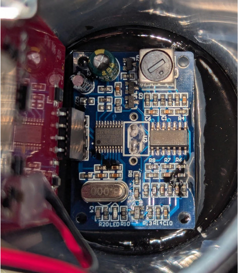

Product Page: https://www.smartoilgauge.com/shop/product/ccf901i/

SKU: CCF-901

## Pinout

| Pin    | Function                                 |
| ------ | ---------------------------------------- |
| GPIO14 | Ultrasonic Power                         |
| GPIO12 | Control Button (HIGH = off, LOW = on)    |
| GPIO13 | System Timer DONE (TP5111)               |
| GPIO15 | Analog Switch SELECT (SN74LVC1G3157)     |
| GPIO2  | Control Board LED (HIGH = off, LOW = on) |
| GPIO0  | UART download                            |
| GPIO16 | Connected to RST                         |
| A0     | Temperature or Battery Voltage           |
| RST    | Reset, Connected to GPIO16               |
| GPIO5  | Ultrasonic Echo (JSN-SR04T)              |
| TXD    | UART0_TXD                                |
| RXD    | UART0_RXD                                |
| GPIO4  | Ultrasonic Trigger (JSN-SR04T)           |

## Flashing

1) REMOVE THE BATTERIES!!
2) Remove the control board
3) Locate the contact points required for Physically Connecting to your Device: \
    \
    \
4) Solderless connections to the contact point can be made using IC Hook Test Leads such as these: \
   https://www.sparkfun.com/ic-hook-test-leads.html \
    \
    \
5) Follow the directions as outlined by Esphome for Physically Connecting to your Device: \
   https://esphome.io/guides/physical_device_connection#physically-connecting-to-your-device \

## Operation

Note: Be sure to modify the substitution section of the code for your tank_size and tank_orientation. \
It is highly recommended to use an external 6.5 to 7.4 VDC power supply. Running this code will likely deplete the batteries faster than the stock firmware.

The controller wakes every hour, sends three level readings to Home Assistant, and then powers down for another hour waiting for the TPL5111 to power it back up.

Pressing the control button once will either wake up the controller, or power it back down.

Double pressing the control button while powered on will toggle between allowing and not allowing the automatic power down. When the controller is on, and the automatic power down is allowed, the LED on the control board will be OFF and briefly blink ON every second. When the controller is on, and the automatic power down is not allowed, the LED on the control board will be ON and briefly blink OFF every second. Wait about 15 to 20 seconds after waking the controller before attempting to disable the automatic power down. Disabling the Automatic power down gives time to flash Esphome code updates.

| LED Behavior                 | Controller State (Double Press Control Button to switch states)                                           |
| ---------------------------- | --------------------------------------------------------------------------------------------------------- |
| Short Blink ON every Second  | Controller is awake, after sending 3 oil volume measurements, will power down for 1 hour. (Default State) |
| Short Blink OFF every Second | Controller is awake, will continue to stay awake until restarted. Useful for reprogramming.               |

## Ultrasonic JSN-SR04T

Datasheet: https://components101.com/sites/default/files/component_datasheet/JSN-SR04-Datasheet.pdf \
 \
The Ultrasonic JSN-SR04T is configured with R27 open. This causes the JSN-SR04T to operate using Trigger and Echo Pulses like an HC-SR04 Ultrasonic Distance Sensor.

## IC References

 \

### TPL5111 - Nano-Power System Timer for Power Gating

SMD Marking: ZFVX \
https://www.ti.com/lit/ds/symlink/tpl5111.pdf?ts=1739630376626&ref_url=https%253A%252F%252Fwww.google.com%252F

Power Gating of 3.3VDC to the ESP8266.\
Hardwired to restart the controller every hour.\
Timer will cut 3.3V when DONE pin goes HIGH, will wake after 1hr.

### SN74LVC1G3157 - Single-Pole Double-Throw Analog Switch

SMD Marking: C5F \
Datasheet: https://www.ti.com/lit/ds/symlink/sn74lvc1g3157.pdf?ts=1740393486499

Switches the connection to A0 (GPIO17)
| SELECT (GPIO15) | A0 (GPIO17)                  |
| --------------- | ---------------------------- |
| LOW             | Battery Voltage*             |
| HIGH            | Temperature (MCP9700AT-E/TT) |

*Battery Voltage is measured with a voltage divider circuit using R1= 10MOhm, R2= 1MOhm.

### MCP9700AT-E/TT - Low-Power Linear Active Thermistor IC

SMD Marking: AFT3 \
Datasheet: https://ww1.microchip.com/downloads/aemDocuments/documents/MSLD/ProductDocuments/DataSheets/MCP970X-Family-Data-Sheet-DS20001942.pdf

## Basic Configuration

```yaml
substitutions:
  device_name: "smart-oil-gauge"
  friendly_name: "Smart Oil Gauge"
  Samples_Before_Sleep: '3'
  Auto_Sleep_On_dc: '2.5%'
  Auto_Sleep_Off_dc: '87%'
  ultrasonic_interval: '250ms'
  tank_size: "330" # 275, 330, 500, 550, or 1000
  tank_orientation: '1'  # 1 = Vertical,  2 = Horizontal

esphome:
  name: ${device_name}
  friendly_name: ${friendly_name}
  on_boot:
    - priority: 800
      then:
        - switch.turn_off: ultrasonic_en
        - switch.turn_off: deep_sleep_trig
        - switch.turn_off: VarCheck
        - switch.turn_off: ultrasonic_pwr
        - switch.turn_off: Auto_Sleep_Disable
    - priority: -100
      then:
        - script.execute: set_tank_dimensions
        - output.turn_on: LED_pwm
        - output.set_level:
            id: LED_pwm
            level: ${Auto_Sleep_On_dc}
        - switch.turn_on: TempSens_EN

  on_shutdown:
    then:
      - switch.turn_off: ultrasonic_en
      - output.turn_off: LED_pwm
      - if:
          condition:
            - switch.is_on: deep_sleep_trig
          then:
            - switch.turn_on: sleep_1hr

esp8266:
  board: esp_wroom_02

# Enable logging
logger:

# Enable Home Assistant API
api:
  encryption:
    key: !secret api_encryption_key

ota:
  - platform: esphome
    password: !secret ota_password

wifi:
  ssid: !secret wifi_ssid
  password: !secret wifi_password

  # Enable fallback hotspot (captive portal) in case wifi connection fails
  ap:
    ssid: ${device_name}
    password: !secret fallback_password

captive_portal:

deep_sleep:
  id: my_deep_sleep
  sleep_duration: 30s

globals:
  - id: Tank_Width
    type: float
    initial_value: '0'

  - id: Tank_Radius
    type: float
    initial_value: '0'

  - id: Tank_Height
    type: float
    initial_value: '0'

  - id: Tank_Length
    type: float
    initial_value: '0'

  - id: Oil_Height
    type: double
    initial_value: '0'

  - id: Rectangle_Height
    type: double
    initial_value: '0'

  - id: Arc_Height
    type: double
    initial_value: '0'

  - id: Rectangle_Area
    type: double
    initial_value: '0'

  - id: Arc_Area
    type: double
    initial_value: '0'

  - id: Total_Area
    type: double
    initial_value: '0'

  - id: Oil_In_Tank
    type: double
    initial_value: '0'

  - id: Max_Fill
    type: double
    initial_value: '0'

  - id: Tank_Orientation
    type: float
    initial_value: ${tank_orientation}

  - id: Tank_Size
    type: float
    initial_value: ${tank_size}

  - id: Measure_Count
    type: int
    initial_value: '0'

  - id: Samples_Before_Sleep
    type: int
    initial_value: ${Samples_Before_Sleep}

switch:
  - platform: restart
    name: Reboot

  - platform: template
    name: "Ultrasonic EN"
    id: ultrasonic_en
    entity_category: "config"
    disabled_by_default: true
    optimistic: true
    on_turn_on:
      then:
        - script.execute: ultrasonic_loop
    on_turn_off:
      then:
        - switch.turn_off: ultrasonic_pwr

  - platform: template
    name: "Deep Sleep Trigger"
    id: deep_sleep_trig
    optimistic: True
    on_turn_on:
      then:
        - script.stop: ultrasonic_loop
        - switch.turn_off: ultrasonic_en
        - deep_sleep.enter:
            id: my_deep_sleep

  - platform: template
    name: "Auto Sleep Disable"
    id: Auto_Sleep_Disable
    optimistic: True
    on_turn_on:
      - output.set_level:
          id: LED_pwm
          level: ${Auto_Sleep_Off_dc}
    on_turn_off:
      - output.set_level:
          id: LED_pwm
          level: ${Auto_Sleep_On_dc}

  - platform: template
    name: "Variable Check"
    entity_category: "config"
    id: VarCheck
    optimistic: True

  - platform: gpio
    pin: GPIO15
    id: TempSens_EN
    name: "TempSens EN"
    entity_category: "config"
    disabled_by_default: true

  - platform: gpio
    pin: GPIO14
    id: ultrasonic_pwr
    name: "Ultrasonic Pwr"
    entity_category: "config"
    disabled_by_default: false
    on_turn_on:
      then:
        - delay: 5s
        - switch.turn_on: ultrasonic_en

  - platform: gpio
    pin: GPIO13 # Done Signal to TPL5111
    id: sleep_1hr # Use Deep_Sleep_EN
    entity_category: "config"
    disabled_by_default: true
    name: "Sleep 1hr"

output:
  - platform: slow_pwm
    id: LED_pwm
    period: 1s
    pin: GPIO2
    inverted: True

binary_sensor:
  - platform: gpio
    pin:
      number: GPIO12
      inverted: true
    id: ctrl_btn
    name: "Control Button"
    on_multi_click:
      - timing:
          - ON for at most 1s
          - OFF for at most 1s
          - ON for at most 1s
          - OFF for at least 0.2s
        then:
          - switch.toggle: Auto_Sleep_Disable
      - timing:
          - ON for at most 1s
          - OFF for at least 0.5s
        then:
          - switch.turn_on: deep_sleep_trig

sensor:
  - platform: template
    name: 'Oil In Tank'
    id: Oil_In_Tank_sens
    device_class: volume_storage
    state_class: measurement
    unit_of_measurement: 'gal'
    accuracy_decimals: 4

  - platform: template
    name: 'Max Fill'
    id: Max_Fill_sens
    device_class: volume
    state_class: total
    unit_of_measurement: 'gal'
    accuracy_decimals: 4

  - platform: adc
    pin: A0
    name: "ADC Input"
    id: ADC_Input
    accuracy_decimals: 5
    update_interval: 5s
    entity_category: "diagnostic"
    filters:
      - lambda: |-

          // Battery Voltage Divider R Values
          int R1 = 10;  // MOhm
          int R2 = 1;   // MOhm

          float offset = -2.2; // Temperature correction offset (degC)

          if (id(TempSens_EN).state){
            return (((x*1000)-500)/10) + offset; // Temperature Sensor (degC)
          } else {
            return (x * (R1+R2))/R2; // Battery Voltage
          }

    on_value:
      then:
        - if:
            condition:
              - switch.is_on: TempSens_EN
            then:
              - sensor.template.publish:
                  id: TempC
                  state: !lambda 'return id(ADC_Input).state;'
              - component.update: VP_Oil
              - switch.turn_off: TempSens_EN
              - delay: 1s
              - switch.turn_on: ultrasonic_pwr
            else:
              - sensor.template.publish:
                  id: Batt_V
                  state: !lambda 'return id(ADC_Input).state;'

  - platform: template
    name: 'Temperature'
    id: TempC
    device_class: temperature
    state_class: measurement
    accuracy_decimals: 3
    unit_of_measurement: '°C'

  - platform: template
    name: 'Battery Voltage'
    id: Batt_V
    device_class: voltage
    state_class: measurement
    accuracy_decimals: 4
    unit_of_measurement: 'V'

  - platform: template
    name: 'Vapor Pressure Oil'
    id: VP_Oil
    update_interval: never
    device_class: pressure
    unit_of_measurement: kPa
    entity_category: "diagnostic"
    accuracy_decimals: 8
    lambda: |-
      return id(TempC).state;
    filters:
      - calibrate_linear:
          method: exact
          datapoints:
            # https://www.eng-tips.com/threads/typical-diesel-info.109718/post-424028
            # Map 0.0 (from sensor) to 1.0 (true value)
            # degC to Oil Vapor Pressure kPa
            - 4.444444444 -> 0.021373756
            - 10.0 -> 0.03102642
            - 15.55555556 -> 0.051021224
            - 21.11111111 -> 0.06205284
            - 26.66666667 -> 0.08273712
            - 32.22222222 -> 0.11031616
            - 37.77777778 -> 0.15168472

  - platform: ultrasonic
    trigger_pin:
        number: GPIO4
        inverted: true

    echo_pin: GPIO5
    name: "Distance to Oil"
    id: Oil_Distance
    accuracy_decimals: 25
    update_interval: never # 4s
    filters:

      - median:
          window_size: 5
          send_every: 5
          send_first_at: 5

      - sliding_window_moving_average:
          window_size: 16
          send_every: 16
          send_first_at: 16

      - lambda: |-

          // Calc Molecular Weight of Vapor above Oil

          double MW_Oil = 167.31102; // g_Oil/mol_Oil  (C12H23)
          double MW_Air = 28.9639475; // g_Air/mol_Air

          double P_Total = 101.325; // kPa (Could use a measured pressure here)
          double P_Oil = id(VP_Oil).state; // Partial Pressure of Oil kPa
          double P_Air = P_Total - P_Oil; // Partial Pressure Of Air kPa

          double nOil_per_nTotal = P_Oil / P_Total; // mol_Oil/mol_Total
          double nAir_per_nTotal = P_Air / P_Total; // mol_Air/mol_Total

          double g_Oil_per_nTotal = nOil_per_nTotal * MW_Oil; // g_Oil/mol_Total
          double g_Air_per_nTotal = nAir_per_nTotal * MW_Air; // g_Air/mol_Total

          double MW_Total = g_Oil_per_nTotal + g_Air_per_nTotal; // g_Total/mol_Total
          MW_Total = MW_Total / 1000; // kg_Totla/mol_Total


          // Back Calc Time of Flight
          double ESP_speed_sound_m_per_s = 343.0;
          double total_dist = x * 2.0;
          double time_s = total_dist / ESP_speed_sound_m_per_s;


          // Calc Speed of Sound in Vapor above Oil
          // https://en.wikipedia.org/wiki/Speed_of_sound
          double gamma = 1.4; // Oil is small enough fraction that large change in gamma is not expected
          double R = 8.31446261815324;
          double Sc = sqrt(gamma * R * 273.15 / MW_Total);
          double speed_sound_m_per_s = Sc * sqrt(1+(id(TempC).state/273.15)); // ideal diatomic gas

          // Calc Distance to Oil Surface
          total_dist = time_s * speed_sound_m_per_s;
          return total_dist/2.0;

    on_value:
      then:
        - script.execute: Calc_Oil_Height

script:

  - id: Calc_Oil_Height
    then:
      - if:
          condition:
            - lambda: |-
                return id(Tank_Orientation) == 1; // Vertical
          then:
            - lambda: |-
                id(Oil_Height) = id(Tank_Height) - (id(Oil_Distance).state * 1000 / 25.4);
            - script.execute: Check_Oil_Height_V
      - if:
          condition:
            - lambda: |-
                return id(Tank_Orientation) == 2; // Horizontal
          then:
            - lambda: |-
                id(Oil_Height) = id(Tank_Width) - (id(Oil_Distance).state * 1000 / 25.4);
            - script.execute: Check_Oil_Height_H

  - id: Check_Oil_Height_H
    then:
      - lambda: |-
          id(Rectangle_Height) = id(Oil_Height);
          id(Arc_Height) = id(Oil_Height);
      - script.execute: Calc_Area

  - id: Check_Oil_Height_V
    then:
      - if:
          condition:
            lambda: |-
              return id(Oil_Height) >= (id(Tank_Height)-id(Tank_Radius));
          then:
            - lambda: |-
                id(Rectangle_Height) = id(Tank_Height) - id(Tank_Width);
                id(Arc_Height) = id(Oil_Height) - id(Rectangle_Height);
            - script.execute: Calc_Area
      - if:
          condition:
            all:
              - lambda: |-
                  return id(Oil_Height) >= (id(Tank_Radius));
              - lambda: |-
                  return id(Oil_Height) < (id(Tank_Height)-id(Tank_Radius));
          then:
            - lambda: |-
                id(Rectangle_Height) = id(Oil_Height) - id(Tank_Radius);
                id(Arc_Height) = id(Tank_Radius);
            - script.execute: Calc_Area
      - if:
          condition:
            all:
              - lambda: |-
                  return id(Oil_Height) >= 0;
              - lambda: |-
                  return id(Oil_Height) < (id(Tank_Radius));
          then:
             - lambda: |-
                id(Rectangle_Height) = 0;
                id(Arc_Height) = id(Oil_Height);
             - script.execute: Calc_Area

  - id: Calc_Area
    then:
      - lambda: |-
          double d;
          double r;
          double arc;

          d = id(Arc_Height);
          r = id(Tank_Radius);
          arc = 2 * (acos((r-d)/r));
          id(Arc_Area) = ((r*r) * (arc - sin(arc))) / 2;
      - lambda: |-
          if (id(Tank_Orientation) == 1){ // Vertical
            id(Rectangle_Area) = id(Rectangle_Height) * id(Tank_Width);
          } else { // Horizontal
            id(Rectangle_Area) = id(Rectangle_Height) * (id(Tank_Height) - id(Tank_Width));
          }

      - lambda: |-
          id(Total_Area) = id(Rectangle_Area) + id(Arc_Area);
      - script.execute: Calc_Oil_Volume

  - id: Calc_Oil_Volume
    then:
      - globals.set:
          id: Oil_In_Tank
          value: !lambda |-
            return id(Total_Area) * id(Tank_Length) / 231;
      - sensor.template.publish:
          id: Oil_In_Tank_sens
          state: !lambda 'return id(Oil_In_Tank);'
      - sensor.template.publish:
          id: Max_Fill_sens
          state: !lambda 'return id(Max_Fill) - id(Oil_In_Tank);'
      - if:
          condition:
            - switch.is_on: Auto_Sleep_Disable
          then:
            - globals.set:
                id: Measure_Count
                value: '0'
          else:
            - globals.set:
                id: Measure_Count
                value: !lambda 'return id(Measure_Count) += 1;'
            - if:
                condition:
                  - lambda: 'return id(Measure_Count) >= id(Samples_Before_Sleep);'
                then:
                  - switch.turn_on: deep_sleep_trig
      - lambda: 'ESP_LOGD("MeasureCount", "%i", id(Measure_Count));'

      - if:
          condition:
            - switch.is_on: VarCheck
          then:
            - script.execute: Log_Values

  - id: Log_Values
    mode: queued
    then:
      - lambda: |-
          ESP_LOGD("VarCheck", "Tank_Orientation %.15g", id(Tank_Orientation));
          ESP_LOGD("VarCheck", "Tank_Size %.15g", id(Tank_Size));
          ESP_LOGD("VarCheck", "Oil_Distance %.15g", id(Oil_Distance).state);
          ESP_LOGD("VarCheck", "Tank_Width %.15g", id(Tank_Width));
          ESP_LOGD("VarCheck", "Tank_Height %.15g", id(Tank_Height));
          ESP_LOGD("VarCheck", "Tank_Length %.15g", id(Tank_Length));
          ESP_LOGD("VarCheck", "Tank_Radius %.15g", id(Tank_Radius));
          ESP_LOGD("VarCheck", "Oil_Height %.15g", id(Oil_Height));
          ESP_LOGD("VarCheck", "Arc_Height %.15g", id(Arc_Height));
          ESP_LOGD("VarCheck", "Rectangle_Height %.15g", id(Rectangle_Height));
          ESP_LOGD("VarCheck", "Arc_Area %.15g", id(Arc_Area));
          ESP_LOGD("VarCheck", "Rectangle_Area %.15g", id(Rectangle_Area));
          ESP_LOGD("VarCheck", "Total_Area%.15g", id(Total_Area));
          ESP_LOGD("VarCheck", "Oil_In_Tank%.15g", id(Oil_In_Tank));

  - id: ultrasonic_loop
    mode: restart
    then:
      - delay: ${ultrasonic_interval}
      - while:
          condition:
            switch.is_on: ultrasonic_en
          then:
            - component.update: Oil_Distance
            - delay: ${ultrasonic_interval}

 # Tank Dimensions:
 # https://www.fuelsnap.com/heating_oil_tank_charts.php

  - id: set_tank_dimensions
    then:
      - lambda: |-
          if (id(Tank_Size) == 275){
              id(Max_Fill) = 250;
              id(Tank_Width) = 27.8;
              id(Tank_Height) = 44;
              id(Tank_Length) = 60;
          }
          if (id(Tank_Size) == 330){
              id(Max_Fill) = 300;
              id(Tank_Width) = 27.8;
              id(Tank_Height) = 44;
              id(Tank_Length) = 72;
          }
          if (id(Tank_Size) == 500){
              id(Max_Fill) = 450;
              id(Tank_Width) = 48;
              id(Tank_Height) = 48;
              id(Tank_Length) = 63.8;
          }
          if (id(Tank_Size) == 550){
              id(Max_Fill) = 500;
              id(Tank_Width) = 48;
              id(Tank_Height) = 48;
              id(Tank_Length) = 70.25;
          }
          if (id(Tank_Size) == 1000){
              id(Max_Fill) = 900;
              id(Tank_Width) = 48;
              id(Tank_Height) = 48;
              id(Tank_Length) = 127.6;
          }

          id(Tank_Radius) = id(Tank_Width)/2;

```
