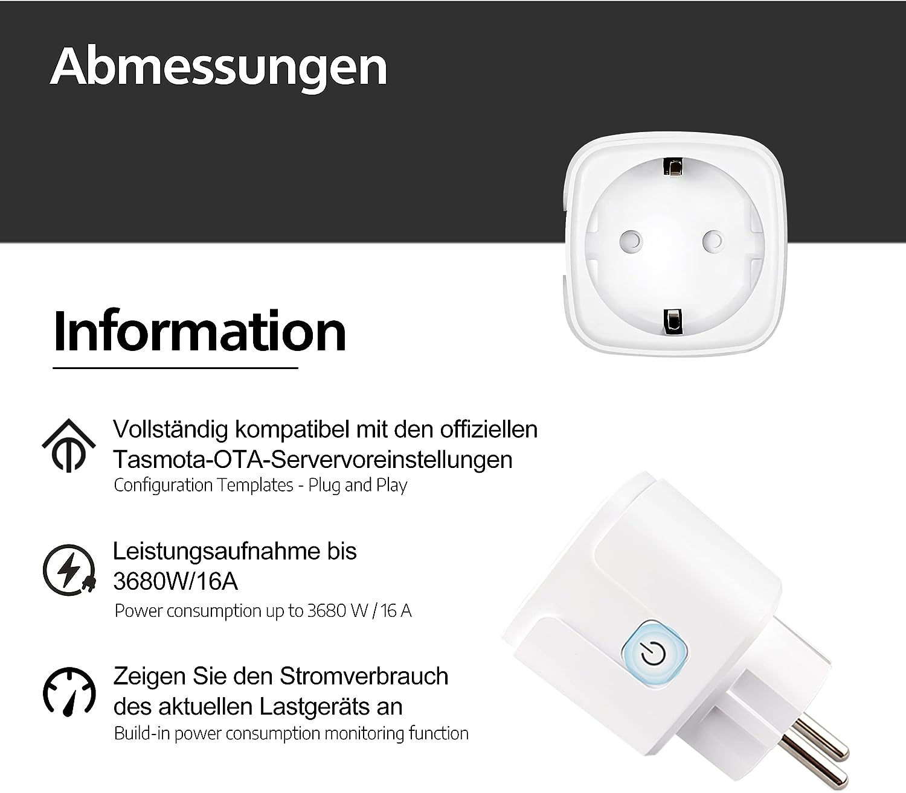

Maker: <https://currysmarter.com/>

Available on Amazon (preflashed with Tasmota)

## GPIO Pinout

| Pin    | Function            |
| ------ | ------------------- |
| GPIO3  | HLWBL Sel_i         |
| GPIO4  | Button_i            |
| GPIO5  | Led_i               |
| GPIO12 | Relay               |
| GPIO13 | BL0937 CF           |
| GIPO14 | HLWBL CF1           |

## Basic Configuration

```yaml
esphome:
  name: currysmarter16a
  friendly_name: CurrySmarter16a

esp8266:
  board: esp8285
    
# OTA flashing
ota:
  - platform: esphome

wifi: # Your Wifi network details
  
# Enable fallback hotspot in case wifi connection fails  
  ap:

# Enabling the logging component
logger:

# Enable Home Assistant API
api:

# Enable the captive portal
captive_portal:

time:
  - platform: sntp
    timezone: Europe/Madrid

switch:
  - platform: gpio
    pin: 12
    name: "Relay"
    id: relay

binary_sensor:
  - platform: gpio
    pin:
      number: 4
      mode: INPUT_PULLUP
      inverted: true
    name: "Button"
    disabled_by_default: true
    internal: True
    on_multi_click:
      - timing:
          - ON for at most 1s
          - OFF for at least 0.2s
        then:
          - switch.toggle: relay

sensor:
  - platform: hlw8012
    model: BL0937
    voltage_divider: 1670
    sel_pin:
      number: 3
      inverted: true
    cf_pin: 13
    cf1_pin: 14
    power:
      name: "Power"
      id: power
      filters:
        - calibrate_linear:
          - 0.0000 -> 0.0000
          - 17.7014 -> 16.000
    update_interval: 10s

  - platform: total_daily_energy
    name: "Energy"
    power_id: power
    device_class: energy
    state_class: total_increasing
    filters:
      - multiply: 0.001
    unit_of_measurement: kWh

```
