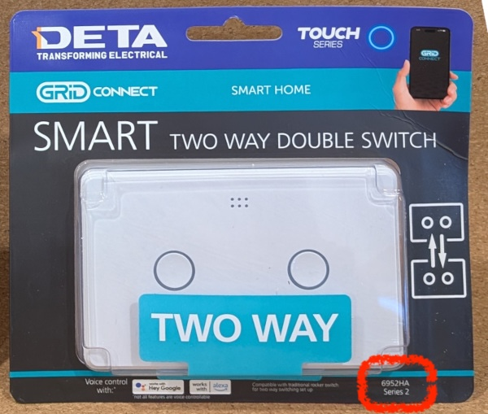
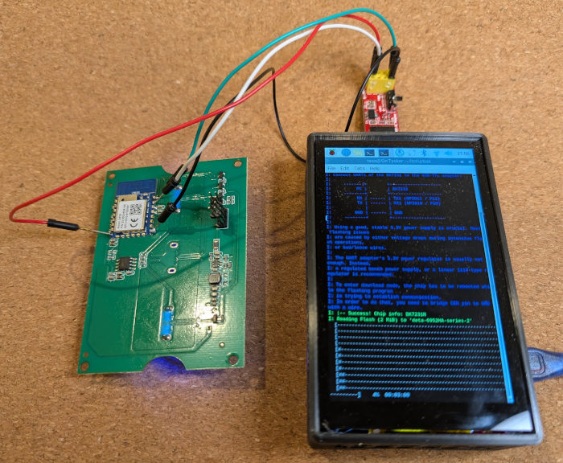

## Overview

The DETA [Switch Smart Grid 2 Way 2 Gang (6951HA)](https://www.bunnings.com.au/deta-switch-smart-grid-2-way-2-gang_p0346911) is part of the [Grid Connect ecosystem](https://grid-connect.com.au/), and is sold at Bunnings in Australia.



Also known as:

- Smart Double Gang 2 Way Touch Light Switch ([Deta website](https://detaelectrical.com.au/product/deta-grid-connect-smart-double-gang-2-way-touch-light-switch/))
- Twin Gang 2 Way Touch Light Switch ([Grid Connect website](https://grid-connect.com.au/download/6952ha/))

### Variations

As shown on the front of the packet.

| Variation   | Microcontroller | Board     | Firmware | Flashing methods |
| ----------- | --------------- | --------- | -------- | ---------------- |
| Series 2    | Beken BK7231N   | Tuya CB3S | v1.3.5   | Manual flashing  |

## Setup Guide

### Manual Flashing

You'll need a USB to serial adapter.

1. Remove the front plastic face.
2. Unscrew the two exposed screws.
3. Remove the clear panel and the small PCB underneath.
4. Connect TX, RX, GND and 3V3 to the USB to serial adapter.



Follow the [ltchiptool](https://github.com/libretiny-eu/ltchiptool) documentation to flash the microcontroller with [ESPHome Kickstart](https://github.com/libretiny-eu/esphome-kickstart/releases), or build an ESPHome package from the configuration below.

## GPIO Pinouts

### Series 2 (CB3S) GPIO Pinouts

_See [Pinouts on CB3S Module Datasheet](https://developer.tuya.com/en/docs/iot/cb3s?id=Kai94mec0s076#title-5-Pin%20definition) for more detail_

| Pin    | Function                                                                          |
| ------ | --------------------------------------------------------------------------------- |
| P24    | Status LED  _(inverted)_ |
| P26    | Button 1 _(inverted)_ |
| P23    | Button 2 _(inverted)_ |
| P14    | Relay 1 and Button 1 LED |
| P6    | Relay 2 and Button 2 LED |
| P7     | Light 1 activation status, taking into account _this_ Light 1 switch and the _remote_ Light 1 switch _(inverted)_     |
| P8     | Light 2 activation status, taking into account _this_ Light 2 switch and the _remote_ Light 2 switch _(inverted)_     |

## Configuration Examples

### Series 2 (CB3S) Configuration Examples

```yaml
substitutions:
  device_name: "deta-2-way-2-gang-switch"

  friendly_name: "DETA 2 Way 2 Gang Switch"
  switch_1_name: "${friendly_name} 1"
  switch_2_name: "${friendly_name} 2"
  switch_1_icon: "mdi:light-recessed"
  switch_2_icon: "mdi:light-recessed"

esphome:
  name: ${device_name}
  friendly_name: ${friendly_name}

bk72xx:
  board: cb3s

wifi:
  ssid: !secret wifi_ssid
  password: !secret wifi_password

logger:

# Status LED
status_led:
  pin:
    number: P24
    inverted: true

# Relays
output:
  - platform: gpio
    id: relay_1
    pin: P14
  - platform: gpio
    id: relay_2
    pin: P6

# Lights
light:
  # Keeping these internal to avoid sync issues if the lights
  # are switched off via the remote switch.
  # The lights are exposed as "switch" entities instead.
  - platform: binary
    output: relay_1
    id: light_1
    internal: true

  - platform: binary
    output: relay_2
    id: light_2
    internal: true

binary_sensor:
  # Buttons
  - platform: gpio
    id: button_1
    pin:
      number: P26
      inverted: true
      mode: INPUT_PULLUP
    on_press:
      then:
        - light.toggle: light_1
    internal: true

  - platform: gpio
    id: button_2
    pin:
      number: P23
      inverted: true
      mode: INPUT_PULLUP
    on_press:
      then:
        - light.toggle: light_2
    internal: true
  # Activation statuses
  - platform: gpio
    id: activation_status_1
    pin:
      number: P7
      mode: INPUT
      inverted: true  
    internal: true

  - platform: gpio
    id: activation_status_2
    pin:
      number: P8
      mode: INPUT
      inverted: true  
    internal: true

# Switches
switch:
  - platform: template
    name: ${switch_1_name}
    id: switch_1
    icon: ${switch_1_icon}
    lambda: "return id(activation_status_1).state;"
    turn_on_action:
    - if:
        condition:
          - binary_sensor.is_off: activation_status_1
        then:
          - light.toggle: light_1
    turn_off_action:
    - if:
        condition:
          - binary_sensor.is_on: activation_status_1
        then:
          - light.toggle: light_1

  - platform: template
    name: ${switch_2_name}
    id: switch_2
    icon: ${switch_2_icon}
    lambda: "return id(activation_status_2).state;"
    turn_on_action:
    - if:
        condition:
          - binary_sensor.is_off: activation_status_2
        then:
          - light.toggle: light_2
    turn_off_action:
    - if:
        condition:
          - binary_sensor.is_on: activation_status_2
        then:
          - light.toggle: light_2
```

### Add Reboot button to HA

```yaml
switch:
  - platform: restart
    name: ${friendlyname} REBOOT
```
