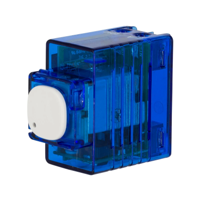
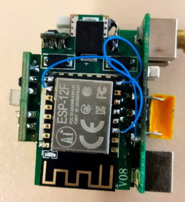

## General Notes

A smart switch that does not require a neutural, needs a minumum 20w load or a [load correction device](https://www.clipsal.com/products/detail?CatNo=31LCDA&itemno=31LCDA&tab-document-1=0)

Available from [Bunnings](https://www.bunnings.com.au/deta-smart-switch-mechanism_p0346912)



## GPIO Pinout

| Pin    | Function                  |
| ------ | ------------------------- |
| GPIO12 | Blue LED (Inverted: true) |
| GPIO14 | Button                    |
| GPIO16 | Relay                     |

## Conversion

To use ESPHome, replace the WB3S with a ESP12F.

- Link GPIO15 to Gnd (recommended via 10k resistor)
- Link EN to Vcc (recommended via 10k resistor)

Due to limited space, conversion below ommited the resistors. No issues but it is outside specifications.


## Configuration

```yaml
substitutions:
  name: "deta-6014-01"
  friendly_name: "DETA 1G"
  project_name: "DETA.60141HA"
  project_version: "1.0"
  device_description: "Deta 6014HA Light Switch"

esphome:
  name: "${name}"
  comment: "${device_description}"
  project:
    name: "${project_name}"
    version: "${project_version}"

esp8266:
  board: esp12e

# Enable logging
logger:

# Enable Home Assistant API
api:
  encryption:
    key: "your key"

ota:
  password: "your password"

wifi:
  ssid: !secret wifi_ssid
  password: !secret wifi_password

  # Enable fallback hotspot (captive portal) in case wifi connection fails
  ap:
    ssid: "Deta-6014Ha-01 Fallback Hotspot"
    password: "fallback password"

captive_portal:

sensor:
  - platform: wifi_signal
    name: "${friendly_name} wifi signal"
    update_interval: 600s
  - platform: uptime
    name: Uptime Sensor
    id: uptime_sensor
    update_interval: 60s
    disabled_by_default: true
    on_raw_value:
      then:
        - text_sensor.template.publish:
            id: uptime_human
            state: !lambda |-
              int seconds = round(id(uptime_sensor).raw_state);
              int days = seconds / (24 * 3600);
              seconds = seconds % (24 * 3600);
              int hours = seconds / 3600;
              seconds = seconds % 3600;
              int minutes = seconds /  60;
              seconds = seconds % 60;
              return (
                (days ? to_string(days) + "d " : "") +
                (hours ? to_string(hours) + "h " : "") +
                (minutes ? to_string(minutes) + "m " : "") +
                (to_string(seconds) + "s")
              ).c_str();

#################################

output:
  # Button
  - platform: gpio
    pin: GPIO16
    id: relay1

light:
  # Top (or only) button
  - platform: binary
    name: "${friendly_name} Light"
    output: relay1
    id: light1
    on_turn_on:
     - light.turn_on: status1
    on_turn_off:
     - light.turn_off: status1
  - platform: status_led
    id: status1
    pin:
      number: GPIO12
      inverted: true

# Buttons
binary_sensor:
  # Button
  - platform: gpio
    pin:
      number: GPIO14
      mode:
        input: true
        pullup: true
      inverted: True
    name: "${friendly_name} Button"
    #toggle relay on push
    on_press:
      - light.toggle: light1

button:
  - platform: restart
    id: restart_button
    name: "${friendly_name} Restart"
    disabled_by_default: true

text_sensor:
  - platform: wifi_info
    ip_address:
      name: "${friendly_name} IP Address"
      disabled_by_default: true
    bssid:
      name: "${friendly_name} BSSID"
      disabled_by_default: true
  - platform: template
    name: Uptime
    id: uptime_human
    icon: mdi:clock-start
```
