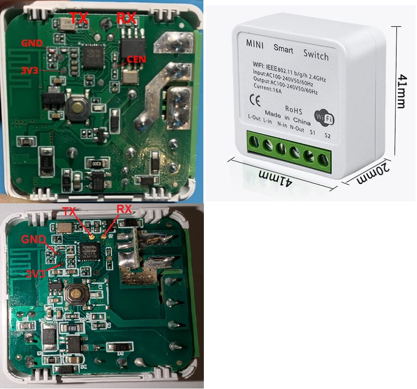

## General Notes

A smart WIFI relay to convert a normal swicht into a smart switch and retain the fuction of the normal switch.

Some modules have RF433 fuction but not included below.

These devices are sold under many brands on Aliexpress.



## GPIO Pinout

| Pin    | Function                   |
| ------ | -------------------------- |
| P6     | Rocker switch INPUT_PULLUP |
| P7     | Relay (H)                  |
| P8     | RF input ?                 |
| P23    | Button INPUT_PULLUP        |
| P26    | Blue Status LED (H)        |

## Configuration

```yaml
## -----------------------##
## Substitution Variables ##
## -----------------------##
substitutions:
  device_friendly_name: WIFI Switch
  device_icon: "mdi:power"
## --------------------##
## Board Configuration ##
## --------------------##
esphome:
  name: ${device_internal_name}
  friendly_name: ${device_friendly_name}

bk72xx:
  board: generic-bk7231n-qfn32-tuya
## ---------------- ##
##    Status LED    ##
## ---------------- ##
status_led:
  pin:
    number: P26
    inverted: false
## ---------------- ##
##  Binary Sensors  ##
## ---------------- ##
binary_sensor:
# Button 1
  - platform: gpio
    id: button_1
    pin:
      number: P23
      inverted: true
      mode: INPUT_PULLUP
# Rocker switch
  - platform: gpio
    name: "${device_friendly_name} Switch"
    pin: P6
    on_press:
      then:
        - switch.turn_on: relay
    on_release:
        - switch.turn_off: relay
    filters:
      - delayed_on_off: 50ms
## ---------------- ##
##      Switch      ##
## ---------------- ##
switch:
#Relay
  - platform: output
    name: "${device_friendly_name} Relay"
    icon: ${device_icon}
    output: relayoutput
    id: relay
## ---------------- ##
##      Relays      ##
## ---------------- ##
output:
# Relay L1
output:
  # Relay
  - platform: gpio
    id: relayoutput
    pin: P7
```
