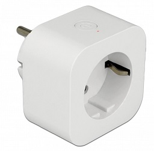

## General Notes

Model reference: 11826

Manufacturer: [Delock](https://www.delock.de/produkte/G_11826/merkmale.html)

The device comes **pre-flashed with Tasmota**.
Flashing ESPHome is easily possible by uploading an ESPHome .bin file using the device's web interface. In case of issues GZIP your .bin file!



## GPIO Pinout

| Pin    | Function          |
| ------ | ----------------- |
| GPIO0  | Button (inverted) |
| GPIO12 | Relay             |
| GPIO13 | LED               |

## Basic Config

Basic configuration with switch.

```yaml
substitutions:
  plug_name: delock01

esphome:
  name: ${plug_name}
  platform: ESP8266
  board: esp8285
    
# OTA flashing
ota:
  - platform: esphome

wifi: # Your Wifi network details
  
# Enable fallback hotspot in case wifi connection fails  
  ap:

# Enabling the logging component
logger:

# Enable Home Assistant API
api:

# Enable the captive portal
captive_portal:

# Example configuration entry
web_server:
  port: 80

binary_sensor:
  - platform: gpio
    pin:
      number: GPIO0
      inverted: True
    name: "${plug_name} Button"
    on_press:
      - switch.toggle: relay

switch:
  - platform: gpio
    id: led
    pin: GPIO13

  - platform: gpio
    name: "${plug_name} Smart Plug"
    pin: GPIO12
    id: relay
    on_turn_on:
      - switch.turn_on: led
    on_turn_off:
      - switch.turn_off: led
```
