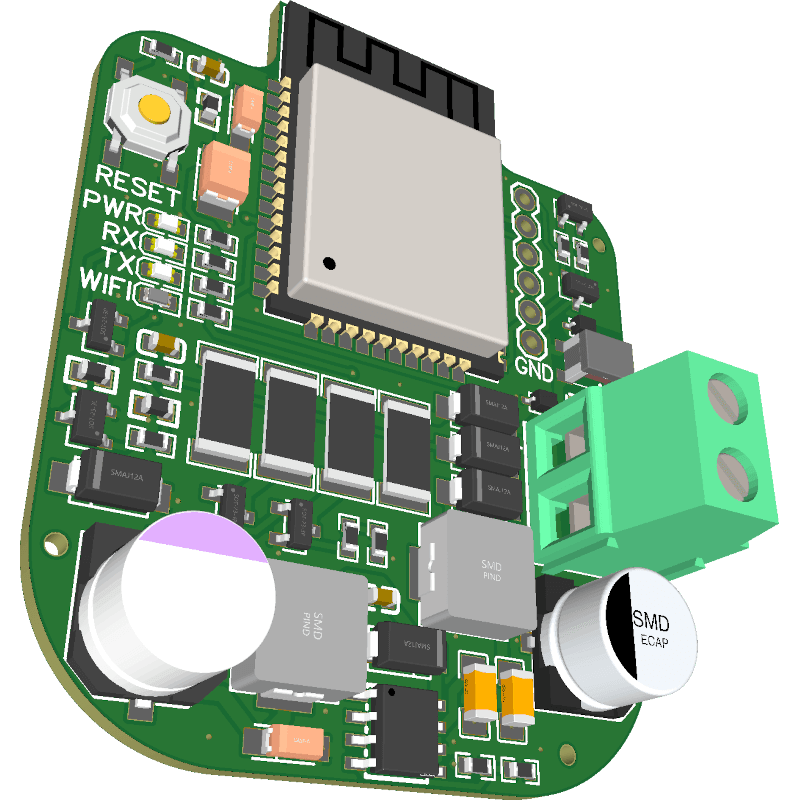

## Description

This device allows you to integrate your ABB-Welcome or Busch-Welcome 2-wire doorbell intercom system into Home Assistant. Features include doorbell notifications and remotely opening your door.

## GPIO Pinout

| Pin    | Function |
| ------ | -------- |
| GPIO2  | Wifi LED |
| GPIO25 | Bus RX   |
| GPIO26 | Bus TX   |

## Basic Configuration

```yaml
esp32:
  board: esp32dev
  framework:
    type: esp-idf
    sdkconfig_options:
      CONFIG_FREERTOS_UNICORE: y # Only required if you have a single core ESP32

esphome:
  name: abb-welcome-demo
  friendly_name: "ABB Welcome Demo"
  on_boot:
    - lock.template.publish:
        id: front_door
        state: LOCKED
    - binary_sensor.template.publish:
        id: doorbell_indoor
        state: OFF
    - binary_sensor.template.publish:
        id: doorbell_outdoor
        state: OFF

external_components:
  - source: github://Mat931/esphome@remote
    components: [ remote_base, remote_receiver ]

wifi:
  networks:
  - ssid: !secret wifi_ssid
    password: !secret wifi_password

logger:

api:
  encryption:
    key: !secret api_encryption_key

ota:
  password: !secret ota_password

remote_transmitter:
  pin: GPIO26
  carrier_duty_percent: 100%

remote_receiver:
  pin:
    number: GPIO25
    mode:
      input: True
  dump: [abbwelcome]
  filter: 8us
  tolerance: 26us
  idle: 1500us
  buffer_size: 15kB
  memory_blocks: 5
  clock_divider: 160
  on_abbwelcome:
    then:
      - lambda: 'id(doorbell_intercom).publish_state(x.to_string().c_str());'
      - if:
          condition:
            and:
              - lambda: 'return (x.get_message_type() == 0x8d);' # unlock door response
              - lambda: 'return (x.get_source_address() == 0x4001);' # door address
          then:
            - lock.template.publish:
                id: front_door
                state: UNLOCKING
            - delay: 3s # time how long the door usually stays unlocked
            - lock.template.publish:
                id: front_door
                state: LOCKED
      - if:
          condition:
            and:
              - lambda: 'return (x.get_message_type() == 0x11);' # doorbell indoor
              - lambda: 'return (x.get_source_address() == 0x1001);' # your indoor station address
          then:
            - binary_sensor.template.publish:
                id: doorbell_indoor
                state: ON
            - binary_sensor.template.publish:
                id: doorbell_indoor
                state: OFF
      - if:
          condition:
            and:
              - lambda: 'return (x.get_message_type() == 0x01);' # doorbell outdoor
              - lambda: 'return (x.get_source_address() == 0x2001);' # outdoor station address
              - lambda: 'return (x.get_destination_address() == 0x1001);' # your indoor station address
          then:
            - binary_sensor.template.publish:
                id: doorbell_outdoor
                state: ON
            - binary_sensor.template.publish:
                id: doorbell_outdoor
                state: OFF

binary_sensor:
  - platform: template
    name: Doorbell indoor
    id: doorbell_indoor
    icon: mdi:bell
    filters:
      - delayed_off: 1s
  - platform: template
    name: Doorbell outdoor
    id: doorbell_outdoor
    icon: mdi:bell
    filters:
      - delayed_off: 1s

sensor:
  - platform: internal_temperature
    name: "Internal Temperature"

text_sensor:
  - platform: template
    name: "Doorbell Intercom" # Receive debug messages
    id: doorbell_intercom
    icon: mdi:bell-circle
    update_interval: never

lock:
  - platform: template
    name: "Front Door"
    id: front_door
    on_unlock:
      - then:
          - lock.template.publish:
              id: front_door
              state: LOCKED
    lock_action:
      - then:
          - lock.template.publish:
              id: front_door
              state: LOCKED
    unlock_action:
      - then:
          - remote_transmitter.transmit_abbwelcome:
              source_address: 0x1001 # your indoor station address
              destination_address: 0x4001 # door address
              message_type: 0x0d # unlock door
              data: [0xab, 0xcd, 0xef]  # door opener secret code, see receiver dump

button:
  - platform: restart
    name: "Reboot"
  - platform: safe_mode
    name: "Reboot (Safe Mode)"
  - platform: template
    name: "Stop Doorbell"
    on_press:
      - remote_transmitter.transmit_abbwelcome:
          source_address: 0x1001 # your indoor station address
          destination_address: 0x2001 # outdoor station address
          message_type: 0x02 # end call (stops your doorbell ringtone)
          data: [0x00]

status_led:
  pin: GPIO2
```
