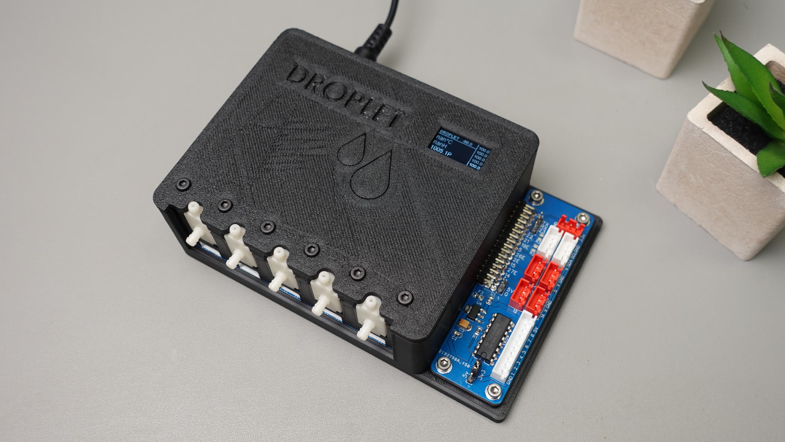
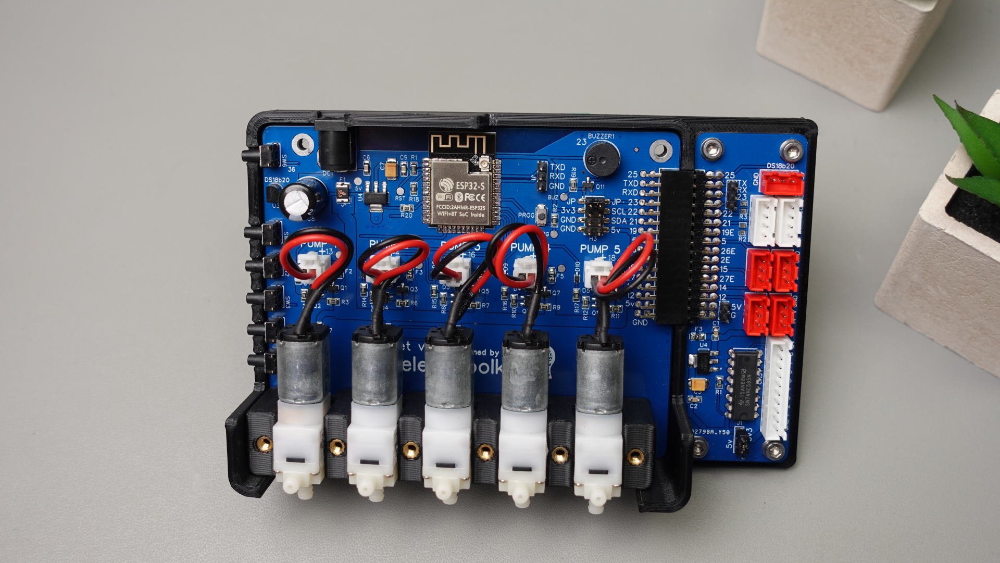
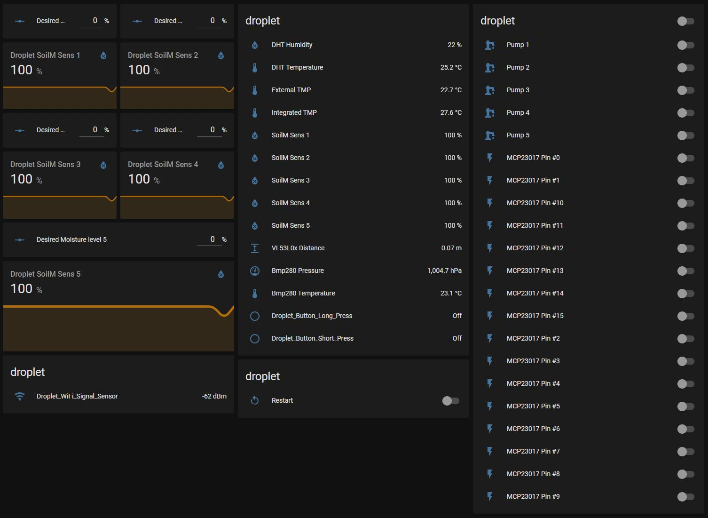

## Product description

The Droplet Smart Irrigation System is a practical solution for efficient water management in gardens and agricultural spaces. It provides precise control over watering schedules, ensuring plants get the right amount of water while conserving resources. Additionally, it can measure soil moisture, air humidity, control lights, and much more.

You can buy an assembled PCB from the official store https://www.pricelesstoolkit.com

## Main Board

| Feature                           | Description                                                       | Notes                                                                                 |
|-----------------------------------|-------------------------------------------------------------------|---------------------------------------------------------------------------------------|
| Micro Pump Outputs                | 5x Micro Pump outputs                                             | 5V each                                                                               |
| Soil Moisture Sensor Inputs       | 5x inputs (ADC-5V-GND)                                            | Data line pulled down with 1M ohm resistor (Data line MAX 3.3V)                       |
| Onboard Temperature Sensor        | DS18B20                                                           | [DS18B20 Documentation](https://esphome.io/components/sensor/dallas.html)             |
| Onboard Buzzer                    | Buzzer port can be freed up with jumper                           | [Buzzer Documentation](https://esphome.io/components/rtttl.html?highlight=buzzer)     |
| Breakout Pins                     | For connecting i2c OLED Display                                   | [OLED Display Documentation](https://esphome.io/components/display/ssd1306.html?highlight=display) |
| Manual Pump Control               | 5x Buttons for manual pump control                                | -                                                                                     |
| Wake-Up/OLED Control Button       | Short press: wake-up OLED, Long press: general purpose            | 2x Binary sensors available for HA                                                    |
| Fuses                             | All pump outputs and moisture sensor inputs have fuses            | -                                                                                     |
| Usable GPIO Pins                  | GPIO 19, 5, 26, 2, 15, 27, 14, 12                                 | -                                                                                     |
| i2c Pins                          | GPIO 21, 22                                                       | 1x i2c                                                                                |
| UART                              | 1x UART                                                           | -                                                                                     |
| External Port for DS18B20         | GPIO 25                                                           | -                                                                                     |

## Expansion Board v3

| Feature                           | Description                                                       | Notes                                                                                 |
|-----------------------------------|-------------------------------------------------------------------|---------------------------------------------------------------------------------------|
| Relay Outputs                     | 1x JST 10-pin connector for 8 relays                              | Uses MCP23017 Expander [MCP23017 Documentation](https://esphome.io/components/mcp230xx.html) |
| i2c Connectors                    | 2x XH 4-pin i2c (V, GPIO 21, GPIO 22, GND)                        | -                                                                                     |
| GPIO Pins                         | 7x XH 3-pin (GPIO 19, 5, 26, 2, 15, 27, 14)                       | -                                                                                     |
| DS18B20 TMP Sensor Connector      | 1x XH 3-pin for DS18B20 TMP Sensors (3.3V, GPIO 25, GND)          | -                                                                                     |
| Buzzer Control                    | 1x 1-pin header GPIO23 connected to buzzer                        | Buzzer port can be freed up by removing jumper JP                                     |

