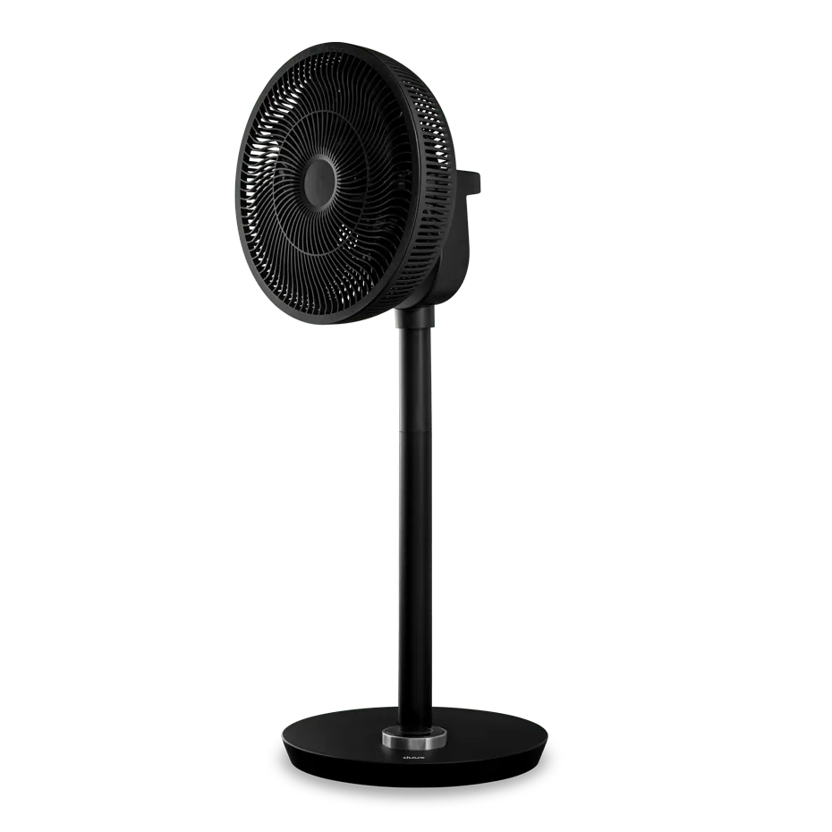

## GPIO Pinout

| Pin    | Function   |
| ------ | ---------- |
| GPIO00 | Nono       |
| GPIO01 | None       |
| GPIO02 | None       |
| GPIO03 | None       |
| GPIO04 | None       |
| GPIO05 | None       |
| GPIO09 | None       |
| GPIO10 | None       |
| GPIO12 | None       |
| GPIO13 | Tuya Rx    |
| GPIO14 | None       |
| GPIO15 | Tuya Tx    |
| GPIO16 | None       |
|  FLAG  | None       |

## Basic Configuration

```yaml
substitutions:
  devicename: "smart-fan"

esphome:
  name: $devicename
  comment: "Duux Whisper Flex Smart Fan (DXCF10)"
  friendly_name: "Duux Whisper Flex Smart Fan"
  project:
    name: "Duux.Whisper-Flex-Smart-Fan"
    version: "1.0.0"

esp8266:
  board: esp07
  restore_from_flash: true

# Enable logging
logger:

# Enable Home Assistant API
api:
  encryption:
    key:

ota:
  password:

wifi:
  ssid: !secret wifi_ssid
  password: !secret wifi_password
  # Enable fallback hotspot (captive portal) in case wifi connection fails
  ap:
    ssid:
    password:

captive_portal:

time:
  - platform: homeassistant
    id: homeassistant_time

# Enable Web server
web_server:
  port: 80

uart:
  tx_pin: GPIO15
  rx_pin: GPIO13
  baud_rate: 9600

# Register the Tuya MCU connection
tuya:

fan:
  - platform: "tuya"
    name: None
    switch_datapoint: 1
    speed_datapoint: 3
    speed_count: 26
    oscillation_datapoint: 4

switch:
  - platform: template
    name: "Oscillate vertically"
    icon: mdi:arrow-up-down
    turn_on_action:
      then:
        - select.set:
            id: "vertically"
            option: "on"
    turn_off_action:
      then:
        - select.set:
            id: "vertically"
            option: "off"
    lambda: |-
      if (id(vertically).state == "on") {
        return true;
      } else {
        return false;
      }

select:
  - platform: "tuya"
    id: "vertically"
    internal: true
    name: "Oscillate vertically"
    enum_datapoint: 5
    optimistic: true
    options:
      0: "off"
      1: "on"

  - platform: "tuya"
    name: "Mode"
    enum_datapoint: 2
    optimistic: true
    options:
      0: "Manual Mode"
      1: "Natural Mode"
      2: "Sleep Mode"

  - platform: "tuya"
    name: "Timer"
    icon: mdi:fan-clock
    enum_datapoint: 6
    optimistic: true
    options:
      0: "off"
      1: "1h"
      2: "2h"
      3: "3h"
      4: "4h"
      5: "5h"
      6: "6h"
      7: "7h"
      8: "8h"
      9: "9h"
      10: "10h"
      11: "11h"
      12: "12h"

sensor:
  - platform: wifi_signal
    name: "Wifi Signal"
    update_interval: 60s
    icon: mdi:wifi

  - platform: uptime
    name: "Uptime"
    update_interval: 60s
    icon: mdi:clock-outline

text_sensor:
  - platform: wifi_info
    ip_address:
      name: "IP Address"
    ssid:
      name: "Wi-Fi SSID"
    bssid:
      name: "Wi-Fi BSSID"
  - platform: version
    name: "ESPHome Version"
    hide_timestamp: true
```
