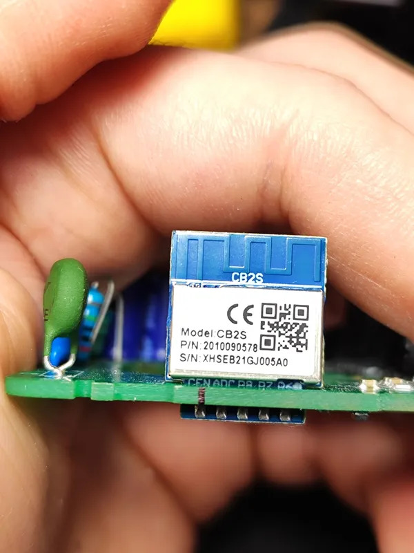
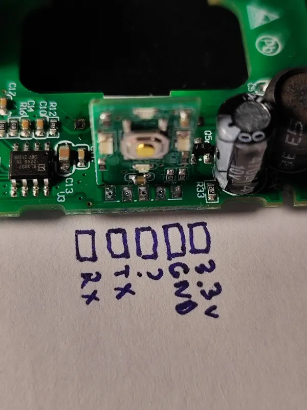
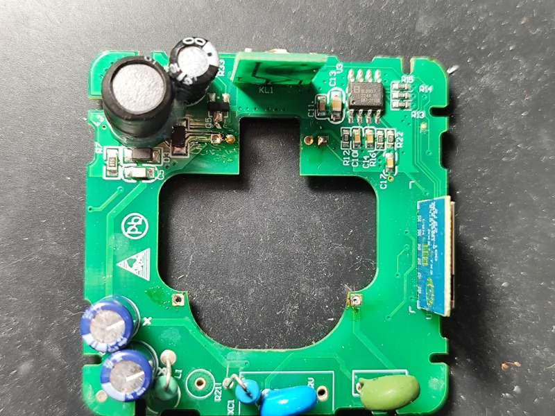
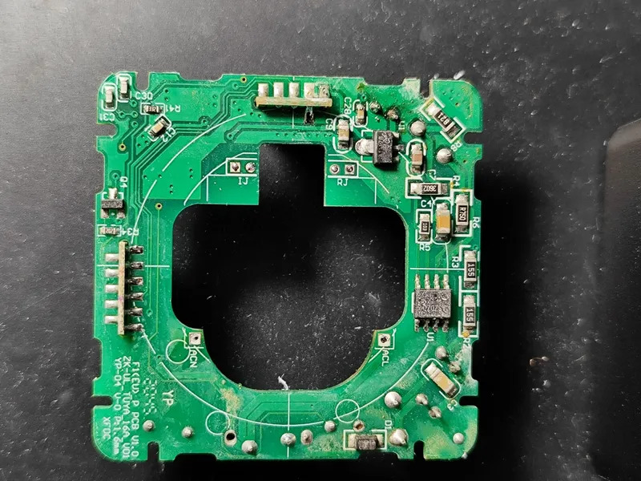

## Notes


Equipped with [cb2s](https://developer.tuya.com/en/docs/iot/cb2s-module-datasheet?id=Kafgfsa2aaypq) Tuya module which is well known and is actualy
based on Beken BK7231N.

The power monitoring chip is [BL0937](https://developer.tuya.com/en/docs/iot-device-dev/Electricity-statistics?id=Kaunfo4am6icc) which is known from other
Tuya designs and does not require further introduction.

## Product internals






## GPIO Pinout

| Pin   | Function          |
| ----- | ----------------- |
| P08   | BL0937 cf_pin     |
| P06   | BL0937 cf1_pin    |
| P26   | BL0937 sel_pin    |
| P07   | Relay             |
| P10   | Button (Inverted) |
| P11   | LED (Inverted)    |

## Basic ESPHome config

Note this is only the device-specific part shown here - make sure to extend with your ESPHome-specific settings (such as wifi, passwords, OTA, etc...)

```yaml
esphome:
  comment: "EKF Сonnect PRO Wi-Fi (RCS-2-WF) Smart Plug with Power Monitor"

bk72xx:
  board: cb2s

binary_sensor:
  - platform: gpio
    pin:
      number: P10
      inverted: on
    name: Button
    icon: mdi:gesture-tap-button

light:
  - platform: status_led
    id: status
    pin:
      number: P11
      inverted: true

switch:
  - platform: gpio
    id: relay
    pin: P7
    name: Relay
    icon: mdi:electric-switch

sensor:
  - platform: hlw8012
    model: BL0937
    cf_pin:
      number: P8
      inverted: true
    cf1_pin:
      number: P6
      inverted: true
    sel_pin:
      number: P26
      inverted: true
    current:
      name: Load Current
      filters:
        - multiply: 0.5 # (needs calibration)
    voltage:
      name: Load Voltage
    power:
      name: Load Power
    energy:
      name: Load Energy
    update_interval: 10s
    voltage_divider: 800 # (needs calibration)
    change_mode_every: 1
    current_resistor: 0.001 Ohm # (needs calibration)
```
