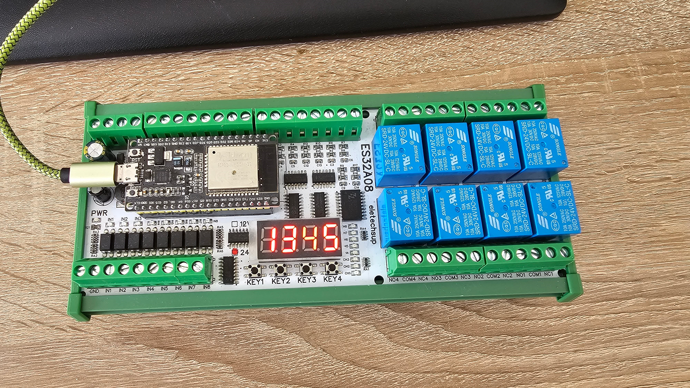

## Board comes without esp32 (use wroom 32 devkit)

## Description

This is a very capable little automation/relay/io board from [AliExpress](https://www.aliexpress.us/item/3256805999936525.html)  
It runs on 12V or 24V depending on your configuration and is perfect for industrial and home automation

  
[Schematic](./Schematic_ES32A08.pdf)

### Exposes

- 8 Relay Outputs (Labeled O1-O8)
- 8 24V Inputs (Labeled I1-I8)
- 4 Analag inputs (0-20ma) (Labeled ADC1-ADC4)
- 2 Analog inputs (0-10V) (Labeled ADC5-ADC6) (ADC7-ADC8 are not usable when using WiFi)
- 4 Input buttons (Labeled KEY1-KEY4)
- 1 Status LED (Labeled "status LED")
- 1 4 Digit 7 Segment display (listens on configurable homeassistant text sensor) (still a little buggy)

### Known limitations

- 4 Digit display has problems with trailing dots
- RS485 has a hardware bug and can't be used reliably, see https://github.com/makstech/esphome-es32a08-expansion-board-example/issues/2#issuecomment-3165396638

## Basic Configuration

```yaml
esphome:
  name: xxx

esp32:
  board: esp32dev
  framework:
    type: arduino
  
  # not compatible with esp idf as of now
  #framework:
  #  type: esp-idf
  #  version: recommended

# Enable logging
logger:

# Enable Home Assistant API
api:
  encryption:
    key: "xxx"

ota:
  - platform: esphome
    password: "xxx"

wifi:
  ssid: !secret wifi_ssid
  password: !secret wifi_password

  # Enable fallback hotspot (captive portal) in case wifi connection fails
  ap:
    ssid: "Es32A08-01 Fallback Hotspot"
    password: "xxx"


text_sensor:
  - platform: homeassistant
    name: "Text from Home Assistant"
    id: home_assistant_text
    entity_id: input_text.test


script:
  - id: display_text
    then:
      - lambda: |-
          std::string text = id(home_assistant_text).state;

          // Pad with spaces if the text is shorter than 4 characters
          while (text.length() < 4) {
            text = " " + text;
          }

          auto clear_display = [&]() {
            id(G1).set_state(0);
            id(G2).set_state(0);
            id(G3).set_state(0);
            id(G4).set_state(0);
            id(DP).set_state(0);
            id(A).set_state(0);
            id(B).set_state(0);
            id(C).set_state(0);
            id(D).set_state(0);
            id(E).set_state(0);
            id(F).set_state(0);
            id(G).set_state(0);
          };

          // Character to segment map
          const uint8_t char_map[95] = {
            0b00000000,            // ' ', ord 0x20
            0b10110000,            // '!', ord 0x21
            0b00100010,            // '"', ord 0x22
            0b00000000,            // '#', ord 0x23
            0b00000000,            // '$', ord 0x24
            0b01001001,            // '%', ord 0x25
            0b00000000,            // '&', ord 0x26
            0b00000010,            // ''', ord 0x27
            0b01001110,            // '(', ord 0x28
            0b01111000,            // ')', ord 0x29
            0b01000000,            // '*', ord 0x2A
            0b00000000,            // '+', ord 0x2B
            0b00010000,            // ',', ord 0x2C
            0b00000001,            // '-', ord 0x2D
            0b10000000,            // '.', ord 0x2E
            0b00000000,            // '/', ord 0x2F
            0b01111110,            // '0', ord 0x30
            0b00110000,            // '1', ord 0x31
            0b01101101,            // '2', ord 0x32
            0b01111001,            // '3', ord 0x33
            0b00110011,            // '4', ord 0x34
            0b01011011,            // '5', ord 0x35
            0b01011111,            // '6', ord 0x36
            0b01110000,            // '7', ord 0x37
            0b01111111,            // '8', ord 0x38
            0b01111011,            // '9', ord 0x39
            0b01001000,            // ':', ord 0x3A
            0b01011000,            // ';', ord 0x3B
            0b00000000,            // '<', ord 0x3C
            0b00001001,            // '=', ord 0x3D
            0b00000000,            // '>', ord 0x3E
            0b01100101,            // '?', ord 0x3F
            0b01101111,            // '@', ord 0x40
            0b01110111,            // 'A', ord 0x41
            0b00011111,            // 'B', ord 0x42
            0b01001110,            // 'C', ord 0x43
            0b00111101,            // 'D', ord 0x44
            0b01001111,            // 'E', ord 0x45
            0b01000111,            // 'F', ord 0x46
            0b01011110,            // 'G', ord 0x47
            0b00110111,            // 'H', ord 0x48
            0b00110000,            // 'I', ord 0x49
            0b00111100,            // 'J', ord 0x4A
            0b00000000,            // 'K', ord 0x4B
            0b00001110,            // 'L', ord 0x4C
            0b00000000,            // 'M', ord 0x4D
            0b00010101,            // 'N', ord 0x4E
            0b01111110,            // 'O', ord 0x4F
            0b01100111,            // 'P', ord 0x50
            0b11111110,            // 'Q', ord 0x51
            0b00000101,            // 'R', ord 0x52
            0b01011011,            // 'S', ord 0x53
            0b00000111,            // 'T', ord 0x54
            0b00111110,            // 'U', ord 0x55
            0b00111110,            // 'V', ord 0x56
            0b00111111,            // 'W', ord 0x57
            0b00000000,            // 'X', ord 0x58
            0b00100111,            // 'Y', ord 0x59
            0b01101101,            // 'Z', ord 0x5A
            0b01001110,            // '[', ord 0x5B
            0b00000000,            // '\', ord 0x5C
            0b01111000,            // ']', ord 0x5D
            0b00000000,            // '^', ord 0x5E
            0b00001000,            // '_', ord 0x5F
            0b00100000,            // '`', ord 0x60
            0b01110111,            // 'a', ord 0x61
            0b00011111,            // 'b', ord 0x62
            0b00001101,            // 'c', ord 0x63
            0b00111101,            // 'd', ord 0x64
            0b01001111,            // 'e', ord 0x65
            0b01000111,            // 'f', ord 0x66
            0b01011110,            // 'g', ord 0x67
            0b00010111,            // 'h', ord 0x68
            0b00010000,            // 'i', ord 0x69
            0b00111100,            // 'j', ord 0x6A
            0b00000000,            // 'k', ord 0x6B
            0b00001110,            // 'l', ord 0x6C
            0b00000000,            // 'm', ord 0x6D
            0b00010101,            // 'n', ord 0x6E
            0b00011101,            // 'o', ord 0x6F
            0b01100111,            // 'p', ord 0x70
            0b00000000,            // 'q', ord 0x71
            0b00000101,            // 'r', ord 0x72
            0b01011011,            // 's', ord 0x73
            0b00000111,            // 't', ord 0x74
            0b00011100,            // 'u', ord 0x75
            0b00011100,            // 'v', ord 0x76
            0b00000000,            // 'w', ord 0x77
            0b00000000,            // 'x', ord 0x78
            0b00100111,            // 'y', ord 0x79
            0b00000000,            // 'z', ord 0x7A
            0b00110001,            // '{', ord 0x7B
            0b00000110,            // '|', ord 0x7C
            0b00000111,            // '}', ord 0x7D
            0b01100011,            // '~', ord 0x7E (degree symbol)
          };

          auto set_digit = [&](int digit, uint8_t ch, bool dot) {
            clear_display();
            id(G1).set_state(digit == 0);
            id(G2).set_state(digit == 1);
            id(G3).set_state(digit == 2);
            id(G4).set_state(digit == 3);

            uint8_t segments = char_map[ch];
            id(DP).set_state((segments & 0b10000000) || dot);
            id(A).set_state(segments & 0b01000000);
            id(B).set_state(segments & 0b00100000);
            id(C).set_state(segments & 0b00010000);
            id(D).set_state(segments & 0b00001000);
            id(E).set_state(segments & 0b00000100);
            id(F).set_state(segments & 0b00000010);
            id(G).set_state(segments & 0b00000001);
            delay(5);
          };

          int l = text.length();
          bool dot = false;
          uint8_t tmp = 0;

          // Iterate over each digit position (up to 4)
          for (int i = 0; i < 4; ++i) {

              // Check if the character is a dot
              if (text[i] == '.') {
                  // Display the dot on its own
                  set_digit(i, 0, true);
              } else {
                  // Character is not a dot, check if the next character is a dot
                  if ((i + 1 < l) && (text[i + 1] == '.')) {
                      // The next character is a dot
                      dot = true;
                      // Erase the dot, so it won't be processed again
                      text.erase(i + 1, 1);
                      // Update the length after erasure
                      l = text.length();
                  } else {
                      dot = false;
                  }

                  // Adjust the character to the segment map
                  if (text[i] < 32) {
                      tmp = 0;
                  } else {
                      tmp = text[i] - 32;
                  }

                  // Set the digit with or without the dot
                  set_digit(i, tmp, dot);
              }
          }


interval:
  - interval: 25ms
    then:
      - script.execute: display_text

sn74hc595:
  - id: 'sn74hc595_hub'
    data_pin: GPIO13
    clock_pin: GPIO27
    latch_pin: GPIO14
    oe_pin: GPIO4
    sr_count: 3

switch:
  - platform: gpio
    name: "O1"
    pin:
      sn74hc595: sn74hc595_hub
      number: 16
      inverted: false

  - platform: gpio
    name: "O2"
    pin:
      sn74hc595: sn74hc595_hub
      number: 17
      inverted: false

  - platform: gpio
    name: "O3"
    pin:
      sn74hc595: sn74hc595_hub
      number: 18
      inverted: false

  - platform: gpio
    name: "O4"
    pin:
      sn74hc595: sn74hc595_hub
      number: 19
      inverted: false

  - platform: gpio
    name: "O5"
    pin:
      sn74hc595: sn74hc595_hub
      number: 20
      inverted: false

  - platform: gpio
    name: "O6"
    pin:
      sn74hc595: sn74hc595_hub
      number: 21
      inverted: false

  - platform: gpio
    name: "O7"
    pin:
      sn74hc595: sn74hc595_hub
      number: 22
      inverted: false

  - platform: gpio
    name: "O8"
    pin:
      sn74hc595: sn74hc595_hub
      number: 23
      inverted: false

  - platform: gpio
    name: "status LED"
    pin: GPIO15
    inverted: True

output:
  - platform: gpio
    id: "A"
    pin:
      sn74hc595: sn74hc595_hub
      number: 0
      inverted: false

  - platform: gpio
    id: "B"
    pin:
      sn74hc595: sn74hc595_hub
      number: 1
      inverted: false

  - platform: gpio
    id: "C"
    pin:
      sn74hc595: sn74hc595_hub
      number: 2
      inverted: false

  - platform: gpio
    id: "D"
    pin:
      sn74hc595: sn74hc595_hub
      number: 3
      inverted: false

  - platform: gpio
    id: "E"
    pin:
      sn74hc595: sn74hc595_hub
      number: 4
      inverted: false

  - platform: gpio
    id: "F"
    pin:
      sn74hc595: sn74hc595_hub
      number: 5
      inverted: false

  - platform: gpio
    id: "G"
    pin:
      sn74hc595: sn74hc595_hub
      number: 6
      inverted: false

  - platform: gpio
    id: "DP"
    pin:
      sn74hc595: sn74hc595_hub
      number: 7
      inverted: false

  - platform: gpio
    id: "G1"
    pin:
      sn74hc595: sn74hc595_hub
      number: 8
      inverted: True

  - platform: gpio
    id: "G2"
    pin:
      sn74hc595: sn74hc595_hub
      number: 9
      inverted: True

  - platform: gpio
    id: "G3"
    pin:
      sn74hc595: sn74hc595_hub
      number: 10
      inverted: True

  - platform: gpio
    id: "G4"
    pin:
      sn74hc595: sn74hc595_hub
      number: 11
      inverted: True

sn74hc165:
  - id: sn74hc165_hub
    clock_pin: GPIO17
    data_pin: GPIO5
    load_pin: GPIO16
    sr_count: 1

binary_sensor:
  - platform: gpio
    name: "I1"
    pin:
      sn74hc165: sn74hc165_hub
      # Use pin number 0
      number: 0
      inverted: true

  - platform: gpio
    name: "I2"
    pin:
      sn74hc165: sn74hc165_hub
      # Use pin number 0
      number: 1
      inverted: true

  - platform: gpio
    name: "I3"
    pin:
      sn74hc165: sn74hc165_hub
      # Use pin number 0
      number: 2
      inverted: true

  - platform: gpio
    name: "I4"
    pin:
      sn74hc165: sn74hc165_hub
      # Use pin number 0
      number: 3
      inverted: true

  - platform: gpio
    name: "I5"
    pin:
      sn74hc165: sn74hc165_hub
      # Use pin number 0
      number: 4
      inverted: true

  - platform: gpio
    name: "I6"
    pin:
      sn74hc165: sn74hc165_hub
      # Use pin number 0
      number: 5
      inverted: true

  - platform: gpio
    name: "I7"
    pin:
      sn74hc165: sn74hc165_hub
      # Use pin number 0
      number: 6
      inverted: true

  - platform: gpio
    name: "I8"
    pin:
      sn74hc165: sn74hc165_hub
      # Use pin number 0
      number: 7
      inverted: true

  - platform: gpio
    name: "KEY1"
    pin:
      number: GPIO18
      inverted: True
      mode:
        input: true
        pullup: true
    filters:
      - delayed_off: 10ms

  - platform: gpio
    name: "KEY2"
    pin:
      number: GPIO19
      inverted: True
      mode:
        input: true
        pullup: true
    filters:
      - delayed_off: 10ms

  - platform: gpio
    name: "KEY3"
    pin:
      number: GPIO21
      inverted: True
      mode:
        input: true
        pullup: true
    filters:
      - delayed_off: 10ms

  - platform: gpio
    name: "KEY4"
    pin:
      number: GPIO23
      inverted: True
      mode:
        input: true
        pullup: true
    filters:
      - delayed_off: 10ms

sensor:
  - platform: adc
    pin: GPIO36
    name: "ADC1 (0-20ma)"
    update_interval: 60s

  - platform: adc
    pin: GPIO39
    name: "ADC2 (0-20ma)"
    update_interval: 60s
  
  - platform: adc
    pin: GPIO34
    name: "ADC3 (0-20ma)"
    update_interval: 60s
  
  - platform: adc
    pin: GPIO35
    name: "ADC4 (0-20ma)"
    update_interval: 60s
  
  - platform: adc
    pin: GPIO32
    name: "ADC5 (0-10V)"
    update_interval: 60s

  - platform: adc
    pin: GPIO33
    name: "ADC6 (0-10V)"
    update_interval: 60s

# no adc because we use wifi
#  - platform: adc
#    pin: GPIO25
#    name: "ADC7"
#    update_interval: 1s

#  - platform: adc
#    pin: GPIO26
#    name: "ADC8"
#    update_interval: 1s

captive_portal:
```
