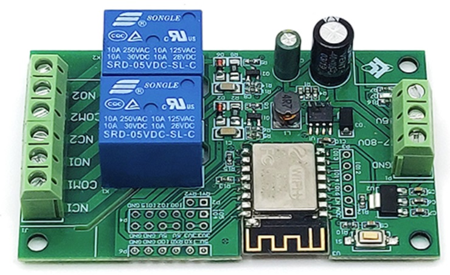

## Product description

This is a 2-relay board with an ESP-12F.

Each relay has COM+NO+NC exposed. Relay load of up to 250VAC or 30VDC.

The board can be powered either via 7-80VDC, or via 5VDC (separate connectors).

I bought it from: https://www.aliexpress.com/item/1005003516399175.html (no affiliation, no guarantee it will continue to exist).

Search for more: https://www.aliexpress.com/wholesale?SearchText=esp-12f+relay+2+channel

Technical specification here: http://www.chinalctech.com/cpzx/Programmer/Relay_Module/510.html (Link working 23 May 2024)

## GPIO Pinout

This board has headers for every GPIO pin on its ESP-12F.

| Pin   | Comment                                                 |
| ----- | ------------------------------------------------------- |
| 5V    | Do not use 5V for programming                           |
| TX    | 3.3V level!                                             |
| RX    | 3.3V level!                                             |
| GPIO0 | 3.3V level! (pulled up, connect to GND for flashing)    |
| GND   |                                                         |
| GND   |                                                         |

| Pin    | Comment                                           |
| ------ | ------------------------------------------------- |
| 3V3    | For programming, inject 3.3V power here           |
| 3V3    | For programming, inject 3.3V power here           |
| 5V     |                                                   |
| 5V     |                                                   |
| GND    |                                                   |
| GND    |                                                   |
|        |                                                   |
| GPIO5  | 3.3V level, Use a jumper to RY1 to enable Relay 1 |
| GPIO4  | 3.3V level, Use a jumper to RY2 to enable Relay 2 |
| GPIO0  | 3.3V level, Extra GPIO0 Header                    |
| GPIO2  | 3.3V level, Blue LED on ESP (inverted)            |
| GPIO15 | 3.3V level                                        |
| GND    |                                                   |

| Pin    | Comment                                  |
| ------ | ---------------------------------------- |
| ADC    | 0V-1V only                               |
| EN     | Pulled up                                |
| GPI16  | 3.3V level, Blue LED on Board (inverted) |
| GPI14  | 3.3V level                               |
| GPI12  | 3.3V level                               |
| GPI13  | 3.3V level                               |

## Basic Config

```yaml
esphome:
  name: esp12frelayx2

esp8266:
  board: esp12e
    
# OTA flashing
ota:
  - platform: esphome

wifi: # Your Wifi network details
  
# Enable fallback hotspot in case wifi connection fails  
  ap:

# Enabling the logging component
logger:

# Enable Home Assistant API
api:

# Enable the captive portal
captive_portal:

# Use the blue LED in the device as a status LED, which will blink if there are warnings (slow) or errors (fast)
status_led:
  pin:
    number: GPIO2
    inverted: True

# x2 relay outputs, exposed as switches in Home Assistant
switch:
  - platform: gpio
    pin: GPIO5
    name: Relay1
    id: relay1
  - platform: gpio
    pin: GPIO4
    name: Relay2
    id: relay2
  # Blue LED on Board (not ESP board) as switch in Home Assistant
  - platform: gpio
    name: Led16
    pin: GPIO16
    inverted: true  
```
