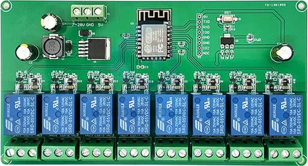

## Product description

This is an 8-relay board with an [ESP-12F](https://docs.ai-thinker.com/_media/esp8266/docs/esp-12f_product_specification_en.pdf).

Each relay has COM+NO+NC exposed. Product descriptions don't seem to specify maximum load.

The board can be powered either via 7-30VDC or via 5VDC via the screw terminals. Power the board with the screw terminals for flashing.

I bought it from: https://s.click.aliexpress.com/e/_DnEOi2r (affiliation link so i can make others like this, no guarantee it will continue to exist).

## GPIO Header

This board has headers for a few GPIO pins on its ESP-12F.

| Pin   | Comment                                                   |
| ----- | --------------------------------------------------------- |
| 5V    | Do not use 5V for programming. Power via screw terminals. |
| TX    | Exposed on board 3.3V level! UART0_TX                     |
| RX    | Exposed on board 3.3V level! UART0_RX                     |
| GPIO0 | 3.3V level! (pulled up, connect to GND for programming)   |
| GND   |                                                           |
| GND   |                                                           |
| GPIO2 | UART1_TX                                                  |
| ADC   |                                                           |

## GPIO Pinout

Be aware that relay 1 and 6 will be momentarily toggled on during boot.

| Pin    | Comment                                       |
| ------ | --------------------------------------------- |
| GPIO0  | Relay 6 (high on boot)                        |
| GPIO2  | Exposed on board | (blue) LED on the ESP-12F  |
| GPIO4  | Relay 7                                       |
| GPIO5  | Relay 8                                       |
| GPIO12 | Relay 3                                       |
| GPIO13 | Relay 4                                       |
| GPIO14 | Relay 2                                       |
| GPIO15 | Relay 5                                       |
| GPIO16 | Relay 1 (high on boot)                        |

## Basic Config

```yaml
esphome:
  name: relayboard

esp8266:
  board: esp12e

# Status LED
light:
  - platform: status_led
    name: "RelayBoard LED"
    restore_mode: ALWAYS_ON
    pin:
      number: GPIO02
      inverted: True

# 8 relay outputs, exposed as switches in Home Assistant
switch:
  - platform: gpio
    pin: GPIO16
    name: Relay1
    id: relay1
  - platform: gpio
    pin: GPIO14
    name: Relay2
    id: relay2
  - platform: gpio
    pin: GPIO12
    name: Relay3
    id: relay3
  - platform: gpio
    pin: GPIO13
    name: Relay4
    id: relay4
  - platform: gpio
    pin: GPIO15
    name: Relay5
    id: relay5
  - platform: gpio
    pin: GPIO00
    name: Relay6
    id: relay6
  - platform: gpio
    pin: GPIO04
    name: Relay7
    id: relay7
  - platform: gpio
    pin: GPIO05
    name: Relay8
    id: relay8
```
