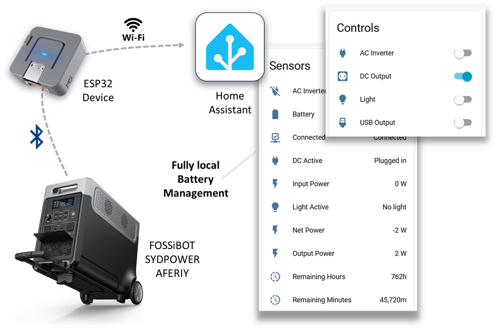

## Description

ESP-FBot is an ESPHome custom component for locally monitoring and controlling portable power stations via Bluetooth.
It provides fast local management without cloud services, making it ideal for outage situations.

Compatible with battery systems that use the "BrightEMS" application, including:

- **FOSSiBOT**: F3600 Pro, F2400
- **SYDPOWER**: N052, N066
- **AFERIY**: P210 (2400W/2048Wh), P310 (3300W/3840Wh)

The ESP32 device communicates with the battery using Bluetooth and relays data locally via WiFi to Home Assistant.

## Features

- **Battery Monitoring**: Real-time battery state of charge (%), remaining capacity (kWh), and time remaining
- **Power Monitoring**: Track input power, output power, system consumption, and total power flow
- **Output Control**: Switch USB ports, DC outputs, AC inverter, and light on/off
- **Home Assistant Integration**: All sensors and controls automatically discovered in Home Assistant
- **Auto-reconnect**: Handles BLE disconnections and automatically reconnects

## Requirements

- A compatible battery that uses the "BrightEMS" application (no cloud pairing needed)
- [Home Assistant](https://www.home-assistant.io/) with [ESPHome](https://esphome.io/)
- ESP32 device (M5Stack ATOM Light, M5StickC PLUS2, ESP32-WROOM, ESP32-DevKit, etc.)
- The ESP32 device must be within Bluetooth range of the battery (typically 10-30 feet)

## Getting Started

### 1. Get the Battery's MAC Address

Find the Bluetooth LE MAC address of your battery by searching for a device that starts with "FOSSIBOT" or "POWER".

**On Windows**: Use [BluetoothLEView](https://www.nirsoft.net/utils/bluetooth_low_energy_scanner.html)

The MAC address will look like `A1:B2:C3:D4:E5:F6`.

### 2. Installation

1. Use the example configuration below as a starting point
2. Update WiFi credentials, API encryption key, and Battery MAC address
3. Flash to your ESP32 device

## Configuration

```yaml
esphome:
  name: bigbattery
  friendly_name: Big Battery
  comment: "AFERIY 3840Wh Portable Power Station"

esp32:
  board: esp32dev
  framework:
    type: esp-idf

# Enable Home Assistant API
api:
  encryption:
    key: "(PLACE YOUR KEY HERE)"

ota:
  - platform: esphome
    password: "(PLACE YOUR KEY HERE)"

wifi:
  ssid: !secret wifi_ssid
  password: !secret wifi_password

# Enable logging
logger:
  level: WARN

# Load external component from GitHub
external_components:
  - source: github://ylianst/esp-fbot
    refresh: 10s

# BLE Client configuration
ble_client:
  - mac_address: "AA:BB:CC:DD:EE:FF"  # Replace with your battery's MAC address

# Configure the FBot component
fbot:
  id: my_fbot
  polling_interval: 5s  # How often to poll for updates (default: 2s)

# Binary sensors for connection and output states
binary_sensor:
  - platform: fbot
    fbot_id: my_fbot
    connected:
      name: "Connected"
    battery_connected_s1:
      name: "Connected S1"
    battery_connected_s2:
      name: "Connected S2"
    usb_active:
      name: "USB Active"
    dc_active:
      name: "DC Active"
    ac_active:
      name: "AC Inverter Active"
    light_active:
      name: "Light Active"

# Sensors for battery and power readings
sensor:
  - platform: fbot
    fbot_id: my_fbot
    battery_level:
      name: "Battery"
      id: battery_percent
    battery_s1_level:
      name: "Battery S1"
      id: battery_percent_s1
    battery_s2_level:
      name: "Battery S2"
      id: battery_percent_s2
    input_power:
      name: "Input Power"
      id: input_watts
    output_power:
      name: "Output Power"
      id: output_watts
    system_power:
      name: "System Power"
      id: system_watts
    total_power:
      name: "Total Power"
      id: total_watts
    remaining_time:
      name: "Remaining Minutes"
      id: remaining_minutes
  # Convert remaining time from minutes to hours
  - platform: template
    name: "Remaining Hours"
    lambda: |-
      if (id(remaining_minutes).has_state()) {
        return id(remaining_minutes).state / 60.0;
      }
      return 0.0;
    unit_of_measurement: "h"
    accuracy_decimals: 1
    device_class: duration
    state_class: measurement
    update_interval: 5s
  # Net power (positive = charging, negative = discharging)
  - platform: template
    name: "Net Power"
    lambda: |-
      if (id(input_watts).has_state() && id(output_watts).has_state()) {
        return id(input_watts).state - id(output_watts).state;
      }
      return 0.0;
    unit_of_measurement: "W"
    accuracy_decimals: 0
    device_class: power
    state_class: measurement
    update_interval: 5s

# Switches to control outputs
switch:
  - platform: fbot
    fbot_id: my_fbot
    usb:
      name: "USB Output"
      id: usb_switch
    dc:
      name: "DC Output"
      id: dc_switch
    ac:
      name: "AC Inverter"
      id: ac_switch
    light:
      name: "Light"
      id: light_switch
```

## Battery Factory Reset

To remove your battery's WiFi connection to the cloud, you can perform a factory reset. Press and hold the **DC button**, **light button**, and **USB button** simultaneously for about 5 seconds until you hear a beep.

## Links

- [GitHub Repository](https://github.com/Ylianst/ESP-FBot)
- [M5 ATOM Extras](https://github.com/Ylianst/ESP-FBot/blob/main/docs/m5atom-extras.md) - Additional features for M5 ATOM Light devices
