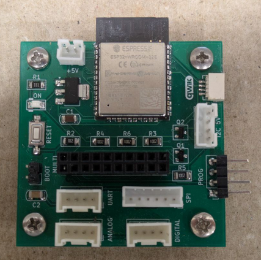

## ESP32 MultiBoard

The ESP32 MultiBoard is a custom board that helps makers connect an ESP32 with all kinds of sensors and actuators,
using common connectors such as Qwiic and Grove.

A serial adapter is needed for programming the board for the first time. Once configured, you can update the
new code via OTA in ESPHome or Arduino IDE.



---

### 🧩 Specifications

- **Power Supply:** 5V DC input
- **Qwiic Connector:** For I²C peripherals (3.3V)
- **Grove Connectors:**
  - UART type (TX/RX communication)
  - Analog type
  - Digital type
  - I²C (5V compatible)
- **Pin Header:** For expansion modules or shields
- **SPI Connector**
- **ESPHome Compatible:** Designed to easily integrate with ESPHome-based devices.

---

### Pinout


---

```yaml
esphome:
  name: esp32-multiboard

esp32:
  board: esp32dev

# I2C Configuration (Qwiic Connector)
i2c:
  - sda: 21
    scl: 22
    scan: true
    id: bus_a

# UART Configuration (Grove UART: 1:GND, 2:3V3, 3:GPIO17, 4:GPIO16)
uart:
  - id: uart_bus
    tx_pin: 17
    rx_pin: 16
    baud_rate: 9600

# SPI Configuration
spi:
  clk_pin: 18
  mosi_pin: 23
  miso_pin: 19

# Grove Digital Connector (3:GPIO25, 4:GPIO26)
binary_sensor:
  - platform: gpio
    pin:
      number: 26
      mode: INPUT_PULLUP
    name: "Grove Digital Input (GPIO26)"

switch:
  - platform: gpio
    pin: 25
    name: "Grove Digital Output (GPIO25)"

# Grove Analog Connector (3:GPIO35, 4:GPIO34)
sensor:
  - platform: adc
    pin: 35
    name: "Grove Analog (GPIO35)"
    update_interval: 5s
    attenuation: 11db

  - platform: adc
    pin: 34
    name: "Grove Analog (GPIO34)"
    update_interval: 5s
    attenuation: 11db
```
