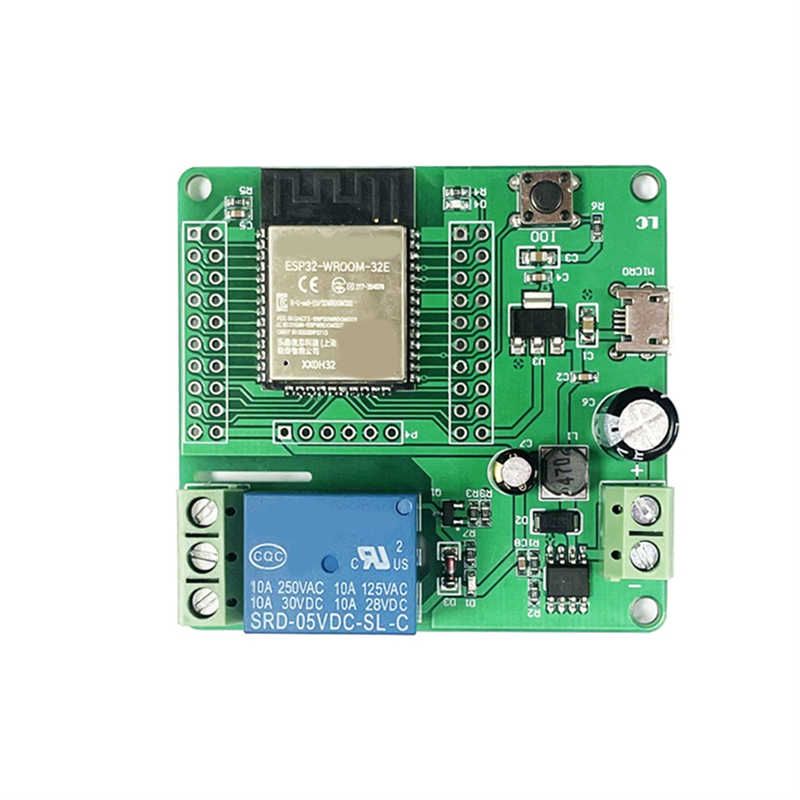

## Product description

This is a 1-relay board with an ESP32-WROOM-32E.

Each relay has COM+NO+NC exposed. Each relay supports 10Amp max load.

The board can be powered either via 7-30VDC or via 5VDC (separate connectors).

The onboard button is connected to GPI00

I bought it from aliexpress.

## GPIO Pinout

This board has headers for every GPIO pin on its ESP32.

I was able to flash it using the ESPhome web tool and an FTDI connector. I was able to use the 5V pin with the FTDI set to 5V as well and connected to the GPIO pins, but 3.3V should be used if possible (it would not flash for me at 3.3V). I was unable to flash with a USB cable.

| Pin   | Comment                           |
| ----- | --------------------------------- |
| 5V    |                                   |
| TX    |                                   |
| RX    |                                   |
| GND   |                                   |
| GND   |                                   |
| GPIO0 | (Connected to GND for programing) |

## Basic Config

```yaml
esphome:
  name: ESP32 relayboard

esp32:
  board: esp32dev
  framework:
    type: esp-idf

# Enable logging
logger:

# Enable Home Assistant API
api:
  encryption:
    key: "xxxx"

ota:
  password: "xxxx"

wifi:
  ssid: "wifi_ssid"
  password: "wifi_password"

  # Enable fallback hotspot (captive portal) in case wifi connection fails
  ap:
    ssid: "ESP32 Fallback Hotspot"
    password: "xxxx"

captive_portal:

light:
  - platform: status_led
    name: "ESP32 Led"
    restore_mode: ALWAYS_OFF
    pin:
      number: GPIO23
      inverted: False

switch:
  - platform: gpio
    pin: GPIO16
    name: "ESP32 Relay"
    id: ESP32_relay

binary_sensor:
  - platform: gpio
    pin:
      number: GPIO0
      mode: INPUT_PULLUP
    name: Button
    filters:
      - invert
      - delayed_on_off: 50ms
    on_press:
      then:
        - switch.turn_on: ESP32_relay

```
