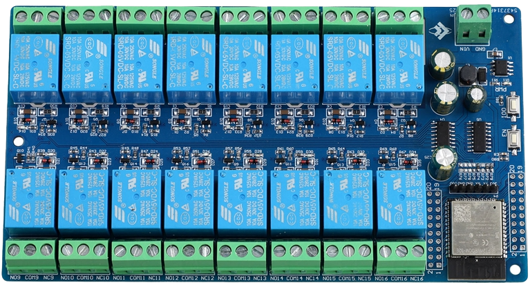

## Product description

This is a 16-relay board with an ESP32-WROOM-E.

Each relay has COM+NO+NC exposed. Each relay supports 10Amp max load.

The board is powered by 12VDC.

It is available on aliexpress.

## GPIO Pinout

This board has headers for every GPIO pin on its ESP32.

|      |      | IO0 | GND | GND | RX  | TX  | 3V3 |      |      |
| :--: | :--: | :-: | :-: | :-: | :-: | :-: | :-: | :--: | :--: |
| 3V3  | IO6  |     |     |     |     |     |     | 3V3  | GND  |
| IO7  | IO8  |     |     |     |     |     |     | IO10 | IO11 |
| IO15 | IO2  |     |     |     |     |     |     | IO13 | IO9  |
| IO0  | IO4  |     |     |     |     |     |     | IO14 | IO12 |
| IO16 | IO17 |     |     |     |     |     |     | IO26 | IO27 |
| IO5  | IO18 |     |     |     |     |     |     | IO33 | IO25 |
| IO9  | GND  |     |     |     |     |     |     | IO35 | IO33 |
| IO21 | IO3  |     |     |     |     |     |     | IO39 | IO34 |
| IO1  | IO22 |     |     |     |     |     |     | EN   | IO36 |
| IO23 | GND  |     |     |     |     |     |     | 3V3  | GND  |

## Basic Config

```yaml
esphome:
  name: relay-x16

esp32:
  board: esp32dev

sn74hc595:
  - id: 'sn74hc595_hub'
    data_pin: GPIO14
    clock_pin: GPIO13
    latch_pin: GPIO12
    oe_pin: GPIO05
    sr_count: 2

switch:
  - platform: gpio
    name: "Relay01"
    id: "relay01"
    pin:
      sn74hc595: sn74hc595_hub
      number: 0
      inverted: false
  - platform: gpio
    name: "Relay02"
    id: "relay02"
    pin:
      sn74hc595: sn74hc595_hub
      number: 1
      inverted: false
  - platform: gpio
    name: "Relay03"
    id: "relay03"
    pin:
      sn74hc595: sn74hc595_hub
      number: 2
      inverted: false
  - platform: gpio
    name: "Relay04"
    id: "relay04"
    pin:
      sn74hc595: sn74hc595_hub
      number: 3
      inverted: false

  - platform: gpio
    name: "Relay05"
    id: "relay05"
    pin:
      sn74hc595: sn74hc595_hub
      number: 4
      inverted: false
  - platform: gpio
    name: "Relay06"
    id: "relay06"
    pin:
      sn74hc595: sn74hc595_hub
      number: 5
      inverted: false
  - platform: gpio
    name: "Relay07"
    id: "relay07"
    pin:
      sn74hc595: sn74hc595_hub
      number: 6
      inverted: false
  - platform: gpio
    name: "Relay08"
    id: "relay08"
    pin:
      sn74hc595: sn74hc595_hub
      number: 7
      inverted: false

  - platform: gpio
    name: "Relay09"
    id: "relay09"
    pin:
      sn74hc595: sn74hc595_hub
      number: 8
      inverted: false
  - platform: gpio
    name: "Relay10"
    id: "relay10"
    pin:
      sn74hc595: sn74hc595_hub
      number: 9
      inverted: false
  - platform: gpio
    name: "Relay11"
    id: "relay11"
    pin:
      sn74hc595: sn74hc595_hub
      number: 10
      inverted: false
  - platform: gpio
    name: "Relay12"
    id: "relay12"
    pin:
      sn74hc595: sn74hc595_hub
      number: 11
      inverted: false

  - platform: gpio
    name: "Relay13"
    id: "relay13"
    pin:
      sn74hc595: sn74hc595_hub
      number: 12
      inverted: false
  - platform: gpio
    name: "Relay14"
    id: "relay14"
    pin:
      sn74hc595: sn74hc595_hub
      number: 13
      inverted: false
  - platform: gpio
    name: "Relay15"
    id: "relay15"
    pin:
      sn74hc595: sn74hc595_hub
      number: 14
      inverted: false
  - platform: gpio
    name: "Relay16"
    id: "relay16"
    pin:
      sn74hc595: sn74hc595_hub
      number: 15
      inverted: false
```
