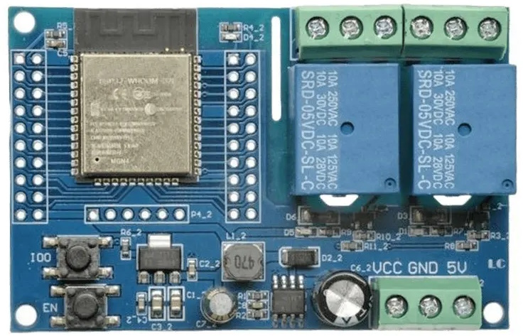

## Description

A 2-relay board with an ESP32-WROOM-32E.

Each relay has COM/NO/NC terminals and is rated for a 10 A max load.

The board can be powered either via 7-30 VDC or 5 VDC (separate terminals).

An onboard button is connected to GPI00, and an onboard LED is connected to GPIO23.

It can be found on eBay and Aliexpress from multiple sellers.

## GPIO Pinout

The board has headers for every GPIO pin on the ESP32. They are labeled on the reverse side of the board.

### Pin Functions

| Pin    | Comment              |
| ------ | -------------------- |
| GPIO0  | Onboard button       |
| GPIO16 | Relay 1 (Outermost)  |
| GPIO17 | Relay 2              |
| GPIO23 | LED                  |

## Programming

Programming was done with a CP2102N USB-to-serial converter via the 6 pin header. The header is not a FTDI compatible pinout. ESPHome Web tools was able to flash the board after using the onboard buttons to enter programming mode.

## Basic Config

```yaml
esphome:
  name: esp32-relay-x2

esp32:
  board: esp32dev

# LED exposed as binary light
output:
  - platform: gpio
    pin: GPIO23
    id: output_led

light:
  - platform: binary
    id: light_led
    name: LED
    output: output_led

# Relays exposed as switches
switch:
  - platform: gpio
    pin: GPIO16
    id: relay_1
    name: Relay 1

  - platform: gpio
    pin: GPIO17
    id: relay_2
    name: Relay 2
```
