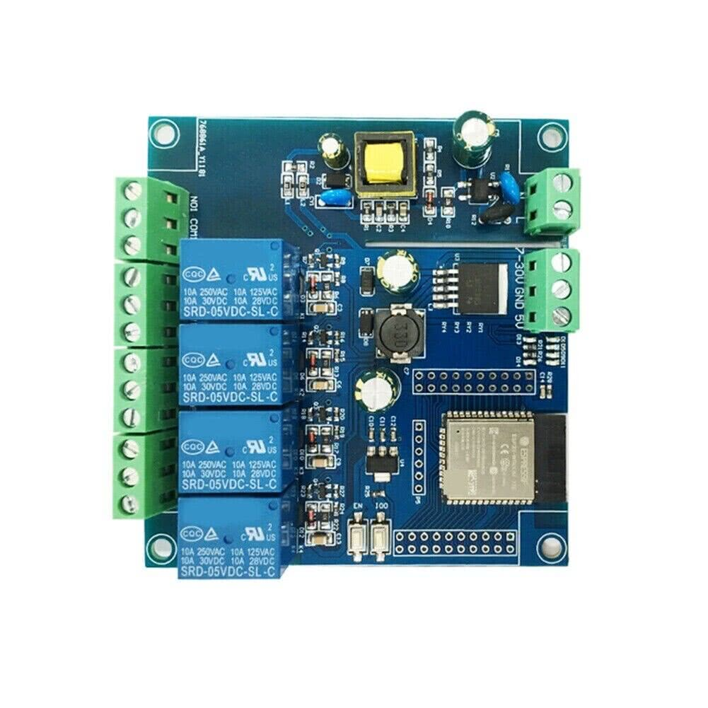
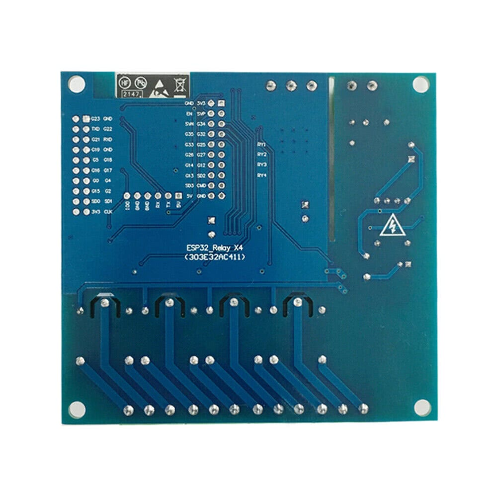

## Product description

This is a 4-relay board with an ESP32-WROOM-E that can be powered from either AC mains or a wide range of DC. The board can be powered either via 120-220VAC, 7-30VDC or 5VDC (separate connectors).

Each relay has COM+NO+NC exposed. The board also exposes a plethora of free GPIOs to use on solder pads.

I bought it from: [eBay](https://www.ebay.com/itm/295164946172), but very similar boards are being sold everywhere.

Note: v1.1 of this board is nearly identical except the chip is an ESP32-WROOOM-32E

## Pinout

This board has two double-row headers 10x2 for every GPIO pin on its ESP32 and a single row header for flashing.
Programming can be done with 3.3V connected to 5V pin and GPIO0 connected to GND (via jumper or a push button).
After flasing, if you want to test the board - it has to be powered properly via dedicated connectors, or via 5VDC applied to 5V ping.
If you'll power it up with 3.3V on 5V pin - the MCU will brownout.

### Programming header pinout

| Pin   | Comment                                                 |
| ----- | ------------------------------------------------------- |
| 5V    | Do not use 5V for programming                           |
| TX    | Exposed on board 3.3V level!                            |
| RX    | Exposed on board 3.3V level!                            |
| GND   |                                                         |
| GND   |                                                         |
| GPIO0 | 3.3V level! (Connected to a push button for programing) |

### Internal pinout

| Pin    | Function                      |
| ------ | ----------------------------- |
| GPIO23 | Status LED                    |
| GPIO32 | Relay #1                      |
| GPIO33 | Relay #2                      |
| GPIO25 | Relay #3                      |
| GPIO26 | Relay #4                      |

## Basic Config

```yaml
esphome:
  name: ac-dc-relay-x4
  friendly_name: ac-dc-relay-x4

esp32:
  board: esp32dev
  framework:
    type: esp-idf

switch:
  - platform: gpio
    pin: GPIO32
    name: "Relay 1"
  - platform: gpio
    pin: GPIO33
    name: "Relay 2"
  - platform: gpio
    pin: GPIO25
    name: "Relay 3"
  - platform: gpio
    pin: GPIO26
    name: "Relay 4"


status_led:
  pin: GPIO23
```
