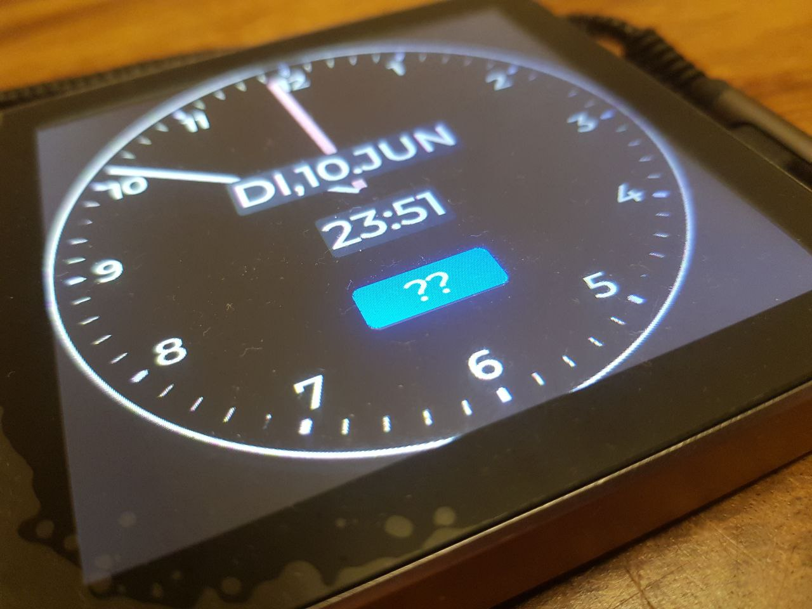
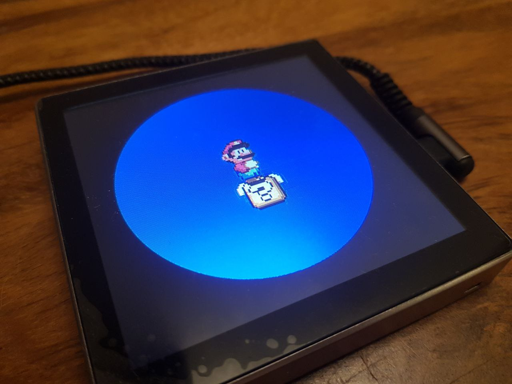

## Description

The "ESP32-S3 4.0 Inch Smart Display" is a cheap (~30 Euro) wall-mounted touch display 

- ESP32-S3 (QFN56) with 16MB flash and 8MB PSRAM
- 4 inch display (driven with a ST7701s) and a GT911 touch screen
- 1 or 3 relays


## Links

- [Shop](https://www.aliexpress.com/item/1005006335587633.html)
- [Schematics, Datasheets and Examples](http://pan.jczn1688.com/directlink/1/ESP32%20module/4.0inch_ESP32-4848S040.zip)


## Simple Configuration

```yaml
substitutions:
  device_name: touchdisplay1
     
esphome:
  name: $device_name   
  on_boot:
    - output.turn_on: backlight
   
psram:
  mode: octal
  speed: 80MHz

esp32:
  board: esp32-s3-devkitc-1
  flash_size: 16MB   
  framework:
    type: esp-idf
   
api:

sensor:

  - platform: wifi_signal
    name: "$device_name WiFi Signal"
    id: sensor_wifi
    update_interval: 60s
    entity_category: "diagnostic"

  - platform: uptime
    id: uptime_sensor
    name: "$device_name Uptime"
    update_interval: 15s
    entity_category: "diagnostic"
    
spi:
      mosi_pin: GPIO47
      clk_pin: GPIO48
      
display:
  - platform: st7701s
    color_order: RGB
    dimensions:
      width: 480
      height: 480
    cs_pin: GPIO39
    de_pin: GPIO18
    hsync_pin: GPIO16
    vsync_pin: GPIO17
    pclk_pin: GPIO21
    data_rate: 40MHz
    
    data_pins:
        - 46 
        - 9 
        - 10 
        - 11 
        - 12
        - 13 
        - 14
        - 0         
        - 4
        - 5 
        - 6 
        - 7 
        - 15
        - 8 
        - 20 
        - 3 
                
    
    init_sequence:
    - [0x01]
    - [0xFF, 0x77, 0x01, 0x00, 0x00, 0x10]
    - [0xC0, 0x3B, 0x00]
    - [0xC1, 0x0D, 0x02]
    - [0xC2, 0x31, 0x05]
    #- [0xCD, 0x08]
    - [0xCD, 0x00] #this differs from the standard init seq. We have to set MDT=0 
    - [
        0xB0,
        0x00,
        0x11,
        0x18,
        0x0E,
        0x11,
        0x06,
        0x07,
        0x08,
        0x07,
        0x22,
        0x04,
        0x12,
        0x0F,
        0xAA,
        0x31,
        0x18,
    ]
    - [
        0xB1,
        0x00,
        0x11,
        0x19,
        0x0E,
        0x12,
        0x07,
        0x08,
        0x08,
        0x08,
        0x22,
        0x04,
        0x11,
        0x11,
        0xA9,
        0x32,
        0x18,
    ]
    - [0xFF, 0x77, 0x01, 0x00, 0x00, 0x11]
    - [0xB0, 0x60]
    - [0xB1, 0x32]
    - [0xB2, 0x07]
    - [0xB3, 0x80]
    - [0xB5, 0x49]
    - [0xB7, 0x85]
    - [0xB8, 0x21]
    - [0xC1, 0x78]
    - [0xC2, 0x78]
    - [0xE0, 0x00, 0x1B, 0x02]
    - [0xE1, 0x08, 0xA0, 0x00, 0x00, 0x07, 0xA0, 0x00, 0x00, 0x00, 0x44, 0x44]
    - [0xE2, 0x11, 0x11, 0x44, 0x44, 0xED, 0xA0, 0x00, 0x00, 0xEC, 0xA0, 0x00, 0x00]
    - [0xE3, 0x00, 0x00, 0x11, 0x11]
    - [0xE4, 0x44, 0x44]
    - [
        0xE5,
        0x0A,
        0xE9,
        0xD8,
        0xA0,
        0x0C,
        0xEB,
        0xD8,
        0xA0,
        0x0E,
        0xED,
        0xD8,
        0xA0,
        0x10,
        0xEF,
        0xD8,
        0xA0,
    ]
    - [0xE6, 0x00, 0x00, 0x11, 0x11]
    - [0xE7, 0x44, 0x44]
    - [
        0xE8,
        0x09,
        0xE8,
        0xD8,
        0xA0,
        0x0B,
        0xEA,
        0xD8,
        0xA0,
        0x0D,
        0xEC,
        0xD8,
        0xA0,
        0x0F,
        0xEE,
        0xD8,
        0xA0,
    ]
    - [0xEB, 0x02, 0x00, 0xE4, 0xE4, 0x88, 0x00, 0x40]
    - [0xEC, 0x3C, 0x00]
    - [
        0xED,
        0xAB,
        0x89,
        0x76,
        0x54,
        0x02,
        0xFF,
        0xFF,
        0xFF,
        0xFF,
        0xFF,
        0xFF,
        0x20,
        0x45,
        0x67,
        0x98,
        0xBA,
    ]
    - [0xFF, 0x77, 0x01, 0x00, 0x00, 0x13]
    - [0xE5, 0xE4]
    - [0x3A, 0x60]
    
#    show_test_card: true
        
touchscreen:
  platform: gt911
  id: my_touchscreen
  #interrupt_pin: GPIOXX
  
i2c:
   scl: GPIO45
   sda: GPIO19 
  
output:
  - platform: ledc
    pin: GPIO38
    id: backlight
    
switch:        #relais
  - platform: gpio
    name: "$device_name Relay 1"
    pin: GPIO40
    id: relay1
  - platform: gpio
    name: "$device_name Relay 2"
    pin: GPIO2
    id: relay2       
  - platform: gpio
    name: "$device_name Relay 3"
    pin: GPIO1
    id: relay3    

``` 
  
  
  

## Advanced Configuration
- to be combined with the simple configuration above
- shows an analog clock and a button that triggers an animation




```yaml  
    
time:
  - platform: homeassistant
    id: time_homeassistant

interval:
  - interval: 5s
    then:
      - script.execute: time_update
      
  - interval: 0.05s
    then:
        - animation.next_frame: my_animation
        - lvgl.image.update:
                id: img_id
                src: my_animation    
  
script:
  - id: time_update
    then:
      - lvgl.indicator.update:
          id: minute_hand
          value: !lambda |-
            return id(time_homeassistant).now().minute;
      - lvgl.indicator.update:
          id: hour_hand
          value: !lambda |-
            auto now = id(time_homeassistant).now();
            return std::fmod(now.hour, 12) * 60 + now.minute;
      - lvgl.label.update:
          id: date_label
          text: !lambda |-
            static const char * const mon_names[] = {"JAN", "FEB", "MAR", "APR", "MAI", "JUN", "JUL", "AUG", "SEP", "OKT", "NOV", "DEZ"};
            static const char * const day_names[] = {"SO", "MO", "DI", "MI", "DO", "FR", "SA"};
            static char date_buf[16];
            auto now = id(time_homeassistant).now();
            snprintf(date_buf, sizeof(date_buf), "%s,%2d.%s", day_names[now.day_of_week-1], now.day_of_month, mon_names[now.month-1]);
            return date_buf;
      - lvgl.label.update:
          id: time_label
          text: !lambda |-
            static char date_buf[16];
            auto now = id(time_homeassistant).now();
            snprintf(date_buf, sizeof(date_buf), "%d:%02d",now.hour, now.minute);
            return date_buf;

lvgl:
  log_level: INFO
  color_depth: 16
  bg_color: 0x000000
  text_font: montserrat_30
  align: center
  
  style_definitions:
    - id: date_style
      text_font: montserrat_40
      align: center
      text_color: 0xFFFFFF
      bg_opa: cover
      bg_color: 0x3f3f3f
      radius: 4
      pad_all: 2
      
  pages:
    - id: clock_page 
      widgets:
        - meter:
            height: 480
            width: 480
            align: center
            bg_opa: TRANSP
            text_color: 0xFFFFFF
            scales:
              - ticks:
                  width: 1
                  count: 61
                  length: 10
                  color: 0xFFFFFF
                range_from: 0
                range_to: 60
                angle_range: 360
                rotation: 270
                indicators:
                  - line:
                      id: minute_hand
                      width: 5
                      color: 0xE0E0E0
                      r_mod: -1
              - angle_range: 330
                rotation: 300
                range_from: 1
                range_to: 12
                ticks:
                  width: 1
                  count: 12
                  length: 1
                  major:
                    stride: 1
                    width: 4
                    length: 8
                    color: 0xC0C0F0
                    label_gap: 20

              - angle_range: 360
                rotation: 270
                range_from: 0
                range_to: 720
                indicators:
                  - line:
                      id: hour_hand
                      width: 8
                      color: 0xF0A0A0
                      r_mod: -20            
                
        - label:
            styles: date_style
            id: date_label
            text_font: montserrat_40
            y: -40
        - label:
            id: time_label
            styles: date_style
            y: +40

        - button:
            align: CENTER
            y: +120
            width: 100
            height: 40
            id: btn_id
            checkable: true
            widgets:
              - label:
                  align: center
                  text: "??"
            on_short_click:
              then:
                - lvgl.page.show: animation_page


    - id: animation_page 
      widgets:
        - image:
            align: CENTER
            src: my_animation
            id: img_id
            radius: 480
            clip_corner: true
            on_short_click:
              then:
                - lvgl.page.show: clock_page
            
animation:
  - file: "mario.webp" # https://i.giphy.com/2sdLzwCEu043Jw2EG5.webp
    id: my_animation
    #resize: 480x480 #this does not fit in the flash
    resize: 400x400
    type: RGB565
    

```
