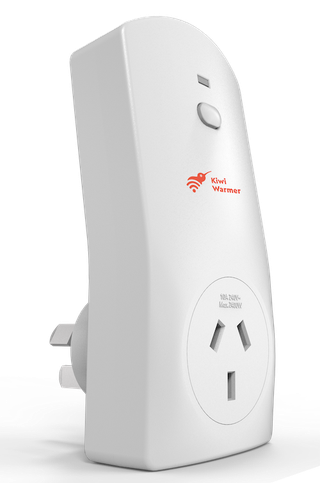

ESP32-based Smart Plug (Rowi), delivered with the pre-flashed ESPHome firmware - no need to open the device!

Configuration: ESP32, Embedded temperature sensor SHTC3, RGB LED.




Maker: Vaiotech (https://www.vaiotech.co.nz/products/)

Purchase online in Australia and New Zealand: https://www.kiwi-warmer.co.nz/for-developers/

## GPIO Pinout

| Pin   | Function             |
| ----- | -------------------- |
| GPIO4 | Button               |
| GPIO2 | Relay                |
| GPI18 | LED RED (inverted)   |
| GPI19 | LED GREEN (inverted) |
| GPI21 | LED BLUE (inverted)  |
| GPI16 | I2C_SDA              |
| GPI17 | I2C_SCL              |

## Basic Configuration

```yaml
substitutions:
  name: rowi-plug
  friendly_name: "Rowi Plug"

esphome:
  name: ${name}
  name_add_mac_suffix: true
  project:
    name: "kiwi-warmer.rowi-plug"
    version: "1.0"

esp32:
  board: nodemcu-32s

wifi:
  ap: {}

captive_portal:

logger:

api:

ota:

web_server:

dashboard_import:
  package_import_url: github://vt-vaio/rowi/rowi-plug.yaml@main

binary_sensor:
  - platform: gpio
    pin:
      number: GPIO4
      mode:
        input: true
        pullup: true
      inverted: true
    name: "${friendly_name} Button"
    disabled_by_default: true
    on_click:
      - switch.toggle: relay

  - platform: status
    name: "${friendly_name} Status"

switch:
  - platform: gpio
    name: "${friendly_name}"
    pin: GPIO2
    id: relay

output:
  - platform: ledc
    id: red
    pin:
      number: GPIO18
      inverted: true
  - platform: ledc
    id: green
    pin:
      number: GPIO19
      inverted: true
  - platform: ledc
    id: blue
    pin:
      number: GPIO21
      inverted: true

light:
  - platform: rgb
    name: ${friendly_name}
    disabled_by_default: true
    id: rgb_light
    red: red
    green: green
    blue: blue

i2c:
  sda: GPIO16
  scl: GPIO17

sensor:
  - platform: shtcx
    temperature:
      name: "${friendly_name} Temperature"
    humidity:
      name: "${friendly_name} Humidity"

  - platform: uptime
    name: "${friendly_name} Uptime"
    disabled_by_default: true
    id: uptime_sensor

text_sensor:
  - platform: wifi_info
    ip_address:
      name: "${friendly_name} IP Address"
      disabled_by_default: true
```
