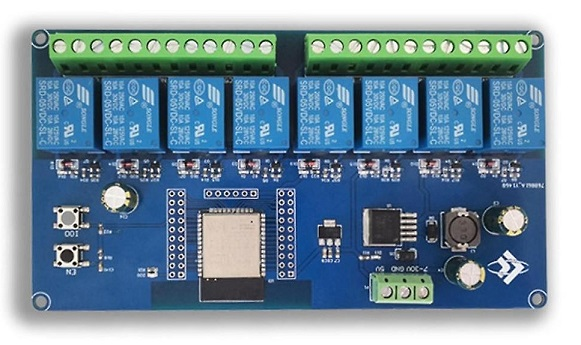

## Product description

This is a 8-relay board with an ESP32-WROOM-E.

Each relay has COM+NO+NC exposed. Product descriptions don't seem to specify maximum load. Each relay supports 10Amp max load, acconding to the label.

The board can be powered either via 7-30VDC or via 5VDC (separate connectors). It draws about 100mA with the relays off, and just over 500mA with all the relays on.

I bought it from: https://www.aliexpress.us/item/3256802045374301.html

## GPIO Pinout

This board has headers for every GPIO pin on its ESP32.

| Pin    | Comment                                                  |
| ------ | -------------------------------------------------------- |
| 5V     | Do not use 5V for programming                            |
| TX     | Exposed on board 3.3V level!                             |
| RX     | Exposed on board 3.3V level!                             |
| GND    |                                                          |
| GND    |                                                          |
| GPIO0  | 3.3V level! (Connected to a push button for programing)  |
| GPIO23 | On-board general purpose LED                             |
| GPIO32 | Relay 1                                                  |
| GPIO33 | Relay 2                                                  |
| GPIO25 | Relay 3                                                  |
| GPIO26 | Relay 4                                                  |
| GPIO27 | Relay 5                                                  |
| GPIO14 | Relay 6                                                  |
| GPIO12 | Relay 7                                                  |
| GPIO13 | Relay 8                                                  |

## Basic Config

```yaml
esphome:
  name: ESP32 relayboard

esp32:
  board: esp32dev

# Status LED
light:
  - platform: status_led
    name: "RelayBoard Led"
    restore_mode: ALWAYS_ON
    pin:
      number: GPIO23

# 8 relay outputs, exposed as switches in Home Assistant
switch:
  - platform: gpio
    pin: GPIO32
    name: Relay1
    id: relay1
  - platform: gpio
    pin: GPIO33
    name: Relay2
    id: relay2
  - platform: gpio
    pin: GPIO25
    name: Relay3
    id: relay3
  - platform: gpio
    pin: GPIO26
    name: Relay4
    id: relay4
  - platform: gpio
    pin: GPIO27
    name: Relay5
    id: relay5
  - platform: gpio
    pin: GPIO14
    name: Relay6
    id: relay6
  - platform: gpio
    pin: GPIO12
    name: Relay7
    id: relay7
  - platform: gpio
    pin: GPIO13
    name: Relay8
    id: relay8
```
