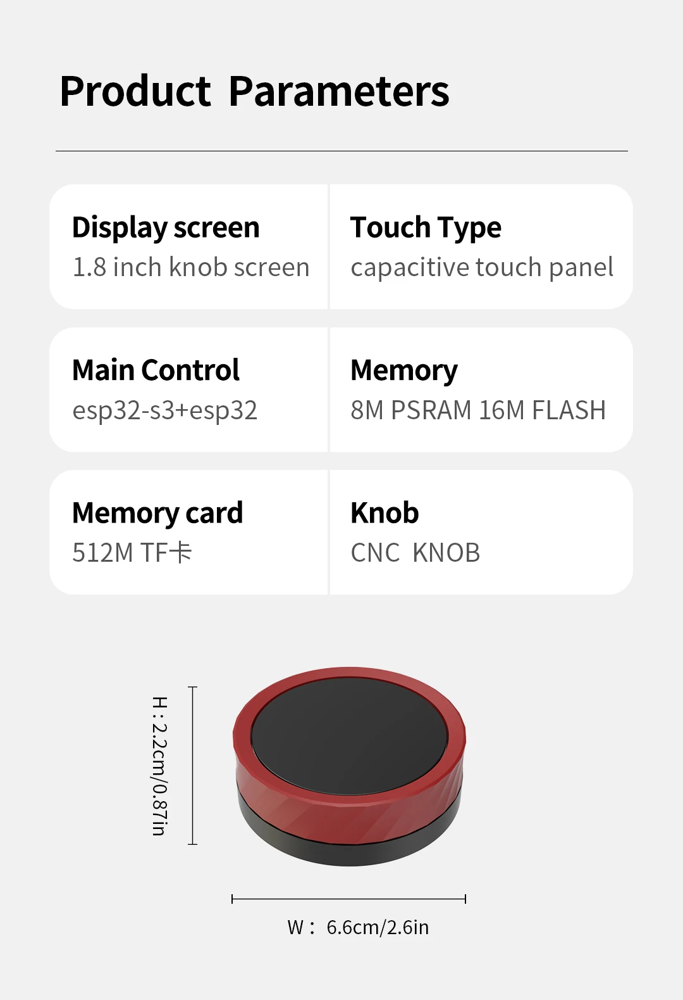

## Product specs

| Feature      | Spec                    |
| ------------ | ----------------------- |
| Screen       | ST77916 driver 360\*360 |
| Touch screen | CST816                  |
| CPU          | ESP32-S3 & ESP32        |
| Flash        | 16MB                    |
| PSRAM        | 8MB                     |

## Product description

A pretty red metal rotatable knob with build-in 1.85inch IPS display. It integrates an esp32s3 as well as an esp32 microcontroller.
Avalible on [AliExpress](https://www.aliexpress.com/item/1005008823969298.html) for ~$25.

A blue version is available from [Waveshare](https://www.waveshare.com/esp32-s3-knob-touch-lcd-1.8.htm).

## Basic Config

```yaml
substitutions:
  name: "JC3636K518C"
  friendly_name: "360knob-basic"
  device_description: "ESP32S3-1.8-inch JC3636K518C"
  project_name: "JC3636K518C"
  project_version: "1.0.0"

esphome:
  name: "${name}"
  friendly_name: "${friendly_name}"
  project:
    name: "${project_name}"
    version: "${project_version}"
  platformio_options:
    board_build.flash_mode: dio
    board_build.f_flash: 80000000L
    board_build.f_cpu: 240000000L

esp32:
  board: esp32-s3-devkitc-1
  flash_size: 16MB
  framework:
    type: esp-idf
    sdkconfig_options:
      CONFIG_ESP32S3_DEFAULT_CPU_FREQ_240: "y"
      CONFIG_ESP32S3_DATA_CACHE_64KB: "y"
      CONFIG_ESP32S3_DATA_CACHE_LINE_64B: "y"
      CONFIG_SPIRAM_FETCH_INSTRUCTIONS: y
      CONFIG_SPIRAM_RODATA: y

psram:
  mode: octal

# Enable logging
logger:

# Enable Home Assistant API
api:
  encryption:
    key: !secret encryption_key

ota:
  - platform: esphome
    password: !secret ota_key

wifi:
  ssid: !secret wifi_ssid
  password: !secret wifi_password

  # Enable fallback hotspot (captive portal) in case wifi connection fails
  ap:
    ssid: "${friendly_name} Fallback Hotspot"
    password: "6T3RFWEF71"

spi:
  id: display_qspi
  type: quad
  clk_pin: 13
  data_pins: [15, 16, 17, 18]

i2c:
  sda: 11
  scl: 12
  id: touchscreen_bus

i2s_audio:
  - id: i2s_in
    i2s_lrclk_pin: GPIO45

microphone:
  - platform: i2s_audio
    id: i2s_microphone
    i2s_audio_id: i2s_in
    i2s_din_pin: GPIO46
    adc_type: external
    pdm: false
    channel: left
    sample_rate: 16000
    bits_per_sample: 32bit

touchscreen:
  platform: cst816
  id: my_touchscreen
  interrupt_pin: GPIO9
  reset_pin: GPIO10
  on_release:
    - if:
        condition: lvgl.is_paused
        then:
          - logger.log: "LVGL resuming"
          - lvgl.resume:
          - lvgl.widget.redraw:
          - light.turn_on: display_backlight

light:
  - platform: monochromatic
    id: display_backlight
    name: "Backlight"
    output: backlight_pwm
    default_transition_length:
      milliseconds: 0
    initial_state:
      brightness: 100%
    restore_mode:
      ALWAYS_ON

output:
  - platform: ledc
    pin:
      number: GPIO47
    id: backlight_pwm

display:
  - platform: qspi_dbi
    model: CUSTOM
    data_rate: 80MHz
    color_order: rgb
    dimensions:
      height: 360
      width: 360
    cs_pin: 14
    reset_pin: 21
    invert_colors: true
    auto_clear_enabled: false
    init_sequence:
      - [ 0xF0, 0x28 ]
      - [ 0xF2, 0x28 ]
      - [ 0x73, 0xF0 ]
      - [ 0x7C, 0xD1 ]
      - [ 0x83, 0xE0 ]
      - [ 0x84, 0x61 ]
      - [ 0xF2, 0x82 ]
      - [ 0xF0, 0x00 ]
      - [ 0xF0, 0x01 ]
      - [ 0xF1, 0x01 ]
      - [ 0xB0, 0x56 ]
      - [ 0xB1, 0x4D ]
      - [ 0xB2, 0x24 ]
      - [ 0xB4, 0x87 ]
      - [ 0xB5, 0x44 ]
      - [ 0xB6, 0x8B ]
      - [ 0xB7, 0x40 ]
      - [ 0xB8, 0x86 ]
      - [ 0xBA, 0x00 ]
      - [ 0xBB, 0x08 ]
      - [ 0xBC, 0x08 ]
      - [ 0xBD, 0x00 ]
      - [ 0xC0, 0x80 ]
      - [ 0xC1, 0x10 ]
      - [ 0xC2, 0x37 ]
      - [ 0xC3, 0x80 ]
      - [ 0xC4, 0x10 ]
      - [ 0xC5, 0x37 ]
      - [ 0xC6, 0xA9 ]
      - [ 0xC7, 0x41 ]
      - [ 0xC8, 0x01 ]
      - [ 0xC9, 0xA9 ]
      - [ 0xCA, 0x41 ]
      - [ 0xCB, 0x01 ]
      - [ 0xD0, 0x91 ]
      - [ 0xD1, 0x68 ]
      - [ 0xD2, 0x68 ]
      - [ 0xF5, 0x00, 0xA5 ]
      - [ 0xDD, 0x4F ]
      - [ 0xDE, 0x4F ]
      - [ 0xF1, 0x10 ]
      - [ 0xF0, 0x00 ]
      - [ 0xF0, 0x02 ]
      - [ 0xE0, 0xF0, 0x0A, 0x10, 0x09, 0x09, 0x36, 0x35, 0x33, 0x4A, 0x29, 0x15, 0x15, 0x2E, 0x34 ]
      - [ 0xE1, 0xF0, 0x0A, 0x0F, 0x08, 0x08, 0x05, 0x34, 0x33, 0x4A, 0x39, 0x15, 0x15, 0x2D, 0x33 ]
      - [ 0xF0, 0x10 ]
      - [ 0xF3, 0x10 ]
      - [ 0xE0, 0x07 ]
      - [ 0xE1, 0x00 ]
      - [ 0xE2, 0x00 ]
      - [ 0xE3, 0x00 ]
      - [ 0xE4, 0xE0 ]
      - [ 0xE5, 0x06 ]
      - [ 0xE6, 0x21 ]
      - [ 0xE7, 0x01 ]
      - [ 0xE8, 0x05 ]
      - [ 0xE9, 0x02 ]
      - [ 0xEA, 0xDA ]
      - [ 0xEB, 0x00 ]
      - [ 0xEC, 0x00 ]
      - [ 0xED, 0x0F ]
      - [ 0xEE, 0x00 ]
      - [ 0xEF, 0x00 ]
      - [ 0xF8, 0x00 ]
      - [ 0xF9, 0x00 ]
      - [ 0xFA, 0x00 ]
      - [ 0xFB, 0x00 ]
      - [ 0xFC, 0x00 ]
      - [ 0xFD, 0x00 ]
      - [ 0xFE, 0x00 ]
      - [ 0xFF, 0x00 ]
      - [ 0x60, 0x40 ]
      - [ 0x61, 0x04 ]
      - [ 0x62, 0x00 ]
      - [ 0x63, 0x42 ]
      - [ 0x64, 0xD9 ]
      - [ 0x65, 0x00 ]
      - [ 0x66, 0x00 ]
      - [ 0x67, 0x00 ]
      - [ 0x68, 0x00 ]
      - [ 0x69, 0x00 ]
      - [ 0x6A, 0x00 ]
      - [ 0x6B, 0x00 ]
      - [ 0x70, 0x40 ]
      - [ 0x71, 0x03 ]
      - [ 0x72, 0x00 ]
      - [ 0x73, 0x42 ]
      - [ 0x74, 0xD8 ]
      - [ 0x75, 0x00 ]
      - [ 0x76, 0x00 ]
      - [ 0x77, 0x00 ]
      - [ 0x78, 0x00 ]
      - [ 0x79, 0x00 ]
      - [ 0x7A, 0x00 ]
      - [ 0x7B, 0x00 ]
      - [ 0x80, 0x48 ]
      - [ 0x81, 0x00 ]
      - [ 0x82, 0x06 ]
      - [ 0x83, 0x02 ]
      - [ 0x84, 0xD6 ]
      - [ 0x85, 0x04 ]
      - [ 0x86, 0x00 ]
      - [ 0x87, 0x00 ]
      - [ 0x88, 0x48 ]
      - [ 0x89, 0x00 ]
      - [ 0x8A, 0x08 ]
      - [ 0x8B, 0x02 ]
      - [ 0x8C, 0xD8 ]
      - [ 0x8D, 0x04 ]
      - [ 0x8E, 0x00 ]
      - [ 0x8F, 0x00 ]
      - [ 0x90, 0x48 ]
      - [ 0x91, 0x00 ]
      - [ 0x92, 0x0A ]
      - [ 0x93, 0x02 ]
      - [ 0x94, 0xDA ]
      - [ 0x95, 0x04 ]
      - [ 0x96, 0x00 ]
      - [ 0x97, 0x00 ]
      - [ 0x98, 0x48 ]
      - [ 0x99, 0x00 ]
      - [ 0x9A, 0x0C ]
      - [ 0x9B, 0x02 ]
      - [ 0x9C, 0xDC ]
      - [ 0x9D, 0x04 ]
      - [ 0x9E, 0x00 ]
      - [ 0x9F, 0x00 ]
      - [ 0xA0, 0x48 ]
      - [ 0xA1, 0x00 ]
      - [ 0xA2, 0x05 ]
      - [ 0xA3, 0x02 ]
      - [ 0xA4, 0xD5 ]
      - [ 0xA5, 0x04 ]
      - [ 0xA6, 0x00 ]
      - [ 0xA7, 0x00 ]
      - [ 0xA8, 0x48 ]
      - [ 0xA9, 0x00 ]
      - [ 0xAA, 0x07 ]
      - [ 0xAB, 0x02 ]
      - [ 0xAC, 0xD7 ]
      - [ 0xAD, 0x04 ]
      - [ 0xAE, 0x00 ]
      - [ 0xAF, 0x00 ]
      - [ 0xB0, 0x48 ]
      - [ 0xB1, 0x00 ]
      - [ 0xB2, 0x09 ]
      - [ 0xB3, 0x02 ]
      - [ 0xB4, 0xD9 ]
      - [ 0xB5, 0x04 ]
      - [ 0xB6, 0x00 ]
      - [ 0xB7, 0x00 ]
      - [ 0xB8, 0x48 ]
      - [ 0xB9, 0x00 ]
      - [ 0xBA, 0x0B ]
      - [ 0xBB, 0x02 ]
      - [ 0xBC, 0xDB ]
      - [ 0xBD, 0x04 ]
      - [ 0xBE, 0x00 ]
      - [ 0xBF, 0x00 ]
      - [ 0xC0, 0x10 ]
      - [ 0xC1, 0x47 ]
      - [ 0xC2, 0x56 ]
      - [ 0xC3, 0x65 ]
      - [ 0xC4, 0x74 ]
      - [ 0xC5, 0x88 ]
      - [ 0xC6, 0x99 ]
      - [ 0xC7, 0x01 ]
      - [ 0xC8, 0xBB ]
      - [ 0xC9, 0xAA ]
      - [ 0xD0, 0x10 ]
      - [ 0xD1, 0x47 ]
      - [ 0xD2, 0x56 ]
      - [ 0xD3, 0x65 ]
      - [ 0xD4, 0x74 ]
      - [ 0xD5, 0x88 ]
      - [ 0xD6, 0x99 ]
      - [ 0xD7, 0x01 ]
      - [ 0xD8, 0xBB ]
      - [ 0xD9, 0xAA ]
      - [ 0xF3, 0x01 ]
      - [ 0xF0, 0x00 ]
      - [ 0xF0, 0x01 ]
      - [ 0xF1, 0x01 ]
      - [ 0xA0, 0x0B ]
      - [ 0xA3, 0x2A ]
      - [ 0xA5, 0xC3 ]
      - delay 1ms
      - [ 0xA3, 0x2B ]
      - [ 0xA5, 0xC3 ]
      - delay 1ms
      - [ 0xA3, 0x2C ]
      - [ 0xA5, 0xC3 ]
      - delay 1ms
      - [ 0xA3, 0x2D ]
      - [ 0xA5, 0xC3 ]
      - delay 1ms
      - [ 0xA3, 0x2E ]
      - [ 0xA5, 0xC3 ]
      - delay 1ms
      - [ 0xA3, 0x2F ]
      - [ 0xA5, 0xC3 ]
      - delay 1ms
      - [ 0xA3, 0x30 ]
      - [ 0xA5, 0xC3 ]
      - delay 1ms
      - [ 0xA3, 0x31 ]
      - [ 0xA5, 0xC3 ]
      - delay 1ms
      - [ 0xA3, 0x32 ]
      - [ 0xA5, 0xC3 ]
      - delay 1ms
      - [ 0xA3, 0x33 ]
      - [ 0xA5, 0xC3 ]
      - delay 1ms
      - [ 0xA0, 0x09 ]
      - [ 0xF1, 0x10 ]
      - [ 0xF0, 0x00 ]
      - [ 0x2A, 0x00, 0x00, 0x01, 0x67 ]
      - [ 0x2B, 0x01, 0x68, 0x01, 0x68 ]
      - [ 0x4D, 0x00 ]
      - [ 0x4E, 0x00 ]
      - [ 0x4F, 0x00 ]
      - [ 0x4C, 0x01 ]
      - delay 10ms
      - [ 0x4C, 0x00 ]
      - [ 0x2A, 0x00, 0x00, 0x01, 0x67 ]
      - [ 0x2B, 0x00, 0x00, 0x01, 0x67 ]
      - [ 0x3A, 0x55 ]
      - [ 0x21, 0x00 ]
      - [ 0x11, 0x00 ]
      - delay 120ms
      - [ 0x29, 0x00 ]

time:
  - platform: homeassistant
    id: homeassistant_time
    timezone: Europe/Berlin
    on_time:
      - hours: 2,3,4,5
        minutes: 5
        seconds: 0
        then:
          - switch.turn_on: switch_antiburn
      - hours: 2,3,4,5
        minutes: 35
        seconds: 0
        then:
          - switch.turn_off: switch_antiburn

number:
  - platform: template
    name: LVGL Screen timeout
    optimistic: true
    id: display_timeout
    unit_of_measurement: "s"
    initial_value: 45
    restore_value: true
    min_value: 10
    max_value: 180
    step: 5
    mode: box

switch:
  - platform: template
    name: Antiburn
    id: switch_antiburn
    icon: mdi:television-shimmer
    optimistic: true
    entity_category: "config"
    turn_on_action:
      - logger.log: "Starting Antiburn"
      - if:
          condition: lvgl.is_paused
          then:
            - lvgl.resume:
            - lvgl.widget.redraw:
      - lvgl.pause:
          show_snow: true
    turn_off_action:
      - logger.log: "Stopping Antiburn"
      - if:
          condition: lvgl.is_paused
          then:
            - lvgl.resume:
            - lvgl.widget.redraw:

lvgl:
  on_idle:
    timeout: !lambda "return (id(display_timeout).state * 1000);"
    then:
      - logger.log: "LVGL is idle"
      - light.turn_off: display_backlight
      - lvgl.pause:  

```
