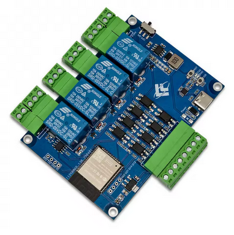

## Product description

This is a 4-relay board, having 4 binary inputs and an RS485 interface based on ESP32. The inputs are optoisolated (mine came with TLP785GB with 4.7k resistors on inputs, making it safe to operate them around max 24V), with a common ground, independent from the board's main gound. The RS485 transceiver is a SP3485E. Connectors are detacheable.

I bought it from: https://www.aliexpress.com/item/1005008876629425.html

## GPIO Pinout

| Pin    | Function  |
| ------ | --------- |
| GPIO23 | Relay 1   |
| GPIO5  | Relay 2   |
| GPIO4  | Relay 3   |
| GPIO13 | Relay 4   |
| GPIO25 | Input 1   |
| GPIO26 | Input 2   |
| GPIO27 | Input 3   |
| GPIO33 | Input 4   |
| GPIO19 | ModBUS TX |
| GPIO18 | ModBUS RX |
| GPIO15 | LED       |
| GPIO16 | Pad RX2   |
| GPIO17 | Pad TX2   |

All pins are inverted. It also exposes GPIOs 12, 14, 21, 22 labelled appropriately on the board.

## Basic Config

```yaml
substitutions:
  device_name: esp32-relay-x4_modbus-v1-3

esphome:
  name: ${device_name}

esp32:
  board: esp32dev
  framework:
    type: esp-idf

logger:
  baud_rate: 0

api:
  reboot_timeout: 30min
  encryption:
    key: !secret encryption_key

ota:
  - platform: esphome
    password: !secret ota_password

web_server:
  port: 80

wifi:
  ssid: !secret wifi_ssid
  password: !secret wifi_password
  reboot_timeout: 30min

sensor:
- platform: uptime
  name: Uptime

button:
- platform: restart
  name: Reboot
- platform: safe_mode
  name: Reboot in safe mode

# ==========================
# RELAYS (OUTPUTS)
# ==========================
switch:
  - platform: gpio
    pin:
      number: 23
      inverted: true
    name: "Relay 1"

  - platform: gpio
    pin:
      number: 5
      inverted: true
      ignore_strapping_warning: true
    name: "Relay 2"

  - platform: gpio
    pin:
      number: 4
      inverted: true
    name: "Relay 3"

  - platform: gpio
    pin:
      number: 13
      inverted: true
    name: "Relay 4"

# ==========================
# INPUTS (BINARY SENSORS)
# ==========================
binary_sensor:
  - platform: gpio
    pin:
      number: 25
      inverted: true
    name: "Input 1"

  - platform: gpio
    pin:
      number: 26
      inverted: true
    name: "Input 2"

  - platform: gpio
    pin:
      number: 27
      inverted: true
    name: "Input 3"

  - platform: gpio
    pin:
      number: 33
      inverted: true
    name: "Input 4"

# ==========================
# EXTRA PADS (RX2/TX2)
# ==========================
  - platform: gpio
    pin:
      number: 16
      inverted: true
      mode: INPUT_PULLUP
    name: "Pad RX2 as input"

  - platform: gpio
    pin:
      number: 17
      inverted: true
      mode: INPUT_PULLUP
    name: "Pad TX2 as input"

# ==========================
# MODBUS UART
# ==========================
uart:
  rx_pin: 18   # Modbus RX
  tx_pin: 19   # Modbus TX
  baud_rate: 9600

# ==========================
# Status LED (system state)
# ==========================
status_led:
  pin:
    number: 15
    inverted: true
    ignore_strapping_warning: true
```
