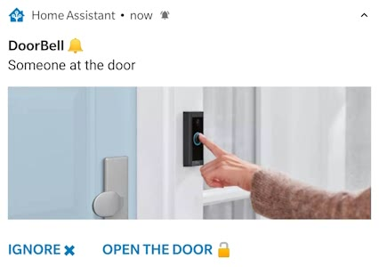
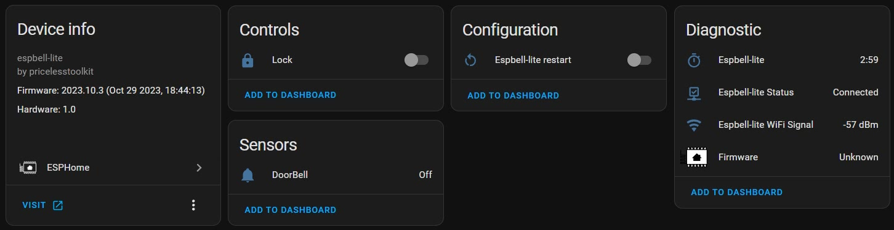

## Product description

ESPBell-LITE Intercom and Doorbell module allow you to stay informed when someone rings your doorbell or presses the intercom button. Upon receiving an interactive notification, you have the convenience to either promptly open the door or choose to dismiss the alert by simply tapping the button within the notification.



You can buy an assembled device from the official store https://www.pricelesstoolkit.com

## GPIO Pinout

| Pin    | Function                    |
| ------ | -------------------------   |
| GPIO12 | Free                        |
| GPIO13 | Free                        |
| GPIO14 | Free                        |
| GPIO4  | Doorbell Input 2-30v AC/DC  |
| GPIO5  | Lock "SSR 2.4A 30v Max"     |
| GPIO17 | ADC 1V Max                  |

- Requires 5V Power supply 0.5A

## Basic Config

```yaml
substitutions:
  name: ESPBell-LITE

esphome:
  name: espbell-lite
  name_add_mac_suffix: false
  project:
    name: pricelesstoolkit.espbell-lite
    version: "1.0"

esp8266:
  board: esp12e


dashboard_import:
  package_import_url: github://PricelessToolkit/ESPBell-LITE/Code/ESPHome/espbell-lite.yaml@main
  import_full_config: true

# Enable logging
logger:

# Enable Home Assistant API
api:

ota:
- platform: esphome
  password: "54699445e0aab07e709ffadssd188eb0"


wifi:
  ssid: !secret wifi_ssid
  password: !secret wifi_password
  fast_connect: true
  power_save_mode: none

  # Enable fallback hotspot (captive portal) in case wifi connection fails
  ap:
    ssid: "${name} Fallback Hotspot"
    password: "password"
    ap_timeout: 10s

captive_portal:

sensor:

- platform: uptime
  name: "${name}"
  id: uptime_seconds
  update_interval: 60

- platform: wifi_signal
  name: "${name} WiFi Signal"

binary_sensor:

# Doorbell Sensor
  - platform: gpio
    pin:
      number: 4
      #inverted: true
    name: "DoorBell"
    icon: "mdi:bell"
    filters:
      delayed_on: 100ms

  - platform: status
    name: "${name} Status"

switch:

# Door Lock Opener "Momentary Switch" Keeps SSR ON for 1.5s.
  - platform: gpio
    pin: 5
    id: Lock
    name: "Lock"
    icon: "mdi:lock"
    restore_mode: ALWAYS_OFF
    on_turn_on:
    - delay: 1500ms
    - switch.turn_off: Lock

  - platform: restart
    name: ${name} restart
```


