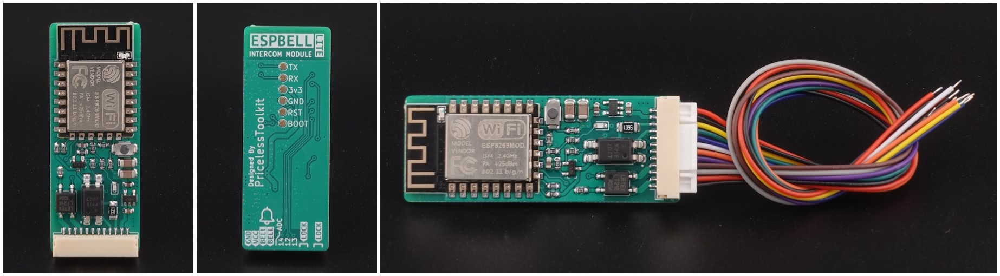

## Product description
ESPBell-LITE Intercom and Doorbell module allow you to stay informed when someone rings your doorbell or presses the intercom button. Upon receiving an interactive notification, you have the convenience to either promptly open the door or choose to dismiss the alert by simply tapping the button within the notification.


You can buy an assembled device from the official store https://www.pricelesstoolkit.com

## Specifications
- Based on ESP12F "Programmable via pads on the PCB"
- Input / Output
  - 1 x "LOCK" Solid State Relay "SSR" 2.4A 30v Max
  - 1 x "BELL" Input Optocoupler 2-30v AC/DC Max "For Doorbell"
  - 1 x "ADC" Input 1v Max
  - 3 x GPIO "12,13,14" 3.3v DC MAX
  - 1 x GND
  - 1 x 5V DC "Input"
- Status LEDs
  - 1 x DoorBell
  - 1 x On ESP module "Not used"
- Button for flashing Firmware
- Requires 5V 0.3A+ DC power supply.

## Basic Config

```yaml
# Door Lock Opener "Momentary Switch" Keeps SSR ON for 1.5s.
  - platform: gpio
    pin: 5
    id: Lock
    name: "Lock"
    icon: "mdi:lock"
    restore_mode: ALWAYS_OFF
    on_turn_on:
    - delay: 1500ms 
    - switch.turn_off: Lock
```

