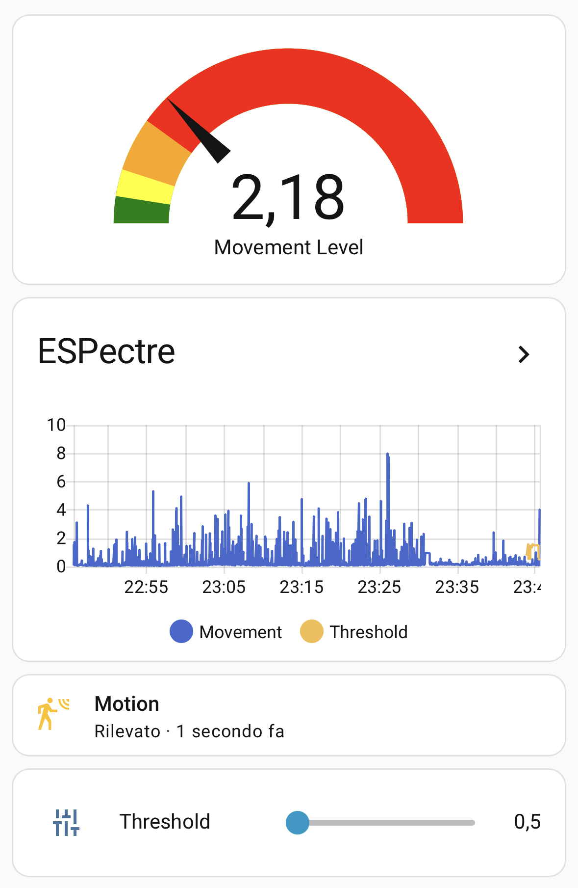

## Description

ESPectre is a motion detection system based on **WiFi spectrum analysis** with native Home Assistant integration via ESPHome.

Unlike traditional PIR sensors, ESPectre detects movement by analyzing changes in WiFi signals.
No cameras, no microphones, no wearables required.

### Features

- **WiFi-based detection**: Uses CSI (Channel State Information) from existing WiFi signals
- **Privacy-preserving**: No cameras, no audio, no identifying data
- **Through-wall detection**: WiFi signals penetrate walls and obstacles
- **Auto-calibration**: Automatically selects optimal subcarriers
- **Adjustable sensitivity**: Threshold control from Home Assistant
- **Multiple platforms**: ESP32-C6, ESP32-S3, ESP32-C3, ESP32-C5, ESP32-S2, ESP32

### Entities Created

- **binary_sensor.espectre_motion_detected** - Motion state (on/off)
- **sensor.espectre_movement_score** - Movement intensity value
- **number.espectre_threshold** - Detection threshold (adjustable)

## Supported Hardware

| Platform | Status | WiFi |
|----------|--------|------|
| ESP32-C6 | ✅ Tested | WiFi 6 |
| ESP32-S3 | ✅ Tested | WiFi 4 |
| ESP32-C3 | ✅ Tested | WiFi 4 |
| ESP32-C5 | ⚠️ Experimental | WiFi 6 |
| ESP32-S2 | ⚠️ Experimental | WiFi 4 |
| ESP32 | ⚠️ Experimental | WiFi 4 |

## Setup

1. Flash the device using ESPHome Dashboard or CLI
2. Configure WiFi via:
   - **BLE**: ESPHome app or Home Assistant Companion
   - **USB**: [web.esphome.io](https://web.esphome.io)
   - **Captive Portal**: Connect to "ESPectre Fallback" AP
3. Device auto-discovers in Home Assistant

## Configuration

Download the example configuration for your platform from [GitHub](https://github.com/francescopace/espectre/tree/main/examples).

```yaml
external_components:
  - source:
      type: git
      url: https://github.com/francescopace/espectre
      ref: main
    components: [ espectre ]

espectre:
  id: espectre_csi
  # Optional parameters:
  # segmentation_threshold: 1.0    # Motion sensitivity (0.5-10.0)
  # traffic_generator_rate: 100    # CSI packets/sec (0-1000)
```



## Important Notes

- **Calibration**: Keep room still for 10 seconds after boot
- **Traffic Generator**: Required for CSI packet generation (enabled by default)
- **Optimal Distance**: 3-8 meters from WiFi router

## Support

- [Documentation](https://github.com/francescopace/espectre#readme)
- [Setup Guide](https://github.com/francescopace/espectre/blob/main/SETUP.md)
- [Tuning Guide](https://github.com/francescopace/espectre/blob/main/TUNING.md)
- [GitHub Issues](https://github.com/francescopace/espectre/issues)
- [Discussions](https://github.com/francescopace/espectre/discussions)


